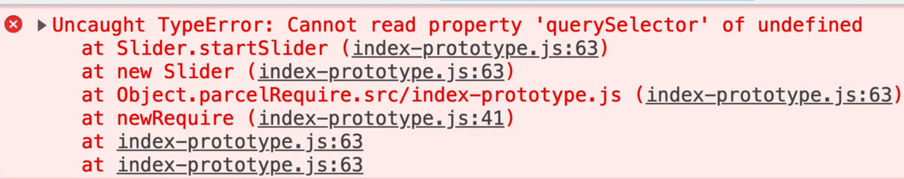
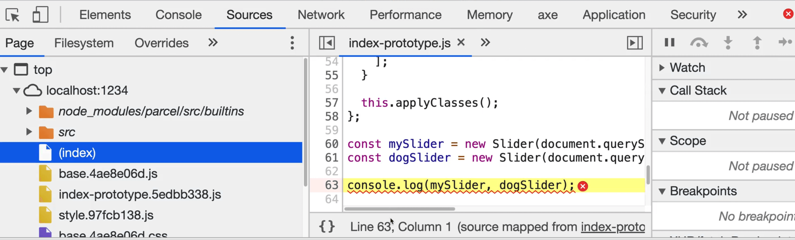
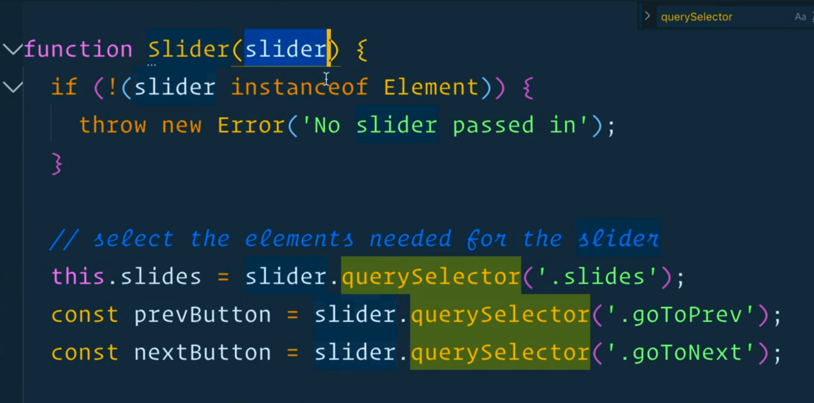
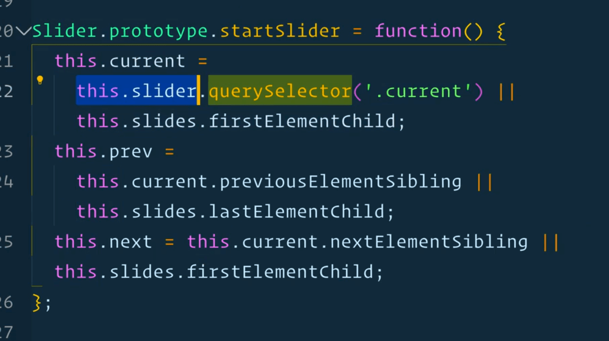
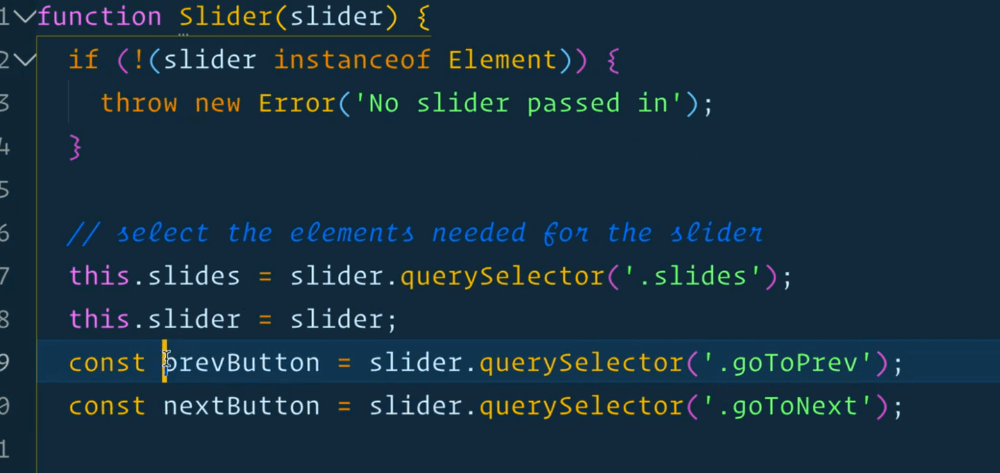
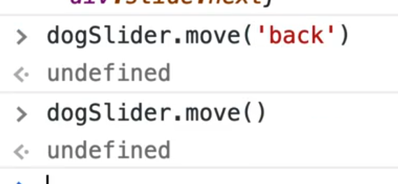

This lesson is a bit easier because there is no removing of events so there is no binding that we need to deal with.

Open up the slider exercise directory and open up `index.js`.

Make a copy of and call it `index-prototype.js` and then go to the `index.html` and modify the script's source tag to point to `index-prototype.js`.

Navigate into that directory in the terminal and run `npm start` within the actual terminal window (not the console).

Open the server up on your localhost and run the slider to make sure that it still works.

We have the sliders that we grabbed at the bottom.

We will log them, like we did in the previous lesson.


You should see the following in the console


Now we will do the same thing we did last time -- add a `new` keyword in front of it. That will create a new instance of the slider for each instance that we have.

```js
const mySlider = new Slider(document.querySelector(".slider"));
const dogSlider = new Slider(document.querySelector(".dog-slider"));

console.log(mySlider, dogSlider);
```


As you can see we have our sliders now, and they each have the prototypes, and there is nothing in them yet.

Let's start refactoring from the top of the file now.

The code shown below is what we are starting with.

```js
function Slider(slider) {
if (!(slider instanceof Element)) {
  throw new Error('No slider passed in');
}
// create some variables for working with the slider
let prev;
let current;
let next;
// select the elements needed for the slider
const slides = slider.querySelector('.slides');
const prevButton = slider.querySelector('.goToPrev');
const nextButton = slider.querySelector('.goToNext');

function startSlider() {
  current = slider.querySelector('.current') || slides.firstElementChild;
  prev = current.previousElementSibling || slides.lastElementChild;
  next = current.nextElementSibling || slides.firstElementChild;
  console.log({ current, prev, next });
}

function applyClasses() {
  current.classList.add('current');
  prev.classList.add('prev');
  next.classList.add('next');
}

function move(direction) {
  // first strip all the classes off the current slides
  const classesToRemove = ['prev', 'current', 'next'];
  prev.classList.remove(...classesToRemove);
  current.classList.remove(...classesToRemove);
  next.classList.remove(...classesToRemove);
  if (direction === 'back') {
    // make an new array of the new values, and destructure them over and into the prev, current and next variables
    [prev, current, next] = [
      // get the prev slide, if there is none, get the last slide from the entire slider for wrapping
      prev.previousElementSibling || slides.lastElementChild,
      prev,
      current,
    ];
  } else {
    [prev, current, next] = [
      current,
      next,
      // get the next slide, or if it's at the end, loop around and grab the first slide
      next.nextElementSibling || slides.firstElementChild,
    ];
  }

  applyClasses();
}

// when this slider is created, run the start slider function
startSlider();
applyClasses();

// Event listeners
prevButton.addEventListener('click', () => move('back'));
nextButton.addEventListener('click', move);
}

const mySlider = Slider(document.querySelector('.slider'));
const dogSlider = Slider(document.querySelector('.dog-slider'));function Slider(slider) {
if (!(slider instanceof Element)) {
  throw new Error('No slider passed in');
}
// create some variables for working with the slider
let prev;
let current;
let next;
// select the elements needed for the slider
const slides = slider.querySelector('.slides');
const prevButton = slider.querySelector('.goToPrev');
const nextButton = slider.querySelector('.goToNext');

function startSlider() {
  current = slider.querySelector('.current') || slides.firstElementChild;
  prev = current.previousElementSibling || slides.lastElementChild;
  next = current.nextElementSibling || slides.firstElementChild;
  console.log({ current, prev, next });
}

function applyClasses() {
  current.classList.add('current');
  prev.classList.add('prev');
  next.classList.add('next');
}

function move(direction) {
  // first strip all the classes off the current slides
  const classesToRemove = ['prev', 'current', 'next'];
  prev.classList.remove(...classesToRemove);
  current.classList.remove(...classesToRemove);
  next.classList.remove(...classesToRemove);
  if (direction === 'back') {
    // make an new array of the new values, and destructure them over and into the prev, current and next variables
    [prev, current, next] = [
      // get the prev slide, if there is none, get the last slide from the entire slider for wrapping
      prev.previousElementSibling || slides.lastElementChild,
      prev,
      current,
    ];
  } else {
    [prev, current, next] = [
      current,
      next,
      // get the next slide, or if it's at the end, loop around and grab the first slide
      next.nextElementSibling || slides.firstElementChild,
    ];
  }

  applyClasses();
}

  // when this slider is created, run the start slider function
  startSlider();
  applyClasses();

  // Event listeners
  prevButton.addEventListener('click', () => move('back'));
  nextButton.addEventListener('click', move);
}

const mySlider = Slider(document.querySelector('.slider'));
const dogSlider = Slider(document.querySelector('.dog-slider'));
```

The condition that checks whether the parameter is an element or not is fine, we do not have to refactor that.

The `let` variable declarations that come next need to be renamed to be `this` dot the variable name.

```js
let prev;
let current;
let next;
```

Rename those variable everywhere in the code they are used.

```js
this.prev;
this.current;
this.next;
```

Now that we have done that, we actually do not need those declarations because there is no sense in making those variables when they are properties because properties can be added at any time.

We were only declaring those variables so we had a closure where those variables were available.

You can go ahead and delete those 3 variable declarations (but keep the references to them that you renamed elsewhere!)

```js
// select the elements needed for the slider
const slides = slider.querySelector(".slides");
const prevButton = slider.querySelector(".goToPrev");
const nextButton = slider.querySelector(".goToNext");
```

The next 3 declarations you see above also need to be `this.`. Go ahead and rename those and everywhere they are being referenced. The `prevButton` however is only accessible inside of the constructor when we add the event listener. They are not needed anywhere inside of the prototype method, so it's not necessary to put it on `this`.

So `prevButton` and `nextButton` can stay variables but we will just rename `slides` like so 👇

```js
// select the elements needed for the slider
this.slides = slider.querySelector(".slides");
const prevButton = slider.querySelector(".goToPrev");
const nextButton = slider.querySelector(".goToNext");
```

Now we will move all of the methods out of the `Slider()` constructor.

Grab everything from the `startSlider` function all the way to where we have our event listeners and the call to `startSlider` and `applyClasses`.

Your file should look the same as below.

```js
function Slider(slider) {
  if (!(slider instanceof Element)) {
    throw new Error("No slider passed in");
  }
  // create some variables for working with the slider
  let prev;
  let current;
  let next;
  // select the elements needed for the slider
  const slides = slider.querySelector(".slides");
  const prevButton = slider.querySelector(".goToPrev");
  const nextButton = slider.querySelector(".goToNext");

  // when this slider is created, run the start slider function
  startSlider();
  applyClasses();

  // Event listeners
  prevButton.addEventListener("click", () => move("back"));
  nextButton.addEventListener("click", move);
}

function startSlider() {
  current = slider.querySelector(".current") || slides.firstElementChild;
  prev = current.previousElementSibling || slides.lastElementChild;
  next = current.nextElementSibling || slides.firstElementChild;
  console.log({ current, prev, next });
}

function applyClasses() {
  current.classList.add("current");
  prev.classList.add("prev");
  next.classList.add("next");
}

function move(direction) {
  // first strip all the classes off the current slides
  const classesToRemove = ["prev", "current", "next"];
  prev.classList.remove(...classesToRemove);
  current.classList.remove(...classesToRemove);
  next.classList.remove(...classesToRemove);
  if (direction === "back") {
    // make an new array of the new values, and destructure them over and into the prev, current and next variables
    [prev, current, next] = [
      // get the prev slide, if there is none, get the last slide from the entire slider for wrapping
      prev.previousElementSibling || slides.lastElementChild,
      prev,
      current,
    ];
  } else {
    [prev, current, next] = [
      current,
      next,
      // get the next slide, or if it's at the end, loop around and grab the first slide
      next.nextElementSibling || slides.firstElementChild,
    ];
  }

  applyClasses();
}

const mySlider = new Slider(document.querySelector(".slider"));
const dogSlider = new Slider(document.querySelector(".dog-slider"));
console.log(mySlider, dogSlider);
```

Now we need to grab every function that we just moved out of the constructor and refactor it to live on the prototype.

```js
function Slider(slider) {
  if (!(slider instanceof Element)) {
    throw new Error("No slider passed in");
  }
  // create some variables for working with the slider
  this.prev;
  this.current;
  this.next;
  // select the elements needed for the slider
  this.slides = slider.querySelector(".slides");
  const prevButton = slider.querySelector(".goToPrev");
  const nextButton = slider.querySelector(".goToNext");

  // when this slider is created, run the start slider function
  this.startSlider();
  this.applyClasses();

  // Event listeners
  prevButton.addEventListener("click", () => this.move("back"));
  nextButton.addEventListener("click", this.move);
}

Slider.prototype.startSlider = function() {
  this.current =
    this.slider.querySelector(".current") || this.slides.firstElementChild;
  this.prev =
    this.current.previousElementSibling || this.slides.lastElementChild;
  this.next = this.current.nextElementSibling || this.slides.firstElementChild;
};

Slider.prototype.applyClasses = function() {
  this.current.classList.add("current");
  this.prev.classList.add("prev");
  this.next.classList.add("next");
};

Slider.prototype.move = function(direction) {
  // first strip all the classes off the current slides
  const classesToRemove = ["prev", "current", "next"];
  this.prev.classList.remove(...classesToRemove);
  this.current.classList.remove(...classesToRemove);
  this.next.classList.remove(...classesToRemove);
  if (direction === "back") {
    // make an new array of the new values, and destructure them over and into the prev, current and next variables
    [this.prev, this.current, this.next] = [
      // get the prev slide, if there is none, get the last slide from the entire slider for wrapping
      this.prev.previousElementSibling || this.slides.lastElementChild,
      this.prev,
      this.current,
    ];
  } else {
    [this.prev, this.current, this.next] = [
      this.current,
      this.next,
      // get the next slide, or if it's at the end, loop around and grab the first slide
      this.next.nextElementSibling || this.slides.firstElementChild,
    ];
  }

  this.applyClasses();
};

```

Now let's go ahead and fix the errors showing up in the text editor.

The call to `startSlider` and `applyClasses` need to be changed to `this.startSlider()` and `this.applyClasses()`. Same thing for the calls to the `move` function, they need to be `this.move`.


```js
// when this slider is created, run the start slider function
this.startSlider();
this.applyClasses();

// Event listeners
prevButton.addEventListener("click", () => this.move("back"));
nextButton.addEventListener("click", this.move);
```

Within `move` function we need to change it to call `this.applyClasses()`.

Now let's go to our browser to refresh and see what errors we are getting.



The first one we see is

> Cannot read property 'querySelector' of undefined`

The stack trace tells us it happened on line 63, however that is not helpful because that is the end of our file. Further down the stack trace it mentions line 41 so let's check that, however that line is just a comment!

So let's click on the error to see where it takes us.



Unfortunately that is not very helpful either. Sometimes you get these errors and it's hard to find where the error is even when the browser tries to give you a stack trace.

Let's just try to debug this ourselves.

Let's look at everywhere that we are using `querySelector`.



Those first 3 should be fine since we are passing in the slider.

Where else are we using `querySelector`? Within the `startSlider` function and where we initialize the slider instances.


Wes thinks it might be the latter, which he will test by logging the slider parameter within the `Slider()`.

We can tell it's not an issue with that because we can see the slider being logged to the console.

It seems like the issue must be in our `startSlider` function when we try to access `this.slider`.



Let's throw a `debugger` in the first line of the `startSlider` function.

Now when you refresh the page, the debugger should pause the execution of the code.

If we look at the debug dev tools, we can see that at this point in time, the Slider is missing properties it needs, such as `this.slider`.

Whenever the `startSlider()` function is running, `this.slider` does not yet exist.

The reason for this is we never saved a reference to the slider that was passed in, so let's go ahead and do that.

```js
// select the elements needed for the slider
this.slides = slider.querySelector(".slides");
this.slider = slider;
```

Now if you refresh the page, you should no longer see that problem in the console.

We now get the following error 👇

> index-prototype.js:41 Uncaught TypeError: Cannot read property 'classList' of undefined
>  at HTMLButtonElement.Slider.move (index-prototype.js:38)

On line 38 we are calling `this.prev.classList.remove(...classesToRemove);`. It is trying to tell us that `this.prev` is not defined.

If we log what `this` is within our `move` function, we will see that it's the next button which is not working. The previous button actually works.

So let's go to where we have listened to our move.


The reason next is broken but previous is not is that in next, we just pass a reference to that function, and it's being rebound.

In the `prevButton` case, we are passing it an anonymous arrow function.

We can solve this issue 1 of 2 ways.

We can bind it with `this` and that will work.

```js
nextButton.addEventListener('click', this.move.bind(this));
```

The reason we are allowed to do that here is because we aren't removing the event listener so we don't need access to the new `this` that was bound.

The other thing we can do is refactor it to an arrow function as shown below.

```js
nextButton.addEventListener('click', () => this.move());
```

You can also do it as shown below.

```js
// Event listeners
this.move = this.move.bind(this);
prevButton.addEventListener('click', () => this.move('back'));
nextButton.addEventListener('click', () => this.move());
```

We will stick to the arrow function in this case.

The arrow function will have bound and not the `this.move` which is what we want, because `this.move` needs access to the instance in order to reference the previous, next and current DOM elements.

The slider should be working well now if you refresh the page!

Now that we are done, let's just go over a few things.



Why did we not rename the buttons to live on `this` like `this.prevButton = slider.querySelector('.goToPrev');`?

It is because we do not need them anywhere outside of the constructor. If that is the case, keep them as regular variables and reference them when you need them inside of the function.

One cool thing about this is if you take `dogSlider`, you cannot access it in the console using Parcel. If you want to access it, you have to say something like `window.dogSlider = dogSlider` and then you have access to `dogSlider` in the console.

The cool thing about that is now you can call the functions yourself like the move in the terminal to control the slider.



What you could do is at the bottom of the page add an event listener on the window's keyup event like below.


Now if you use your arrow keys you will see that it works.

That is what is great about this, you can build something like this slider and then surface the functionality via methods and then let other people hook into your slider functionality and extend it with their own.
