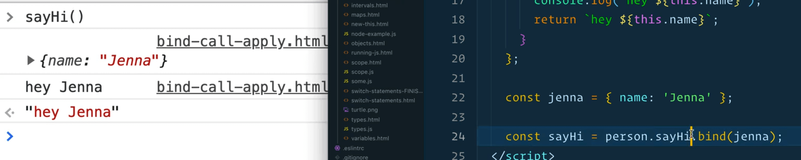
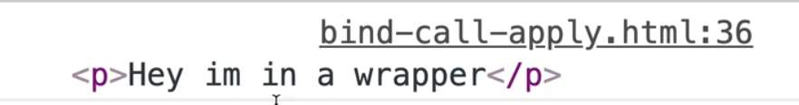
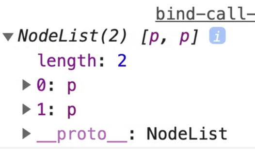
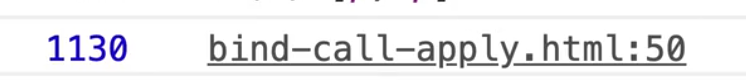
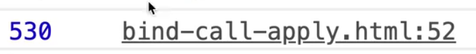
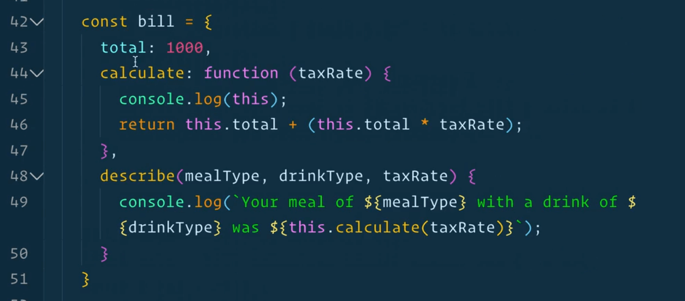
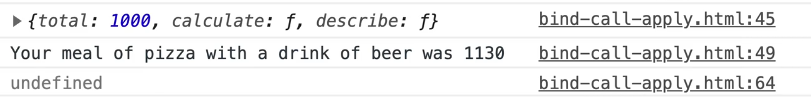

This lesson will focus on the `bind`, `call` and `apply` functions, which are all used to change the scope of what `this` is equal to inside of a function or a method.

Wes does not use these very often, but they are common interview questions so we will go over them so you have an understanding of how it works.

Go into the `playground` directory and add a file `bind-call-apply.html`. Add our HTML base and a script tag wtihin the body tag.

We will start with a simple example of an object that has a method on it.

Create a person object on it with property of `name` and `sayHi`. The name can be your name, and `sayHi` will equal a function that logs "Hey!" with the person's name.

```js
const person = {
  name: 'Wes Bos',
  sayHi: function() {
    return `hey ${this.name}`;
  }
};
```

Let's change it shorthand, which is the exact same thing as above, it's just shorter syntax for the `sayHi` property.

```js
const person = {
  name: 'Wes Bos',
  sayHi() {
    return `hey ${this.name}`;
  }
};
```

Open that in the browser and take a look at it in the console.


As you can see, it says "hey wes bos".

Why is that?

That is because `sayHi` is a method, and when a method is called, the way they get the `this` value is they look to the left of the dot to see what they are bound against.

The `sayHi` method will give us the object it was run against. This is no different than if we were to have class or prototype. The `this` is going to be equal to whatever was to the left of the dot.

Now , what if you were to take the `sayHi` method and put it in it's own variable, as shown below 👇?

```js
const sayHi = person1.sayHi;
```

When you run that, we will just see "hey " with no name.


You can see if we call the `sayHi()` on the person object, we get the hey message returned with a name.

But when we just call `sayHi()`, `this` is equal to the window because there is nothing that the method was bound to on the left-hand side.

That is important. In JavaScript, the `this` keyword is always defined by _where the function is being called, and not where the function is being defined_.

So although we defined the `sayHi` function inside of an object, it's not bound to it unless we call it as a method of an object.

We can use the `bind` keyword to change where the `this` keyword is equal to or what is it bound to.

Let's try that by binding the `sayHi` method back to the original person.

```js
const sayHi = person1.sayHi.bind(person);
```

The code above tells JavaScript to call a function `sayHi` and when it's called, it's `this` keyword is equal to whatever we pass to the `bind()` method.

Now when you refresh the page, if you were to run `sayHi()`, you will see that it now says "hey wes bos" instead of just "hey".

That is because we have changed what `this` will be equal to by binding it to another object.

Why would that be useful?

Sometimes you want to use a method of an object with some other information. Let's say we have a Jenna object, as shown below 👇

```js
const jenna = { name: 'Jenna' };
```

How would we use the `sayHi` method for this other object when `name` isn't being passed in as an argument?


That is the difference between object oriented programming and functional programming.


Our `sayHi` method is object oriented.

If it were to take an argument, that would be much more of a functional approach.

What we can do is we can bind `sayHi`` to Jenna object as shown below.

```js
const sayHi = person.sayHi.bind(jenna);
```



`bind` is a method that lives on all functions and it says change the `this` keyword to be equal to, in this example, a different object.

You could also manually pass in a name, as shown below.

```js
const sayHi = person.sayHi.bind({ name: 'Harry' });
```

If you refresh the page and call `sayHi()` you will see "hey Harry" returned.

Let's look at another example.

`document.querySelector` and `document.querySelectorAll` are kind of hard to type.

Let's do an example using that.

Let's say we wanted to make `$` a short hand for `document.querySelector` and `$$` for `document.querySelectorAll`.

You might think you could do something as shown below 👇

```js
//QS Example

const $ = document.querySelector;
```

Now if you refresh the page, open the dev tools console and type `$` you will see that it is the `querySelector` function.

If you try typing in `document.querySelector` it will be the exact same thing. In fact, they are identical.


_Aside: sometimes you see that "[native code]" in the console. That means that is a function that has been implemented by the browser so we are not able to see how it works under the hood because it's implemented in whatever language it's written in._

Now if you wanted to actually select something, you might think you would be able to just do `$('p')`. However, if you try that you will see that we get an error complaining about "Illegal invocation".


What is happening here?

Somewhere under the hood in `document.querySelector` it needs to know where to look for the thing that you are selecting.

Let's demonstrate the reason for that with an example.

```html
<div class="wrapper">
  <p>Hey im in a wrapper</p>
</div>
```

Now let's say we grabbed the wrapper and did the following 👇

```html
const wrapper = document.querySelector('.wrapper');
const p = wrapper.querySelector('p');
console.log(p);
```



As you can see, that works. We got it.

`querySelector` is a function and it needs to know what to look inside of for the selector.

The reason it knows where to scope it to, either globally (the document) or in a subset of the DOM, based on what is left of the dot.

So when we try to log `$('p')`, it doesn't work because there is nothing to the left of the dot. We have taken away the object that it was called against and as a result it is not bound to anything.

## Bind method

The way that we can fix that is we can call `bind()` on it and manually pass it reference to the thing we want it to be equal to.

```js
// by calling bind against querySelector, we say that when the $ function is run, use `document` as the `this` value.
const $ = document.querySelector.bind(document);
```

Now if you try doing `console.log($('p'))`, you will see that it works now because it has been bound to the function.

This piece of code, `document.querySelector.bind(document);` does not run the function, it return the function which you can then store in a variable, which in our example is `$`.

You could also do that with `querySelectorAll`, as shown below 👇

```js
const lookFor = document.querySelectorAll.bind(document);
console.log(lookFor('p'));
```

You would see that a NodeList is returned to us.



To reiterate: using `bind` will change the context of what `this` is equal to inside of a function or a method.

`bind` is also useful to prep a function that has arguments sort of "pre-loaded".

Let's demonstrate with an example.

```js
const bill = {
  total: 1000,
  calculate: function(taxRate) {
    return this.total + (this.total * taxRate);
  }
}

const total = bill.calculate(0.13);
console.log(total);
```

Let's refresh the page to check if it works. You should see 1130 in the console.



If you wanted to take that function and store it in an external variable, you could add the code below 👇

```js
const calc = bill.calculate;
```

If you tried to call `calc` and pass it 0.13, you would see `NaN` in the console.

```js
console.log(calc(0.13));
```


Why?

Because if we were to log `this` inside of the `calculate` method on our `bill` object, you would see that it is equal to the window.


The first time around it is equal to our `bill` object and the second time it was called it was equal to the window.

That is because `calc` is not bound to anything. We could just bind it to the original `bill` and that would work.

```js
const calc = bill.calculate.bind(bill);
```

You could also pass it it's own bill as shown below 👇

```js
const calc = bill.calculate.bind({ total: 500 });
console.log(calc(0.13));
```

In the next example, we will demonstrate how `bind` can be used to "pre-load" functions with some arguments that need to be called.

Wes likes to think of this as the "check-in online" of functions. What that means is when you bind something, you can pass it additional arguments that line up with the arguments of the function or method.

So if we wanted to pass the tax rate, we could do that in the arguments we pass to `bind` and not pass it when we call the `calc` function, as you see in the code below.

```js
const calc = bill.calculate.bind({ total: 500 }, 0.06);
console.log(calc());
```



As you can see, it still works! Why?

The additional arguments to `bind`, the first one will always be the `this` object, and then the additional ones will line up with the arguments that get passed. If `bill.calculate` took more arguments, like `tipRate`, we could pass another value as an argument.

Why is that helpful?

Sometimes, when you are generating functions, for example looping over a list of data, you have access to the data at the time of function creation, and then let's say later you want to call it.

Sometimes it's easier to pre-load the function by passing it what the arguments will be at call time when you are binding it. Then you can just go ahead and take the function and call it from wherever you want because you know the arguments are already included.

## Call and Apply methods

Let's move on to the two methods: `call` and `apply`.

They work the exact same as `bind` does with one difference: they will call the function for you.


### Call method

Instead of returning, like you see happens above when we call `calc`, if we just duplicate the line of code where we are declaring `calc` and modify it like below, let's see what is returned.

```js
const total2 = bill.calculate.call({total:500}, 0.06);
console.log(total2);
```

You will see we have 530 returned to us.

What happened there?

`.bind` calls a function, which then needs to be called by itself.

`call` does the same thing as `bind` but it will also run the function for you so you don't have to call it.

If you need to bind a function and call it later, use `bind`.

If you need to bind a function that you want to call immediately you can use `call`.

### Apply method


> Note: While the syntax of this function is almost identical to that of `call`, the fundamental difference is that `call` accepts an argument list, while `apply` accepts a single array of arguments.

If you want to run one of the functions but you don't care what `this` is equal to, you can just pass `null` and then after you pass the additional arguments as an array.

In our case, there is only 1 argument.

```js
const total3 = bill.calculate.apply({ total: 325 }, [0.60]);
console.log(total3);
```

That is not very useful now that we have spread, because you could just spread into `call` but it's available if you need it.

Let's add 1 more argument to our `bill` object.

```js
const bill = {
  total: 1000,
  calculate: function(taxRate) {
    return this.total + (this.total * taxRate);
  },
  describe(mealType,drinkType,taxRate) {
    console.log(`Your meal of ${mealType} with a drink of ${drinkType} was ${this.calculate(taxRate)}`);
  }
}
```

Now we can try running the function in the console.

```js
bill.describe('pizza', 'beer', 0.13);
```

 17:52

As you can see the function works.

Now if we wanted to run that with `call` and `apply` we could do the following.

```js
const myMeal = bill.describe.call({ total: 342 }, 'pizza', 'beer', 0.13);
console.log(myMeal);
```


Why do we pass an object as the first argument to `call`?

Because that is what `this` will be equal to, and inside of `calculate` it looks for `this.total` so we need an object with a `total` property.

The additional arguments are `mealType`, `drinkType` and `taxRate`.

If you try running that, you will see that we get an error complaining that "this.calculate is not a function".

What is happening?



We called `this.calculate` but we didn't pass it the `this` that we wanted.

Let's go modify the `myMeal` declaration so that it has access to the `calculate` function.

```js
const myMeal = bill.describe.call(bill, 'pizza', 'beer', 0.13);
```



Now it should be working for you.

If you were to `apply` that instead, we would pass all the arguments as 1 argument.

```js
const myMeal2 = bill.describe.apply(bill, ['pizza', 'beer', 0.13]);
console.log(myMeal2);
```

That wraps up `call`, `bind`, and `apply`.

When should you use them? When the `this` value is different from what you have hoped. You won't always need it but it is helpful to know.
