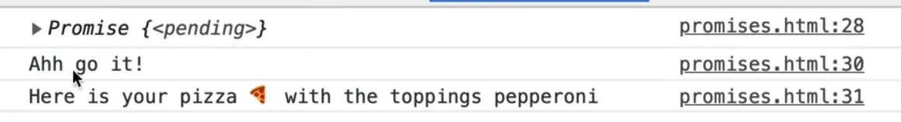
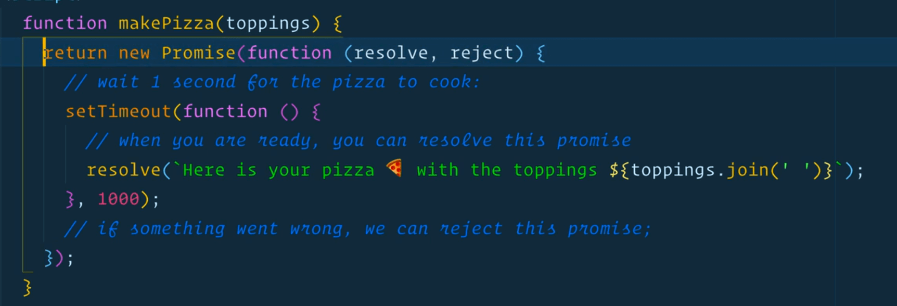
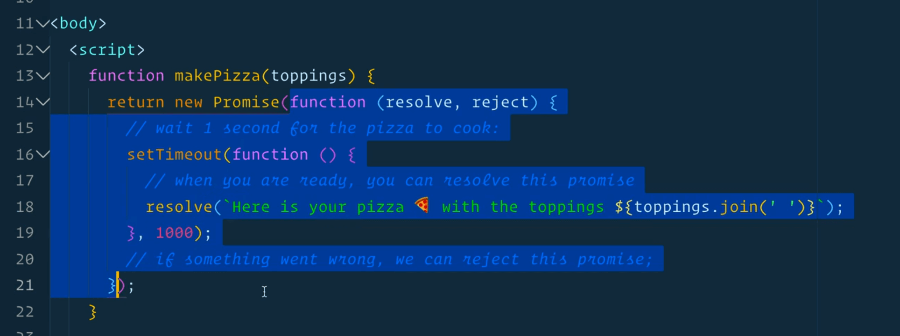
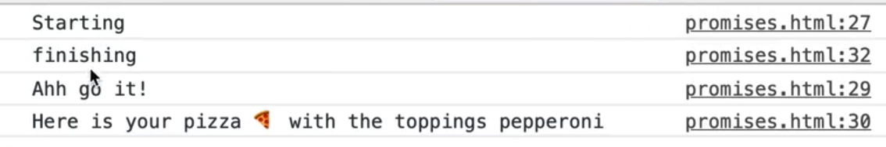
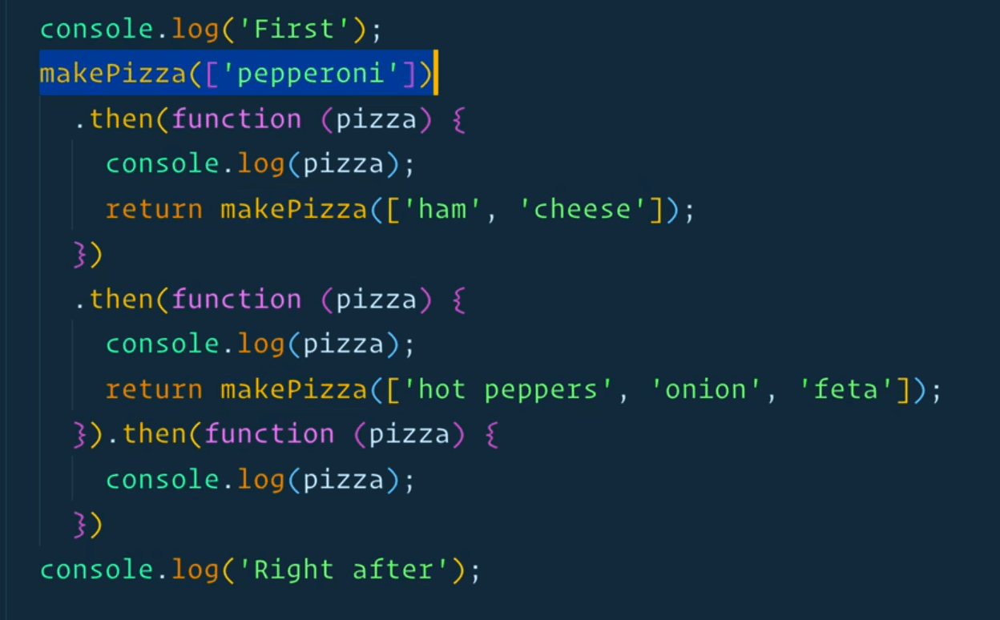
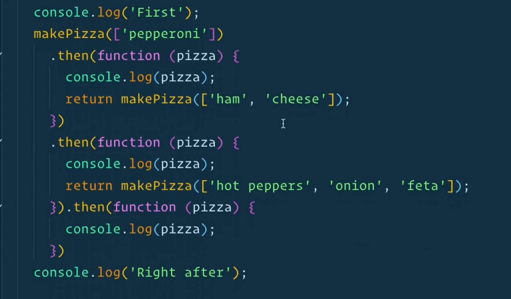
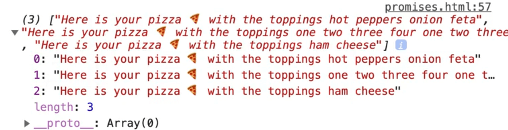
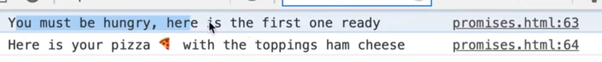

The solution to callback hell is to use a **promise**, and although we haven't covered that yet, we will now.

Promises are an IOU (I Owe You) for something that will happen in the future.

If you think of our timer, data being returned from an API or someone giving access to a webcam, when we request or start those things, what we often get in return is not the immediate data back, because those things take time. Instead of getting the immediate data returned, we get a promise.

You can think of a Promise as a little ticket you have in your hand that says "I might get a timer, or some data at some point" and eventually at some point we will get some data back (it can also fail which is called rejecting).

Or, when we were asking for a user's webcam, like we did in our Face Detection exercises, we used the code below.

```js
const stream = await navigator.mediaDevices.getUserMedia({
  video: { width: 1280, height: 720 },
});

video.srcObject = stream;
await video.play();
```

We had to wait for the user to give us access to their webcam before playing the video. That happens all the time in JavaScript, and that is what a promise is.

In the `playground` directory, make a `promises.html` file. Add our base HTML and the following script tag.

```html
<script>
function makePizza() {

}
</script>
```

Inside of this script tag, we are going to make a pizza promise.

When you make a pizza, it takes time. You can't make it instantly. You gotta put the toppings on, the pepperoni on, and that takes time.

If you were to order a pizza by phoning them or doing it online, they will immediately give you some sort of order number. That order number is not the pizza -- you cannot eat it, but you know that the order number or that receipt is a "promise" that they will give it to you when its finished.

So what we need to do is to make a promise and then return it from our function immediately as shown below.

```js
function makePizza() {
  const pizzaPromise  = new Promise();
  return pizzaPromise;
}
```

Promises are made immediately, but they do not resolve immediately (they resolve once the timer is finished or the data comes back).

That idea of returning happening immediately and resolving happening when it's done is really important.

A promise takes a callback function, and that callback function is going to give us 2 arguments:
1. the `resolve` function
1. the `reject` function

The first will always be resolve, second will always be reject.

Now what you can do is when you are ready, you can resolve the promise or if something went wrong you can reject it, as shown below.

```js
function makePizza() {
  const pizzaPromise = new Promise(function(resolve, reject) {
    resolve('');
  });

  return pizzaPromise;
}

const pizza = makePizza();
console.log(pizza);
```

Now if we refresh the page, what do you think we will get in the console? Will we get the pizza or something else, like a promise?


If you refresh the page, you should see the promise.

What is important to note is that our `makePizza` function doesn't give us the pizza, it gives us the promise of pizza, that at some point in the future, we will either resolve a slice of pizza or reject it if something went wrong.

Let's make the function a bit more robust.

We will take in some toppings and will resolve using backticks. Modify the code as shown below to make a `pepperoniPromise` and a `canadianPromise`.

```js
function makePizza(toppings) {
  const pizzaPromise = new Promise(function(resolve, reject) {
    resolve(`Here is your pizza 🍕 with the toppings ${toppings.join(' ')}`);
  });

  return pizzaPromise;
}

const pepperoniPromise = makePizza('[pepperoni]');
const canadianPromise = makePizza(['pepperoni', 'mushroom', 'onions'])

console.log(pepperoniPromise, canadianPromise);
```


As you can see, we get our 2 promises. But how do we get the actual pizza itself?

This is a bit confusing because the dev tools will show you the value when it is resolved, but in JavaScript if you actually want to access the value of the pizza, you cannot say `pepperoniPromise.value` or anything.

## .then() method

The way that we can access it by using the `then()` method, which takes in a callback method. The callback method will pass you the pizza, which we will then log.

```js
pepperoniPromise.then(function(pizza) {
  console.log("Ahh I got it!");
  console.log(pizza);
});
```

Now when you refresh the page you should see the logs below.


At this stage, you might be wondering "why are you doing it like this Wes? this seems like a much harder way to just return data".

The reason for that is we haven't introduced any time delays in our example so let's go ahead and do that.

We will add a 1 second wait for the pizza to cook using `setTimeout` and then call `resolve` from within that timeout.

```js
function makePizza(toppings) {
  const pizzaPromise = new Promise(function(resolve, reject) {

    // wait 1 second for the pizza to cook
    setTimeout(function() {
      resolve(`Here is your pizza 🍕 with the toppings ${toppings.join(' ')}`);
    }, 1000)

    // if something went wrong, we can reject this promise
  });

  return pizzaPromise;
}

const pepperoniPromise = makePizza(['pepperoni']);

pepperoniPromise.then(function(pizza) {
  console.log("Ahh I got it!");
  console.log(pizza);
});
```

If you refresh the page, you will see in the console that we get our promise immediately and then a second after we actually have access to our pizza.



That is a great example of how we sometimes have to wait.

Often what you will see is instead of making a promise and then returning it, people will often just return the promise immediately.

```js
function makePizza(toppings) {
  return new Promise(function(resolve, reject) {
    // wait 1 second for the pizza to cook
    setTimeout(function() {
      resolve(`Here is your pizza 🍕 with the toppings ${toppings.join(' ')}`);
    }, 1000)

    // if something went wrong, we can reject this promise
  });
}
```



The logic to how a Promise gets resolved is always inside of the Promise body, which in the example is the code below

```js
function(resolve, reject) {
    // wait 1 second for the pizza to cook
    setTimeout(function() {
      resolve(`Here is your pizza 🍕 with the toppings ${toppings.join(' ')}`);
    }, 1000)

    // if something went wrong, we can reject this promise
  }
```



That function will resolve or reject whenever it feels ready. In our case, we feel like the pizza is ready after one second.

So what is happening here is when we declare our `pepperoniPromise` we can call `makePizza(['pepperoni'])`, which returns a promise of pizza. In order to get the pizza, the way we can access the resolved value is by chaining a `.then` onto it.

```js
console.log('Starting');

pepperoniPromise.then(function(pizza) {
  console.log('Ahhh got it!');
  console.log(pizza);
});

console.log('finishing');
```

When you refresh the page you will see that we get "Starting" then "finishing" then the "I got it" message.



We will look at how we can use `async/await` to actually do that sequentially if we would like to, but for now we know we can chain a `.then()` onto it.

Why is that any more useful than a regular callback?

That is useful because let's say we wanted to make multiple pizzas one after the other, and we have an oven that can only cook one at at time.

Delete our `canadianPizza` and `pepperoniPizza` declaration code and everything below it in the script tag and just leave the line below

```js
makePizza(['pepperoni']);
```

We can chain a `.then()` immediately onto it (because `makePizza` returns a promise), which gives a function that has a pizza. LLog the pizza so that we know that it still works.

The neat thing is if from this `then()` we return another `makePizza`, you can then chain another `.then()` on that function.

```js
makePizza(['pepperoni', 'ham'])
  .then(function(pizza) {
    console.log(pizza);
    return makePizza(['ham', 'cheese']);
  }).then(function(pizza) {
    console.log(pizza);
  })
```

As you can see first we get one pizza and then after a second we see the other pizza logged to the console.


You can chain as many as you want.

Often people like to organize the code so that each `.then()` is on it's own line to make it more readable as you see below.


```js
makePizza(['pepperoni', 'ham'])
  .then(function(pizza) {
    console.log(pizza);
    return makePizza(['ham', 'cheese']);
  })
  .then(function(pizza) {
    console.log(pizza);
    return makePizza(['hot peppers', 'onion', 'feta']);
  })
  .then(function(pizza) {
    console.log(pizza);
  })
```

Unlike what we were doing the lesson where we were adding and removing classes which were all nested in callback hell, this chaining of `then` is the promise land and it allows us to keep all of our logic one level deep.

The downside to that is if you had a log of First and After all our promise chaining, both logs would execute before any of our pizzas are logged.

```js
console.log('First');

makePizza(['pepperoni', 'ham'])
  .then(function(pizza) {
    console.log(pizza);
    return makePizza(['ham', 'cheese']);
  })
  .then(function(pizza) {
    console.log(pizza);
    return makePizza(['hot peppers', 'onion', 'feta']);
  })
  .then(function(pizza) {
    console.log(pizza);
  })

console.log('Right after');
```


We will look at how we can use async/await to get around that.

If you look at the call stack, what we know is that it first runs the function `makePizza(['pepperoni'])` (highlighted in the image below), which immediately returns a promise.



Then it runs the bottom log, before jumping back up to the first `then()` we have when the promise is resolved, and then it keeps going down the promise chain.

Let's make our `makePizza` function a bit more resilient, starting with `toppings`.

Set an empty array as the default because sometimes people might order a pizza with nothing on it.

```js
function makePizza(toppings = [])
```

For every single topping that is added to the pizza, let's add 200 milliseconds to the initial bake time which is 500. Let's calculate that and save it in a variable as shown below 👇

```js
const amountOfTimeToBake = 500 + (toppings.length * 200);
```

Now we will take that variable and pass it to our timeout.

```js
function makePizza(toppings = []) {
  const pizzaPromise = new Promise(function(resolve, reject) {
    const amountOfTimeToBake = 500 + (toppings.length * 200);

    // wait 1 second for the pizza to cook
    setTimeout(function() {
      resolve(`Here is your pizza 🍕 with the toppings ${toppings.join(' ')}`);
    }, amountOfTimeToBake)

    // if something went wrong, we can reject this promise
  });

  return pizzaPromise;
}
```



When we refresh the page and the above code is executed, what should happen is ham and cheese should be logged to the console faster than the pizza with 3 toppings.

Let's chain 2 more pizzas together, one with no toppings, the other with a lot of toppings.  Then let's resolve that last pizza and just log it using an arrow function as shown below.

```js
console.log('First');

makePizza(['pepperoni', 'ham'])
  .then(function(pizza) {
    console.log(pizza);
    return makePizza(['ham', 'cheese']);
  })
  .then(function(pizza) {
    console.log(pizza);
    return makePizza(['hot peppers', 'onion', 'feta']);
  })
  .then(function(pizza) {
    console.log(pizza);
    return makePizza();
  })
  .then(function(pizza) {
    console.log(pizza);
    return makePizza(['one', 'two', 'three', 'four', 'one', 'two', 'three', 'four', 'one', 'two', 'three', 'four']);
  })
  .then(pizza => {
    console.log('All done! here is your last pizza');
    console.log(pizza);
  })

console.log('Right after');
```

## Promise.all()

Let's say we have a big oven and we can make all the pizzas at once. You could run them all **concurrently**, instead of one after another like we are doing (which is referred to as **sequentially**).

If you have 10 employees and an oven big enough to cook them all at once, you can do it like so 👇

```js
// Run them concurrently
const pizzaPromise1 = makePizza(['hot peppers', 'onion', 'feta']);
const pizzaPromise2 = makePizza(['one', 'two', 'three', 'four', 'one', 'two', 'three', 'four', 'one', 'two', 'three', 'four']);
const pizzaPromise3 = makePizza(['ham', 'cheese']);
```

So how do we know when all of those promises are done? We could do `.then()` on each of them like so 👇


But those are going to pop into the console in whatever order they are done, which isn't what we want. We can instead make it into a "mega promise" that we then wait upon.

If you have a few promises and all you care about is when all 3 of them are finished, you can make a mega promises, which we will call a `dinnerPromise`.

```js
const dinnerPromise = Promise.all([pizzaPromise1, pizzaPromise2, pizzaPromise3]);
```

`Promise.all()` is a static method because it lives on the "momma" Promise directly.

It takes an array of "baby" promises which are `pizza1`, `pizza2`, `pizza3`.

That makes one big promise which then you can call `.then()` on and we get passed the `pizzas` which we will log.

```js
dinnerPromise.then(pizzas => {
  console.log(pizzas);
})
```

Now we wait for all 3 to be finished, and we get an array of all 3 of them.



If you wanted the first pizza it would be `pizza[0]`.

A pretty common thing to do is destructure the pizzas.

Let's convert the arrow function to a regular function to make it clearer to understand.

We will use **array destructuring**. Let's call the first pizza `hottie`, second one `garbagePail` and third one `hamAndCheese`.

Those will now be equal to 3 variables which we can now log or use however we want like so 👇

```js
dinnerPromise.then(function (pizzas) {
  [hottie, garbagePail, hamAndCheese] = pizzas;

  console.log(hottie, garbagePail, hamAndCheese);
});
```


You do not have to destructure those variables in the body of the function, you can destructure the argument directly with square brackets.

```js
dinnerPromise.then(function ([hottie, garbagePail, hamAndCheese]) {
  console.log(hottie, garbagePail, hamAndCheese);
});
```

That is saying take the first argument and destructure it into a variable named `hottie` , the second one into `garbagePail` and so on.

If you refresh the page you will see it still works.

To reiterate, `Promise.all()` will take all of your promises and will only resolve when all 3 of the sub-promises have been resolved themselves.

## Promise.race()

Similarly there is `Promise.race()`. Let's say someone is really hungry and they will take whichever pizza the first pizza is that is ready because they are very hungry.

We could do this 👇

```js
const firstPizzaPromise = Promise.race([pizzaPromise1, pizzaPromise2, pizzaPromise3]);
```

Now we can log it.

```js
firstPizzaPromise.then(pizza => {
  console.log('You must be hungry, here is the first one ready');
  console.log(pizza);
})
```

TO reiterate, `Promise.race()` will wait for the first one to finish rendering.



There are also a couple of other ones which we will get into when we talk about error handling.

That is a high level overview of promises.
