In this lesson we will be working more with promises and async await to build a sort of prompt interface.

A pretty common thing to do in JavaScript is when someone clicks a button or something happens on the page, you want to pop up a little box, ask them for something, and then go ahead and get that data back and display it on the page somehow.


There is a prompt that is built into the browser, but the problem with that prompt if you can only have one input box.

If you wanted multiple input boxes or an image upload or something like that, you couldn't do that with the built in.

The built-in interface is also blocking, meaning that when it is popped up, you cannot do anything else on the page.

We are going to see how we can re-implement this with promises and async/await.

We will be working out of the `/exercises/72 - Async Prompts/` directory, and are starting with some very basic HTML.

```html
<!DOCTYPE html>
<html lang="en">

<head>
  <meta charset="UTF-8">
  <meta name="viewport" content="width=device-width, initial-scale=1.0">
  <title>Async Prompt</title>
  <link rel="stylesheet" href="../../base.css">
  <link rel="stylesheet" href="./style.css">
</head>

<body>

  <div class="wrapper">
    <button class="askMe" data-question="What is your name?">Enter Name</button>
    <button class="askMe" data-cancel data-question="What is your age?">Enter Age</button>
  </div>

  <script src="./scripts.js"></script>
</body>

</html>

```

We also have some CSS that Wes will explain to us because we will be using CSS variables for animation, which is pretty nifty.

```css
.popup {
  background: hsla(0, 0%, 30%, 0.5);
  position: fixed;
  height: 100vh;
  width: 100vw;
  transition: all 0.25s;
  top: 0;
  display: grid;
  justify-content: center;
  align-items: center;
  pointer-events: none;
  --opacity: 0;
  opacity: var(--opacity);
}

.popup fieldset {
  background: var(--grey);
  padding: 2rem;
  border: 3px solid var(--pink);
  border-radius: 5px;
  box-shadow: var(--box-shadow);
  transition: all 0.2s;
  --scale: 0.3;
  transform: scale(var(--scale));
}

.popup.open {
  --opacity: 1;
  pointer-events: all;
}

.popup.open fieldset {
  --scale: 1;
}
```

The buttons on the HTML page are there so that when you click them, they will invoke the prompt.

One more thing we will look at is how to open one prompt after the other and get all three pieces of data back, which is going to be in a **synchronous map**.

That is pretty tricking to do, so Wes will show us how to do that, how to run something in series when you have promises in async/await.

Open up `scripts.js` in your code editor and open up `index.html` in the browser.

Let's get going on the JavaScript in our script file.

Let's start by creating a function, `ask` which will take in some options.

The options will be 2 things:
1. What will the text for the prompt be?
1. Are they allowed to cancel it with a cancel button?

Inside of the function we want to first return a new promise.

Inside of that promise we will have a function that will accept `resolve` as the first argument. (It also accepts `reject`, but we won't be rejecting it in this example.)

When somebody hits cancel, we will just resolve it with nothing instead of reject because that is how the one built into the browser works.

```js
function ask(options) {
  // First we need to create a popup with all the fields in it
  // check if they want a cancel button
  // listen for the submit event on the inputs
  // when someone does submit it, resolve the data that was in the input box!
  // insert that popup into the DOM
  // put a very small timeout before we add the open class
}
```

Now there are a couple of things that need to happen.

First, we need to create a popup with all the fields in it.

Then we need to check if they want a cancel button.

Next we need to listen for a submit event on the input, and then when someone does finally submit it, we need to resole the data that was in the input box.

Let's start sequentially with the popup.

We will use a form tag for this so we can get the submit.

Use `document.createElement` because that will immediately return to us a DOM node, which allows us to add event listeners for things like submit on it.

If we just used backticks and a form tag, we wouldn't be able to add event listeners inside of the function. We would have to wait until that thing was put into the page before we could add event listeners to it.

```js
const popup = document.createElement('form');
```

Now we can add a class of `popup` to it, which just makes sure it has position of fixed, a specific background color, that the width and height are 100 percent of the viewport width and height.

We set the opacity to 0 because we want to fade it in which we will do using a class of open.

```js
popup.classList.add('popup');
```

Now we need to put some HTML inside of the popup.

We will use backticks in this case because there is nothing inside of it that needs an event listener added to it.

```js
popup.insertAdjacentHTML('afterbegin', `
  <fieldset>
    <label>${options.title}</label>
  </fieldset>
`)

console.log(popup);
```

Refresh the page to check whether the code still works.

Call `ask` directly from the console, and pass in an options object as an argument with 1 property in the option, the title.

```js
ask({ title: 'does this work' });
```

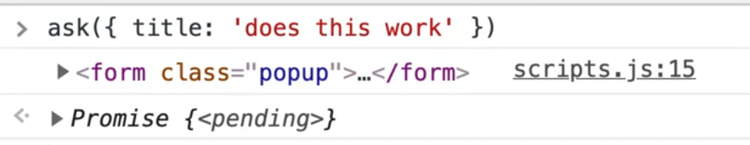

As you can see, we have the form, with a fieldset and label containing the title so we know that it works so far.

Now let's check if they want a cancel button using the options object, and if they do, go ahead and create that button.

You must specify the type of the button or else the browser will just assume it is a submit button and submit the form.

We also need to listen for a click on the cancel but for now, just add a TODO and come back to that later to keep things more simple.

```js
if (options.cancel) {
  const skipButton = document.createElement('button');
  skipButton.type = 'button';
  skipButton.textContent = 'Cancel';
  // TODO: listen for a click on that cancel button
}
```

We still need to listen for the submit event on the inputs, and resolve the data that was entered into the input box and we need to insert that popup into the DOM.

Let's do that last step first.

```js
document.body.appendChild(popup);
```


Let's get that popup showing up so we have a visual.

If you go to our CSS, you will see that we have opacity of 0 on the `popup` class.

The reason Wes has created a **CSS custom property** (or variable as it is referred to in CSS) to store the opacity value which we can then reference using the variable.


Now when we go to the popup with class of `open`, it will know to update the value of the opacity variable everywhere that it is used.

So right after we append our child, we need to take the popup's class list and add a class of `open`.

```js
document.body.appendChild(popup);
popup.classList.add('open');
```

When we click it, as you see, it is not fading itself in, which is a bit of a problem. That is back to the whole event loop that we talked about a few videos ago.


The reason it is not animating itself in is because it queues up the "add a class of `popup`" and "add a class of `open`" sort of at the same time.

There is no time for it to transition from regular popup `opacity:0` to popup open `opacity: 1`. There is no A to B to transition itself from one to another.

The solution there is to put a very small timeout before we add the `open` class.

That will stick the code that is beyond it at the end of the event loop and that is enough to give A and B a little time to transition itself.

Let's add a timeout of 10 milliseconds and then add the class of `open`.

```js
document.body.appendChild(popup);

// put a very small timeout before we add the open clicks
setTimeout(function() {
  popup.classList.add('open');
}, 10);
```

Sometimes you can even get away with doing a 0 second timeout.

Why does that work?

As we learned earlier how the event loop works is that when you have a timeout, it runs it, then sticks the callback in the Web APIs which puts it in the queue, and then the event loop will pull it back.

Sometimes you will see this where somebody puts something at a timeout of 0. All that is doing is it puts that at the end of the event loop so that the other code finishes running by the time we add our class list of open.

Wes has tested that in a few browsers but it doesn't work too great, so let's change it to 50 milliseconds instead of 0.

```js
setTimeout(function() {
  popup.classList.add('open');
}, 50);
```

Now one thing we can do is instead of using `setTimeout`, we could use `async/await`.

Let's code that `wait` function again.

```js
function wait(ms = 0) {
  return new Promise(resolve => setTimeout(resolve, ms));
}
```

Go back to where we had added the timeout and replace it instead with the code below.

```js
document.body.appendChild(popup);

// put a very small timeout before we add the open clicks
await wait(50);
popup.classList.add('open');
```

You might notice your code editor yelling at you that you have can only call `await` from an async function modify the function to make it async as shown below.

```js
function ask(options) {
  return new Promise(async function(resolve) {
```

The reason we did not mark the `ask` function itself as async is because you have to mark the parent function which is the promise callback.

Now that should work exactly the same way as it did before when you call `ask({title: ' does this work'})` from the console.

Try opening Firefox and testing it there to see if it works.

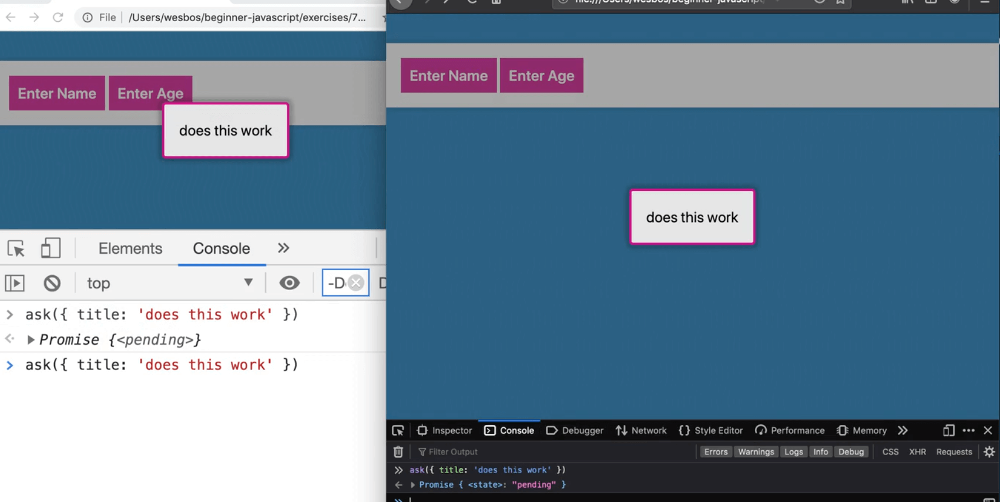

GO back to our fieldset and put the rest of the inputs there.

First we need an input with type of text, which we will name "input" and a button with type of submit.

```js
popup.insertAdjacentHTML(
  "afterbegin", `
    <fieldset>
      <label>${options.title}</label>
      <input type="text" name="input" />
      <button type="submit">Submit</button>
    </fieldset>
  `
);
```

If you refresh the page, you should see an input with the button.

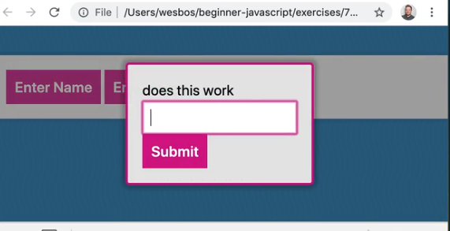

If you try to enter a value into the input and hit submit, you will see that the page refreshed and that we get the value entered in the query string of the url.


We need to use `preventDefault` to stop the form from submitting.

Before we do that, add the cancel button onto the popup if the option is passed, which we forgot to do earlier.

```js
 // check if they want a cancel button
if (options.cancel) {
  const skipButton = document.createElement("button");
  skipButton.type = "button";
  skipButton.textContent = "Cancel";
  popup.firstChild.appendChild(skipButton);
  // TODO: listen for a click on that cancel button
}
```

Run `ask({ title: "does it work" })` in the console to ensure the popup still shows up.

Also try running `ask({ title: "does it work?", cancel: true })`.

We are getting an error.

> Uncaught (in promise) DOMException: Failed to execute 'appendChild' on 'Node': This node type does not support this method.


Why is that happening?

Let's debug by logging the value of `popup.firstChild` before we call `appendChild` on it.


As you can see, it is returning text node.

If you scroll up to our code, you will see that where we created the fieldset using backticks, we had the fieldset start on a new line.

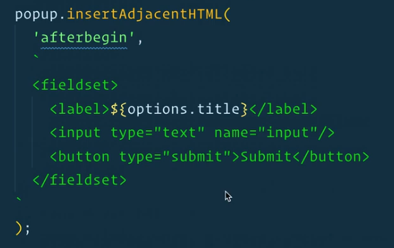

If you just modify the code so that the fieldset starts on the same line as the backtick, it will work.


What happened is when we had the fieldset start on a new line, the new line was treated as a text node.

If you recall `firstChild` will grab all the nodes, not just elements. As Wes has mentioned, if you want to just grab elements, you should use `firstElementChild` instead.

We were trying to append a DOM node to just blank text, which isn't possible, you can only append it to actual elements.

Leave the fieldset on the separate line and then modify the code to be `popup.firstElementChild.appendChild(skipButton)`.

That fixes it!

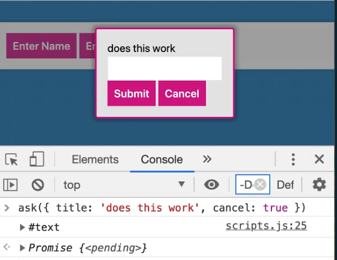

Let's also fix the fieldset so it's not on it's own line because that was sloppy formatting.

```js
popup.insertAdjacentHTML(
  "afterbegin", `
    <fieldset>
      <label>${options.title}</label>
      <input type="text" name="input" />
      <button type="submit">Submit</button>
    </fieldset>
  `
);
```

Now that we have both the buttons, let's hook up the event listeners, starting with the submit button and preventing default on the form.

Pass an anonymous function to the event listener. You could make a separate function but keeping it inside of the `ask` function as an anonymous function is fine.

```js
// listen for the submit event on the inputs
popup.addEventListener("submit", function(e) {
  e.preventDefault();
  console.log("Submitted!");
});
```


Next we want to take the value out of the input and resolve it. We have access to the `resolve` function bcause it passed as a parameter.


Because of the scope of our promise callback, the `resolve` function is available to us in the higher function.

We will call resovle and pass in `e.target.input.value` but before we do that, let's just log the target to see what we have.

```js
popup.addEventListener("submit", function(e) {
  e.preventDefault();
  console.log(e.target);
});
```

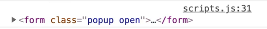

As you can see, the target is the form.

Now let's see what input is.

```js
popup.addEventListener("submit", function(e) {
  e.preventDefault();
  console.log(e.target.input);
});
```

As you can see, it returns the input with a name of input.


Remember, anytime an input has a name property, it will be available via the property on the form.

To get the value from that input, we just tack on a `.value` and then resolve that data by passing it to our resolve function like so:

```js
popup.addEventListener("submit", function(e) {
  e.preventDefault();
  resolve(e.target.input.value);
});
```

If you refresh the page and try it by calling `ask({title:'does it work', cancel:true})` in the console, entering a value in the input and pressing submit, you should see the promise in the console with the resolved value.


If we wanted to get the actual data from the input, we could just call `ask` with `await` in front of it from the console, as shown below 👇

```js
await ask({ title: 'does it work', cancel: true })
```


Now if you try pressing the submit button again, it doesn't really do anything, but that event listener is still there. You can tell that it is still there by adding a log of "Submitted" to the handler.


One neat thing about `addEventListener` is you could remove the event listener for submitted as soon as it is resolved.

### Running an Event Listener Only Once

There is a shortcut we can use where the third argument of `addEventListener` is an `options` object, and we can pass it `{once:true}`. That will tell the browser to only listen for the submit event once, and then remove the event listener.

That is very handy for things that you only want to happen once.

We want to remove the popup from the DOM entirely.

To do that, we will create a function `destroyPopup()` because we need to run it on submit and on cancel.

For now, in the code let's just call the function which we still need to create and we will pass it the popup.

```js
popup.addEventListener(
  "submit",
  function(e) {
    e.preventDefault();
    console.log("Submitted!");
    resolve(e.target.input.value);
    // remove it from the DOM entirely
    destroyPopup(popup);
  },
  { once: true }
);
```

Let's create that function above our `ask` function declaration.

Because `popup` is scoped to a different function, in order to access it within `destroyPopup`, we need to pass it as an argument.

Within the function, let's remove the class of `open` from the popup and then wait one second because we want to wait for the thing to fade out before we remove it from the DOM.

In order to be able to use `await` within `destroyPopup` we will need to mark it as async.

```js
async function destroyPopup() {
  popup.classList.remove('open');
  await wait(1000);
}
```

Then we want to remove the popup entirely. Add the code below to the `destroyPopup` function.

```js
popup.remove();
```

Before we had the `.remove()` method, we used to grab the element one level up and call `removeChild` on it and pass the popup, as shown below 👇

```js
popup.parentElement.removeChild(popup);
```

Thankfully there is now just a `.remove()` method that we can use.

If you refresh the page and then click the button and submit a value into the input, you will see the popup fades out.

Let's check one thing.

If we try to log the `popup` even after we have removed it, is it still there?

```js
popup.remove();
console.log(popup);
```

As you can see, we still have access to the popup even though it has been removed from the DOM.

That is a potential **memory leak**, because every time you pop something up, you add all these things to it, such as event listeners, and simply removing the element from the DOM does **not** remove it from JavaScript's memory entirely (because it is possible you might want to add it back).

If you do want to get rid of it entirely, just destroy any evidence of it using `popup = null;`.

You may notice in the video that Wes' ESLint is yelling at him because he has a rule to not overwrite parameters.  However, to get around that you could do something as shown below 👇

```js
async function destroyPopup(popup) {
  let myPopup = popup;
  popup.classList.remove('open');
  await wait(1000);
  // remove the popup entirely
  popup.remove();
  myPopup = null;
}
```

The reason that works is that it is all references.

If we wanted to disable that rule in eslint we could wrap it in the following comment 👇

```js
/* eslint-disable no-param-reassign */
/* eslint-enable no-param-reassign */
```

The next thing that we need to do is handle the cancel button. Let's hookup the buttons because at this point, Wes is tired of running the code from the console.

Go to the very bottom of the script and grab all the elements with an attribute of `data-question`.

```js
// select all buttons that have a question
const buttons = document.querySelectorAll('[data-question]');
console.log(button);
```

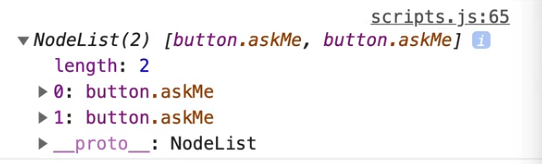

As you can see we get a node list of buttons.

Now for each button, we will listen on the click event and pass it a reference to a function `askQuestion`, which we will make soon..

```js
buttons.forEach(button => button.addEventListener('click', askQuestion));
```

Inside of `askQuestion`, just log the event.

```js
function askQuestion(e) {
  console.log(e);
}
```


As you can see, when we click the button we get the event.

Now let's grab the button that was clicked, and then save the answer.

We will need to use `await` so let's mark the function as `async`.

For the question, we will want to pass the title whatever the button text is. To do that, we can use `button.dataset.question`.

```js
async function askQuestion(e) {
  const button = e.currentTarget;
  const answer = await ask({ title: button.dataset.question });
  console.log(answer);
}
```


As you can see, when you click the popup for name and enter a name, we get the value back.

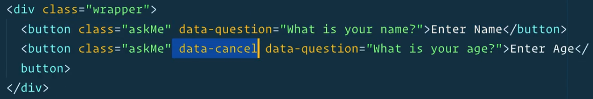

Now we need to check if someone has passed the `data-cancel` attribute.  To do this, we need to pass `cancel` to the options object we are passing to `ask`.

How do we tell if the user has passed a `data-cancel` attribute?

Let's try logging the dataset.

Add the log within `askQuestion` shown below 👇

```js
const button = e.currentTarget;
console.log(button.dataset);
```

If you refresh the page and click the age button you will see `button.dataset` logged to the console.

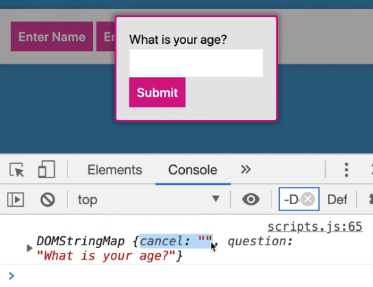

Why is `cancel` an empty string?

Because we didn't pass it as `data-cancel="true"`.

The way HTML attributes work is that simply by existing, they're true. By not existing, they are false.

In addition, trying to convert a string of "true" and "false" is a bit of a nightmare, so instead we will just pass an attribute with nothing in it if it means we should have a cancel button.

To detect if it is there we can add the code below 👇

```js
const shouldCancel = button.dataset.cancel;
const answer = await ask({ title: button.dataset.question, cancel: shouldCancel });
```

If you refresh the page and try that, does it work?

The answer is no, because `shouldCancel` is going to give us an empty string.

Is an empty string `true` or `false`?  It is falsy!

So if we are passing an empty string, it is going to be falsy.

You might think you could just put a bang in front of it as shown below 👇 but we still have the issue with an empty string being falsy.

```js
const shouldCancel = !!button.dataset.cancel;
```

So how do we detect if there is a `cancel` property within the dataset? We can check using the syntax below, because if it's not true, it won't exist .

```js
const shouldCancel = 'cancel' in button.dataset;
```

What is that syntax?

Let's say we have an object `const wes = { name: 'wes'}`.

We want to check if Wes has a name property. We are not checking that it is there, but simply that it has a name property.

```js
'name' in wes;
```

To check for that, we can use the code above 👆 which would return true.

If we check for a property that doesn't exist like `'asfdas' in wes`, it would return false.

That is how you check if a property is there on an object.

We cannot use the other methods to check because sometimes a property is set to a falsy value such as an empty string or a 0. Using the `in` syntax solves that issue.

```js
const button = e.currentTarget;
const shouldCancel = 'cancel' in button.dataset;

const answer = await ask({
  title: button.dataset.question,
  cancel: shouldCancel
});
```

Let's refactor that and rename `shouldCancel` to just `cancel` so we can use the shorthand syntax.

```js
const answer = await ask({
  title: button.dataset.question,
  cancel
});
```

_NOTE: In the video, Wes pauses it to specify that he could have used `button.hasAttribute('data-cancel');` to check for this but he decided to leave this in the video because it is a good lesson on how to check if a property on an object exists, regardless of which value it is set to._

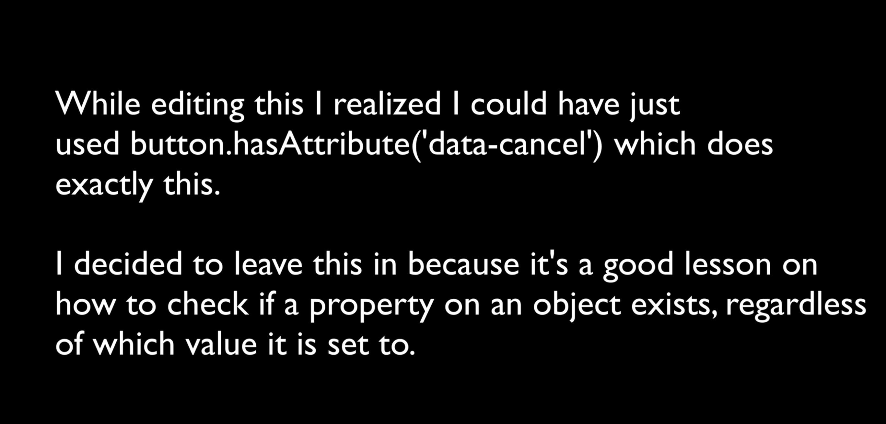

If you refresh the page, that should now work.

Let's hook up the cancel button.

Go back to where we created it and under the TODO comment we will create a callback function which resolves the promise with `null`, and then we will call `destroyPopup` because we want to completely remove the popup.

```js
skipButton.addEventListener(
  'click',
  function() {
    resolve(null);
    destroyPopup(popup);
  },
  {once:true}
);
```

If you refresh the page, you will see that it is still working.

That is the basics of the pop-up.

The last thing we will cover is how to use the popup to ask questions in series.

For example, let's say someone is going through a form and you want to popup something and ask three pieces of data before they can continue.

Let's say we had an array of questions like you see in the image below.

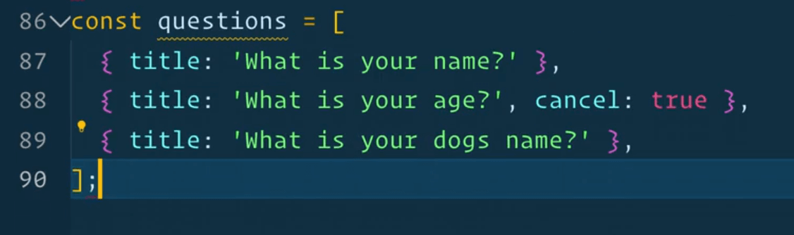

How would we ask them in series?

You might assume we could use `Promise.all()`.

For each one, we want to pass the `ask` a different question from the questions array as shown below 👇

```js
const answers = Promise.all([
  ask(questions[0]);
  ask(questions[1]);
  ask(questions[2]);
]).then(answers => {
  console.log(answers);
});
```

This is not an uncommon thing to do, waiting for few promises to resolve and then getting the answers.

We have to use the promise syntax because we are not in an async function where we are calling `Promise.all()`.

If you refresh the page and try that, you will see that the questions are asked out of order. What s happening is there are actually three popups on the page at the same time.


That is not a good solution, we do not want to pop them all up at once.

`Promise.all` will fire them all off concurrently at the same time, which is often what you want but when you want to do it sequentially like we do, you cannot use `Promise.all`.

A better way to do this would be to take your questions and map over each and pass in the `ask` function.

```js
const qPromises = questions.map(ask);
console.log(qPromises);
```

If you refresh the page and look at that in the console, you will see we have an array of three promises which have not been answered yet.


What we can do is loop over the array and for each one return a promises to get an array of promises.

Then you can wrap that in a `Promise.all()` as shown below.

```js
Promise.all(questions.map(ask)).then(data => {
  console.log(data);
});
```

That will loop over each of the questions, pipe it into the `ask` function (which will return a promise), that will return to us an array. We wrap it in a `Promise.all()` and then listen with a then. This will actually work.

We still have the problem of the UI popping up all the time so that is not what we want.

What we do want is to map over it, but asynchronously.

```js
questions.forEach(async function() {
  console.log('Asking a question');
  console.log(question);
  const answer = await ask(question);
  console.log(answer);
})
```

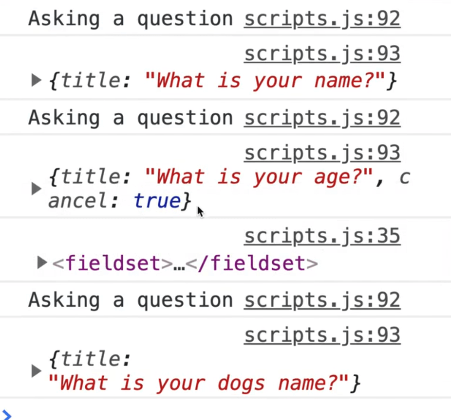

That did not wait for anything right? They will resolve, but they all three ran at the same time.

So how do we make an async map function?

We use a `for of` loop.

- Make an async function called `askMany`.
- Within that function, we will have the `for of` loop which loops through all the questions.
- Inside of the loop we will have `const answer = await ask(question);`.
- We will log the answer after it.

```js
async function askMany() {
  for (const question of questions) {
    const answer = await ask(question);
    console.log(answer);
  }
}

askMany();
```

Now when you refresh the page, you will see the questions come up one after the other and are submitted sequentially as well.


The reason for that is unlike `map` and `foreach`, `for of` allows you to pause a loop by awaiting something inside of it, which is great.

One thing Wes likes to do is make a utility function called `asyncMap` which does exactly what our function does but returns to us an array, like a map does.

We will be using generic variable names here to make the function as flexible as possible.

```js
async function asyncMap(array, callback) {
  // make an array to store our results
  const results = [];

  // loop over our array
  for (const data of array) {
    const result = await callback(item);
    results.push(result);
  }

  // when we are done the loop, return it
  return results;
}
```

Now we should be able to replace the `askMany` code, and make a new function called `go` which we will mark as async to allow us to run an await.

```js
async function go() {
  const answers = await asyncMap(questions, ask);
  console.log(answers);
}

go();
```

Now when you refresh the page and look at the results, you should see that we get our array back.


We could take things one step further and refactor the function slightly to push the await of the callback directly.

```js
async function asyncMap(array, callback) {
  // make an array to store our results
  const results = [];

  // loop over our array
  for (const data of array) {
    results.push(await callback(item));
  }

  // when we are done the loop, return it
  return results;
}
```
