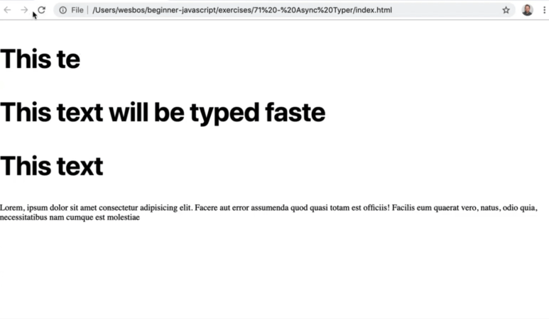
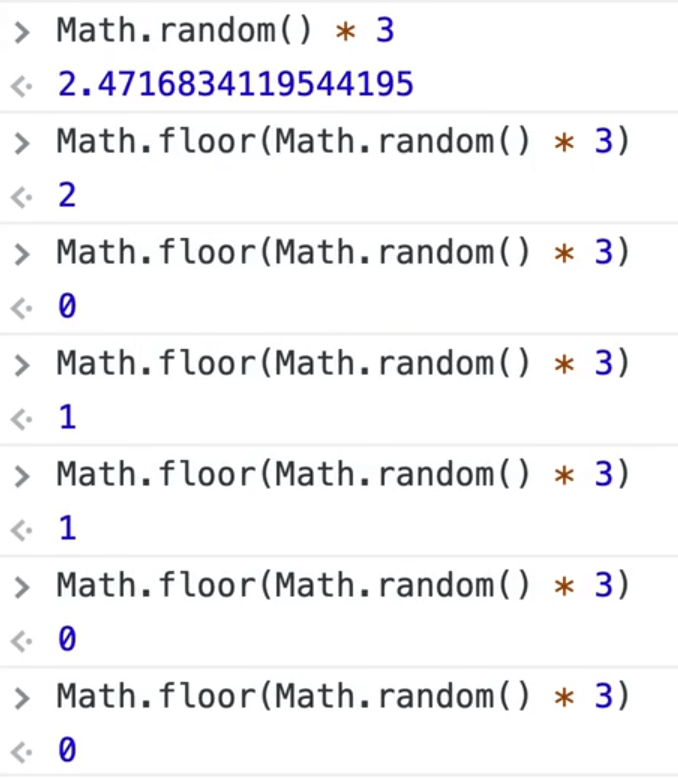
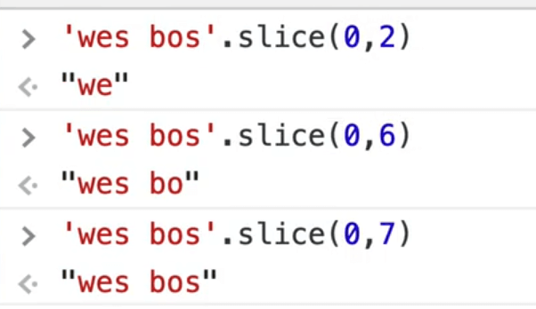

In this video we will using **async/await** and **recursion** to create the effect of someone typing at different speeds.

We will do this by taking any element with a `data-type` attribute on it, and figuring out how we can make it look like it is being typed.

We will also support the ability to pass in a `data-type-min` and a `data-type-max` attribute to specify the amount of time between each letter being typed to make it look a little more human (so instead of always typing a new letter every 10 milliseconds, there is a range).

This is a great example of asynchronous code because if it was synchronous, it would need to wait for one element's text to finish being typed before starting the next one.

Using `async`, each element can wait for a certain amount of time without interfering with each other.

We will be working out of `73 - async typer` exercise folder.

Open up the `scripts.js` file and let's start by adding our `wait` function which we have used in the last few videos.

```js
funciton wait(ms = 0) {
  return new Promise(resolve => setTimeout(resolve, ms));
}
```

Next we need a function that will return us a random number between a max and min value.

We already know that you can calculate a random number using a combination of `Math.floor` and `Math.random` like `Math.floor(Math.random() * 3)`.



But what if you want a number between 10 and 15, how would we do that?

It is basically the same thing, we just shift it up by the amount of the min.

Call `Math.random()` and multiply that by `(max - min)` and then add the min to that value.

Add defaults of 20 milliseconds for the min and 150 for the max.

```js
function getRandomBetween(min = 20, max = 150) {
  return Math.random() * (max - min) + min;
}
```

If you refresh the page and try running the code, you will see that it gives us a random number between 0 and 100.

You can also wrap that in a `Math.floor()` and that will give you a whole number.

One thing that people do not like about functions that get random numbers is that it is not a **pure function**. Pure functions are functions where every single time that you run the function with certain parameters, you will always get the same result.

A pure function is the idea that a function that takes in arguments will always, always return the exact same value. That makes testing your functions easy.

So how do you write a pure function when the thing you are trying to do is implicitly random?

You can do that by passing in a random number so you can then test it. We will replace where we use `Math.random` in the function to instead use the `randomNumber` parameter we pass in.

```js
function getRandomBetween(min = 20, max = 150, randomNumber) {
  return Math.floor(randomNumber * (max - min) + min);
}
```


This way, when you pass the arguments to the function, we will always get the same value returned.

To use this in a production application, you could do `getRandomBetween(0, 100, Math.random())` and pass the random number using `Math.random()`.

One cheat you can do is set the default for `randomNumber` to be `Math.random()` as shown below.

```js
function getRandomBetween(min = 20, max = 150, randomNumber = Math.random()) {
  return Math.floor(randomNumber * (max - min) + min);
}
```

Next we want to make a function called `draw` which will take in an element. Let's just log the element within that function for now.

```js
function draw(el) {
  const text = el.textContent;
}
```

Below that, grab the elements with a `data-type` attribute on it. For each one, we will all the `draw` method.

```js
els.forEach(el => draw(el));
```

We can refactor that code to be even shorter like so, `els.forEach(draw)`.

That works because it will call the function for us, for each one. We can take that even one step further as shown below.

```js
document.querySelectorAll('[data-type']).forEach(draw);
```

Next we want to start looping over it. We will do it twice.

The first time we will use an async for of loop and then we are going to do it again with recursion.

The way this `draw` function will work is we are going to erase all the text that is in the element and write it back in letter by letter.

First we will write `T`, then `Th`, then `Thi`, then `This` and so on for all the text within the element.

Make a variable called `soFar` which we will set to an empty string. Then we will loop over every letter of the text.

Previously for looping over letters we used a spread or we split it. But a `for of` loop has the ability to loop over text one letter at a time.

We will call the variable that represents each letter in our text variable `letter`.

```js
for (const letter of text) {

}
```

Now within the loop, we will log the letter and then on the next line we will tack the letter onto the `soFar` variable and then log that variable.

```js
function draw(el) {
  const text = el.textContent;
  let soFar = '';

  for (const letter of text) {
    console.log(letter);
    soFar += letter;
    console.log(soFar);
  }
}
```

If you take the `data-type` attribute off of the paragraph tag in the HTML and then open the console, it is easier to visualize this and how the text is slowly building up.


If we tried to set the text content of the element to `el.textContent = soFar`, when you refresh the page it happens so fast that you can barely see it.

To fix that, let's wait for some amount of time. Make the `draw` function async and then add `await wait(10);`.

```js
async function draw(el) {
  const text = el.textContent;
  let soFar = '';

  for (const letter of text) {
    console.log(letter);
    soFar += letter;
    console.log(soFar);
    await wait(10);
  }
}
```

That loops pretty cool but to make it seem more human, we will wait a random amount of time instead of 10 ms every time.

Let's do that using our random number function.

```js
const amountOfTimeToWait = getRandomBetween();
await wait(10);
```

We can now pull in the min and max values from the data attributes using `el.dataset` and destructuring. Pass the min and max values to our `random` function.

```js
const { typeMin, typeMax } = el.dataset;
const amountOfTimeToWait = getRandomBetween(typeMin, typeMax);
await wait(amountOfTimeToWait);
```

We can get rid of all the console logs we have added and put the `data-type` back on our paragraph tag.

That is how you do it with a `for of` loop.

Next we will look at how we can do this with **recursion**.

Recursion refers to this concept of a function calling itself until there is some sort of exit condition that tells it to stop.

Let's make a function we will also call draw `draw`.

The way this function will work is we will keep an index variable inside of the function and increment it once each time.

```js
function draw(el) {
  const index = 1;
  const text = el.textContent;
  const { typeMin, typeMax } = el.dataset;
}
```

Add another async function, `drawLetter`, within `draw()` to take advantage of closures because we can run a function multiple times while still accessing the variables within the `draw` function.

So the way this will work is we will start at the index and take 1 letter, then we will take 2 letters, and then 3 letters and so on using slice, and then we will update the element every single time.

```js
async function drawLetter() {
  el.textContent = text.slice(0, index);
}
```

For a quick refresher of how slice works: you pass it a starting and ending index and it will return the charactres inbetween like so.



```js
function draw(el) {
  const index = 1;
  const text = el.textContent;
  const { typeMin, typeMax } = el.dataset;

  async function drawLetter() {
    el.textContent = text.slice(0, index);
  }
}
```

Now when you run this, nothing actually happens. It doesn't actually do anything but that is because we haven't called `drawLetter`.

Let's go ahead and do that.

```js
function draw(el) {
  const index = 1;
  const text = el.textContent;
  const { typeMin, typeMax } = el.dataset;

  async function drawLetter() {
    el.textContent = text.slice(0, index);
  }

  // when this function draw() runs, kick off drawLetter
  drawLetter();
}
```

If you refresh the page you will just see the first letter which is okay because we still need to increment the index using `index = index + 1;` or `index += 1;`. And then we need to call `drawLetter()` again.

How do we do that?

Just call `drawLetter()` within our async function as shown below.

```js
function draw(el) {
  const index = 1;
  const text = el.textContent;
  const { typeMin, typeMax } = el.dataset;

  async function drawLetter() {
    el.textContent = text.slice(0, index);
    index += 1;
    drawLetter();
  }

  // when this function draw() runs, kick off drawLetter
  drawLetter();
}

document.querySelectorAll('[data-type]').forEach(draw);
```

This is the recursive part, meaning that part of the logic of `drawLetter` is to call itself. The way the code is now will create an infinite loop and will probably break the browser.

When Wes ran the code he got the following error..


Remember when we discussed the call stack previously?

What is happening is `drawLetter` is calling itself over and over again and eventually the browser complains that you have added too many things to the call stack.

What we need to do is add an exit condition: we need to check if the index is less than or equal to the length of our `text` variable, the run it again.

```js
async function drawLetter() {
  el.textContent = text.slice(0, index);
  index += 1;

  // exit condition
  if (index <= text.length) {
      drawLetter();
  }
}

// when this function draw() runs, kick off drawLetter
drawLetter();
```

Now when there are no more letters to draw, it will stop and the function will end.

If you refresh the page, it still works but it happens so quickly we don't see anything. Let's wait 10 milliseconds using the wait function which we will add above the if statement.

Now if you refresh the page you will see it's adding the text at a rate of 10 milliseconds.

We can do the same thing we did in the previous method and grab our min and max and pass it to `getRandomBetween`.

The reason why we do the calculation for the random amount of time inside of `drawLetter` is that we want every letter to be random. If we added that code at the top, the random value would only be calculated once.

```js
function draw(el) {
  const index = 1;
  const text = el.textContent;
  const { typeMin, typeMax } = el.dataset;

  async function drawLetter() {
    el.textContent = text.slice(0, index);
    index += 1;
    const amountOfTimeToWait = getRandomBetween(typeMin, typeMax);

    // exit condition
    await wait(10);

    if (index <= text.length) {
        drawLetter();
    }
  }

  // when this function draw() runs, kick off drawLetter
  drawLetter();
}
```

If you refresh the page, you will see that it still works. You could probably also do it with a While loop, but Wes would personally choose the `for of` loop but that is just a personal preference.
