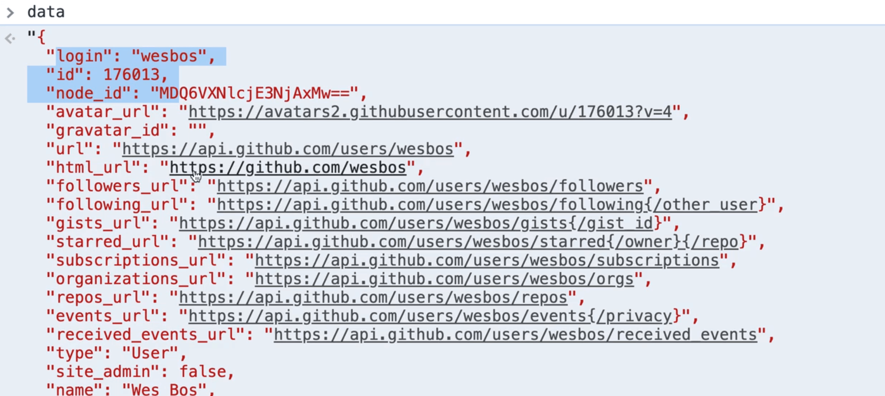
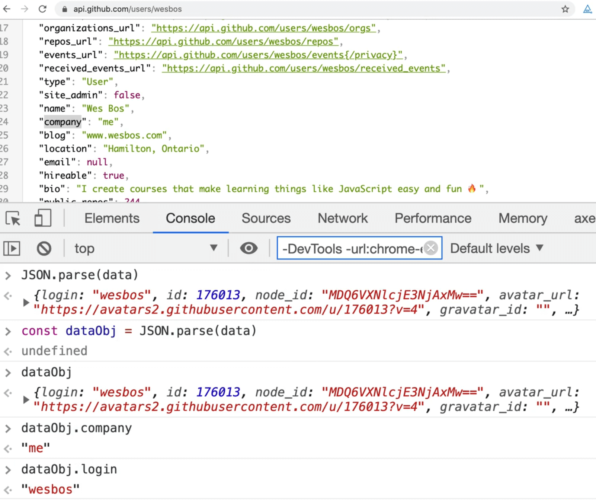
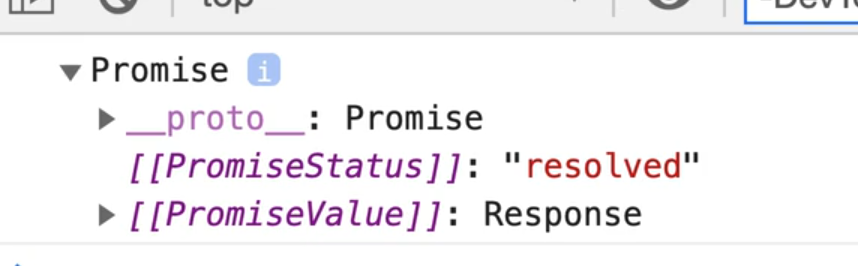
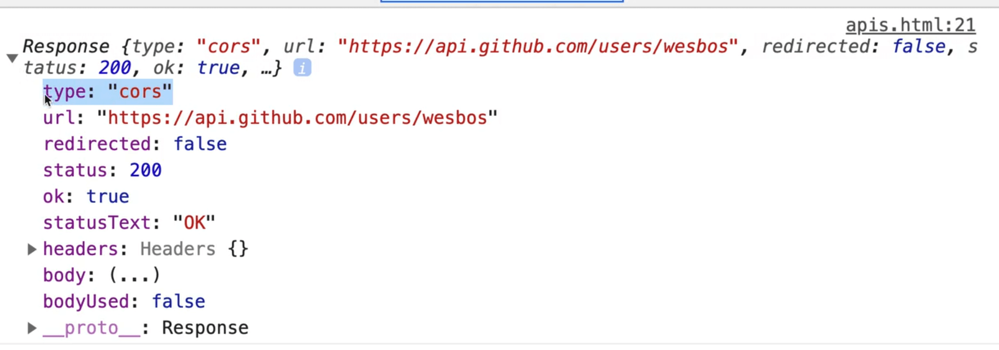
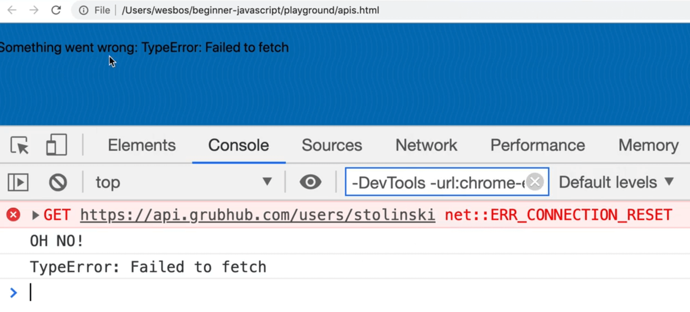

Using **async/await** and **promises** is very useful when fetching data from an **API**.

## What is an API?

**API** is a term that is thrown around a lot. It stands for **Application Programming Interface**, and it is a way to talk to a machine in a somewhat standardized procedure.

When you are building any type of app, that app, the client, needs to talk with server that exists somewhere. It does not matter if you are building a web app, mobile app etc. If you are building a web app, the app (the client) would be the web browser.

For example, if you had a twitter app, you would need to be able to pull down your most recent tweets, send tweets, like tweets, reply to tweets etc. All that functionality is based upon what is called an API.

Most services with a public facing website will try to surface their data and functionality via an API.

As a developer, a lot of our work is just pulling data from APIs.

Let's start by taking a look at how we can go to another service and pull that data into our application in order to display it.

We will go over two examples, one with pizza and one with GitHub.

The most popular way to pull data from an API is using a URL that you can hit with some associated data, like we are doing with "wesbos" in the url https://api.github.com/users/wesbos used in the Github example below.

## JSON

In the example below, the API will respond with what is called **JSON**.


We have discussed **JSON** a few times. It stands for **JavaScript Object Notation**, and it is a good way to transport JavaScript objects between servers and clients.

Open a browser and navigate to this endpoint: https://api.github.com/users/wesbos

That is part of the Github API.

_Note: in the videos, Wes is using a chrome extension that makes viewing JSON files easier called JSONViewer. If you are going to be working with JSON or APIs,Wes recommends downloading it._

Although what is returned looks like an object, it's actually just a string.

If we copy that string into the console and assign it to a variable called `data`, we can log it and access it from the console like so.



As you can see, it is just a huge string.

If you do `typeof data` it would return string.

That means that if you wanted to grab one of the properties from the data returned such `company`, if you try to use `data.company` it will return undefined because it's just a string.

The server returns a string, and it is up to us, the developers, to turn it back into a JavaScript object.

To do that, we can wrap `data` in a `JSON.parse()` and that will return to us a proper object, which we can then store in a variable.

```js
const dataObj = JSON.parse(data);
```

Now we can access the object properties using **JavaScript dot notation**.



Lots of APIs allow you to pull data from their server onto your own. There are many that do not allow it and many that require API keys (which we will go into later). For now, we will be working with wide open APIs that do not require any authentication.

In the `playground` folder and create a new file called `apis.html`.

## AJAX

You will often referred to what we are doing in this video as **AJAX**, which stands for **Asynchronous JavaScript and XML**.

We know what **asynchronous** is and JavaScript, but you may not know what **XML** is.

**XML** is another way that you can receive data and it looks a lot like HTML but is not HTML.

XML was used in the past but has generally been replaced with JSON as the preferred way to send data via APIs, but you might still encounter it. Wes has only had to work with XML once during his 12 year career.

When people say "AJAX", they mean fetching data from an API and displaying it on the page.

Open up the HTML page we created and give add the base HTML and a script tag within the body tag.

```html
<!DOCTYPE html>
<html lang="en">

<head>
  <meta charset="UTF-8">
  <meta name="viewport" content="width=device-width, initial-scale=1.0">
  <title>APIs</title>
  <link rel="stylesheet" href="../base.css">
</head>

<body>
  <script>
  </script>
</body>

</html>
```

The first thing we will do is store the URL in a variable. That is not necessary but is much easier.

Name the variable `endpoint`.

**Endpoint** is a fancy word for the URL that you need to visit in order to get the data.

```js
const endpoint = "https://api.github.com/users/wesbos";
```

In order to get that data, we will use `fetch` which exists within JavaScript. _(There are some other libraries that are used, specifically Axios but the fetch library is very good and comes built in to all browsers)._

To grab that data we will call `fetch` and then pass it the endpoint that we want to call, which will in turn return a Promise.

```js
const wesPromise = fetch(endpoint);
console.log(wesPromise);
```



To check if it worked, you can go to the network tab and refresh the page. When you do that, you will see all the requests that have happened on the page. This allows you to see when a request was sent out, and when it came back with the data.


If we want to get that data back into JavaScript, how do we do that? We can use `.then()`.

Before we do that, let's make a quick error handler first.

```js
function handleError(err) {
  console.log("OH NO!");
  console.log(err);
}
```

Fetch that data and log it to the console. 👇

```js
const endpoint = "https://api.github.com/users/wesbos";
const wesPromise = fetch(endpoint);

wesPromise
  .then((data) => {
    console.log(data);
  })
  .catch(handleError);
```



Now when you refresh the page, you will see that we no longer get a promise. Instead we get the response object you see above 👆

The response tells us the type is **CORS** which we will talk about in a second. We also have all these properties on the response object but where do we get the data?

If you expand the properties like `headers` and `body`, you won't find it.


As you can see, the data is nowhere to be found.

Before we can access the data, there is another step that needs to happen.

Right now we have the data streaming into the browser and we have assigned it to the variable `response`. At this point, the data is not fully downloaded and the data type is unknown.

The `fetch` API can be used to fetch any type of data, whether it is JSON, an image or raw text. It does not assume the response type of the data returned.

To actually get the data, you must tell the browser to convert the data from JSON to a JavaScript object once it is finished downloading.


Take a look at the prototype of the response object, and you will see that there is a number of methods on the response.

In our case, we want to use `json()`. We will return `response.json()` which will return another promise.

```js
wesPromise
  .then((response) => {
    return response.json();
  })
  .catch(handleError);
```

To get the actual data, we must chain on another `.then()` and then we can log the data.

When the page refreshes, after a split second, you should see that we have the full object logged to the console. There is no need to run `JSON.parse()` on the data because `response.json()` will take care of that.

Remember: When using `fetch`, you need to use a double promise to actually get the data. The first promise gets the response and the second one takes the response and converts it into JSON.

Now we can log information from the data we fetched.

```js
wesPromise
  .then((response) => {
    return response.json();
  })
  .then((data) => {
    console.log(data);
    console.log(data.blog);
    console.log(data.name);
    console.log(data.location);
  })
  .catch(handleError);
```


Let's go ahead and display some info about the user.

A paragraph tag to the HTML with a class of "user", and then go ahead and select it in the script tag.

```html
<body>
  <p class="user"></p>
  <script>
    function handleError(err) {
      console.log("OH NO!");
      console.log(err);
    }

    const userEl = document.querySelector(".user");
    const endpoint = "https://api.github.com/users/wesbos";
    const wesPromise = fetch(endpoint);

    wesPromise
      .then((response) => response.json())
      .then((data) => {
        console.log(data);
        console.log(data.blog);
        console.log(data.name);
        console.log(data.location);
        userEl.textContent = `${data.name} - ${data.blog}`;
      })
      .catch(handleError);
  </script>
</body>
```


As you can see, it pops up.

One other thing you can do is set the text content of the element as loading before we replace it with the data, so for a split second you will see "loading...".

Add the following code 👇

```js
userEl.textContent = "loading....";
const wesPromise = fetch(endpoint);
```

Now let's refactor this to use **async/await**.

Create an async function called `displayUser` which takes in a `username`. Take all the code we wrote after selecting the element and put it into the `displayUser` function.


Now let's go line by line. Leave the first line as is.

The promise where we fetch the endpoint can now be switched to `await` and that no longer is a Promise but is a response. Then we can get the data by awaiting `response.json()` like so 👇

```js
async function displayUser(username) {
  userEl.textContent = "loading...";

  const response = await fetch(endpoint);
  const data = await response.json();

  console.log(data);
  console.log(data.blog);
  console.log(data.name);
  console.log(data.location);
  userEl.textContent = `${data.name} - ${data.blog}`;
}
```

The only thing left is to call `displayUser` on page load.

Let's go ahead and do that to display the user.

Replace the `endpoint` variable with `baseEndpoint` and make another variable for the `usersEndpoint` like so 👇

```js
const baseEndpoint = "https://api.github.com";
const usersEndpoint = `${baseEndpoint}/users`;
```

To fetch the username that was passed in, modify the code like so 👇

```js
const response = await fetch(`${usersEndpoint}/${username}`);
```

That modification allows us to generate the endpoint on the fly based on what username was passed in as an argument.

To test this, let's try calling it from the bottom of our script tag with the user `stolinski`.

```html
<script>
  const baseEndpoint = "https://api.github.com";
  const usersEndpoint = `${baseEndpoint}/users`;
  const userEl = document.querySelector(".user");

  async function displayUser(username) {
    userEl.textContent = "loading...";

    const response = await fetch(`${usersEndpoint}/${username}`);
    const data = await response.json();

    console.log(data);
    console.log(data.blog);
    console.log(data.name);
    console.log(data.location);
    userEl.textContent = `${data.name} - ${data.blog}`;
  }

  function handleError(err) {
    console.log("OH NO!");
    console.log(err);
  }

  displayUser("stolinski");
</script>
```

One thing we are not doing is catching the error so if something went wrong, such as a typo in the url assigned to `baseEndpoint`.

To fix that, let's add a catch and pass it our error handler function like so 👇

```js
displayUser("stolinski").catch(handleError);
```


_🔥HOT TIP: You can filter out just AJAX request from the Network tab by clicking XHR. 👇_


Next let's modify the `handleError` function to show the error by replacing the paragraph text content.

```js
function handleError(err) {
  console.log("OH NO!");
  console.log(err);
  userEl.textContent = `Something went wrong: ${err}`;
}
```



We wil do one more example in the next lesson.

## Public API list

It is hard to find good APIs that are public and don't require API keys. There is a good list of them in the github repo https://github.com/public-apis/public-apis


You can scroll through and find different APIs for all different things.
