In this video we will build a currency conversion app.


The app allows you to enter an amount to convert, specify it's currency and then specify which currency to convert it to.

We will be using the https://exchangeratesapi.io API to accomplish this, which is free and open source and will be working out of the `exercises/77 - Currency Converter/` folder.

Let's start by opening the HTML to see what we are working with.

```html
<body>
  <div class="app">
    <form>
      <input type="number" name="from_amount" />
      <select name="from_currency">
        <option>Select a Currency</option>
      </select>
      <p>in</p>
      <select name="to_currency">
        <option>Select a Currency</option>
      </select>
      <p>is</p>
      <p class="to_amount">$0</p>
    </form>
  </div>

  <script src="./money.js"></script>
</body>
```

As you can see we have a form with..

- an input named `from_amount`
- a selectbox named `from_currency` and one named `to_currency`
- a paragraph tag with the class of `to_amount`

You will notice there are no options currently for the `from` or the `to` currency, because that will be populated on page load.

We have a script source tag right before the closing body tag.

If you open up `money.js`, you will see that Wes has already given us just a list of currencies, which is the currency code translated to their English version.

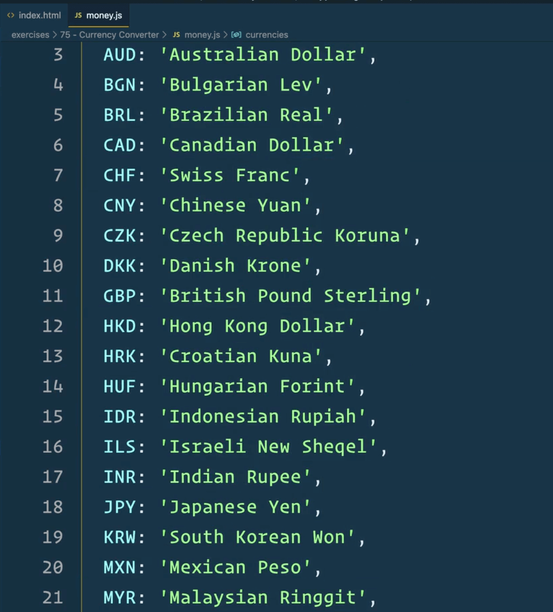

Let's start by converting those currencies so we can populate them.

In `money.js`, after the `currencies` object, make a function called `generateOptions` which will accept one parameter, `options`, which will be an object.

Add the following code so it runs on page load and refresh the page.

```js
const optionsHTML = generateOptions(currencies);
console.log(optionsHTML);
```

Let's go back to looping. How do you loop over an object?

We can use:

- the `for of` loop
- `Object.entries`
- `Object.keys`
- `Object.values`

Let's use `.entries` to turn this object into an array, like so 👇

```js
function generateOptions(options) {
  return Object.entries(options);
}
```

If you refresh the page, you will see that gives us an array, where each item inside of the array is another array, the first time of which is the currency code and the second item being the label.


Let's take that array and map over it so we get the nested array, and then log it. 👇

```js
function generateOptions(options) {
  return Object.entries(options).map((arr) => {
    console.log(arr);
  });
}
```

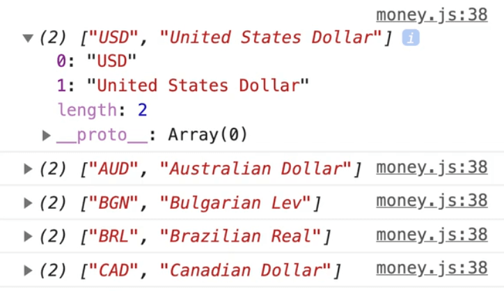

We can destructure each sub-array to two variables:

- `currencyCode`
- `currencyName`

```js
function generateOptions(options) {
  return Object.entries(options).map(([currencyCode, currencyName]) => {
    console.log(currencyCode, currencyName);
  });
}
```

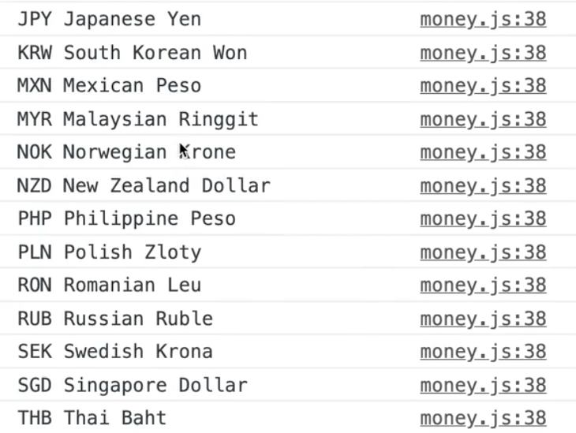

As you can see, it is looking good, except the array is undefined because we are not returning anything, so let's change that and return some HTML using backticks.

```js
function generateOptions(options) {
  return Object.entries(options).map(([currencyCode, currencyName]) => {
    return `<option value="${currencyCode}">${currencyCode} - ${currencyName}</option>`;
  });
}
```

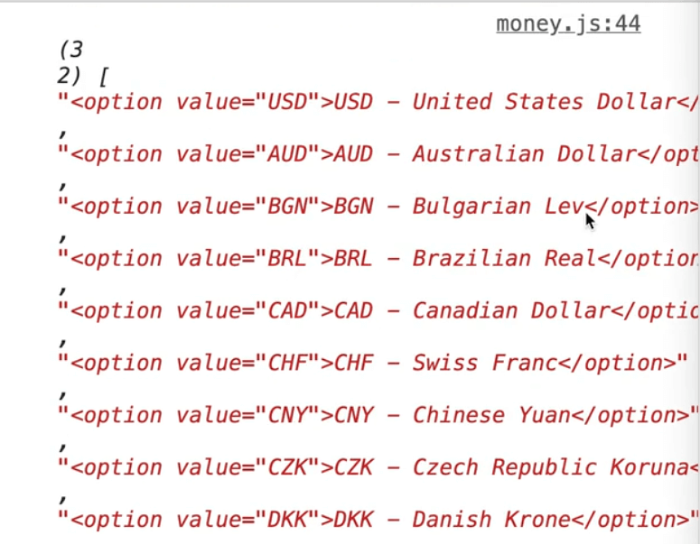

Now the `optionsHTML` variable contains an array of HTML options.

At the end of `map`, add `.join('')`, which should turn the array into one long string of HTML. 👇

```js
function generateOptions(options) {
  return Object.entries(options)
    .map(([currencyCode, currencyName]) =>
        `<option value="${currencyCode}">${currencyCode} - ${currencyName}</option>`)
    .join("");
}
```

On page load, let's populate the option elements.

First go to the top of the page and select those elements.👇

```js
const fromSelect = document.querySelector('[name="from_currency"]');
const fromInput = document.querySelector('[name="from_amount"]');
```

At the bottom of the page, add the following code.

```js
const optionsHTML = generateOptions(currencies);
// populate the options elements
fromSelect.innerHTML = optionsHTML;
toSelect.innerHTML = optionsHTML;
```

We are populating both options with the exact same list. That is why we put `optionsHTML` in a variable, so that we would not unnecessarily run that function twice.

Now when you refresh, you will see that each option has a dropdown. 👇

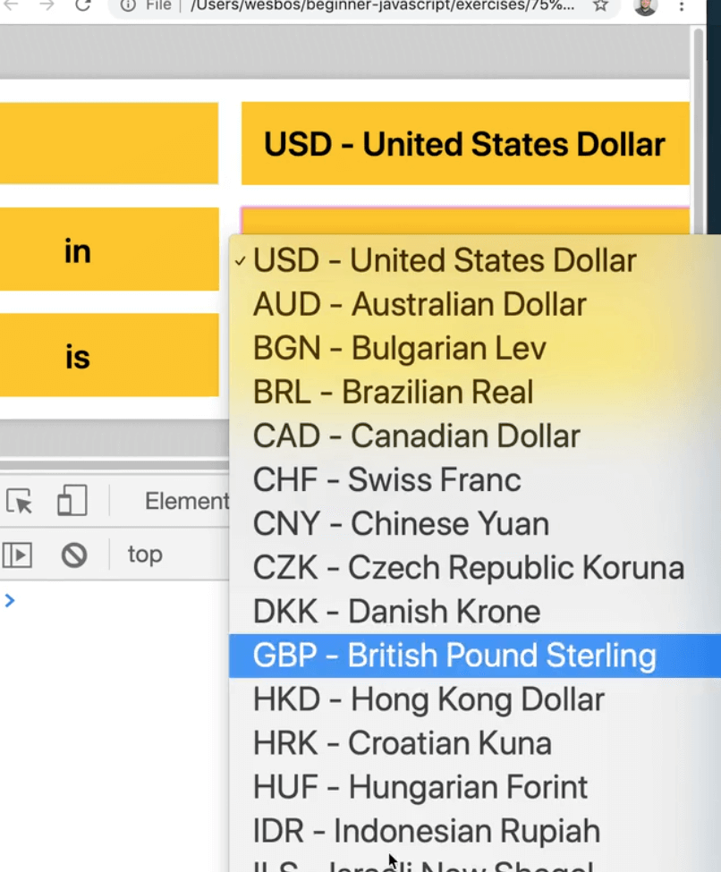

Let's switch to working on some of the functionality before we continue coding the UI any further.

Start with the function that will go fetch the rates from the exchanges API. It will accept one parameter, `base` which we will default to "USD" as the base currency.

Inside of the function, we need to fetch the latest rates from https://api.exchangeratesapi.io/latest.

Stick that endpoint in a variable at the top.

```js
const endpoint = "https://api.exchangeratesapi.io/latest";
```

The way this endpoint works is we need to pass it a query parameter of our base currency, as shown in the image below.

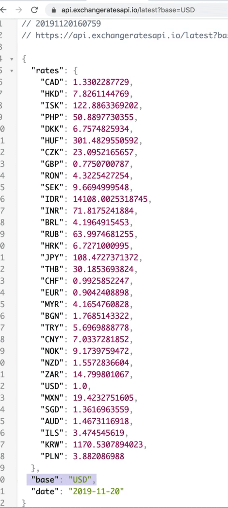

That will return the exchange rates to us as well as the base currency.

```js
async function fetchRates(base = "USD") {
  const res = await fetch(`${endpoint}?base=${base}`);
  const rates = await res.json();
  console.log(rates);
}
```

If you open the browser and try to run `fetchRates()` from the console, it will return to us a promise immediately because it is an async function, and then it will resolve and log our rates.


You can try passing the base currency as "CAD" and it should still work.


Let's wrap that function up by returning `rates` from it.

```js
async function fetchRates(base = "USD") {
  const res = await fetch(`${endpoint}?base=${base}`);
  const rates = await res.json();
  return rates;
}
```

The next thing that we want to do is make a convert function. The function will take in:

- a raw number
- a "from" currency
- a "to" currency

If we do not have the rates for that specific currency, we will have to use `fetchRates` to go ahead and fetch it.

Make that `convert` function like so 👇

```js
function convert(amount, from, to) {
  // first check if we even have the rates to convert from that currency
}
```

## Caching the Rates

Here is where that exercise gets a little tricky.

We could fetch the rates each time, but that could be a bit slow, because every time we type into the `amount` input box, we will call `convert` function.

In the demo, you can see that the conversion is happening almost instantaneously.


If we had to fetch the rates every single time someone typed into the box, for the number 57887 alone, we would be fetch the rate 5 times unnecessarily, and often APIs will rate limit you.

So what we need to do to get around that is cache the rates, meaning you need to hold on to them, if you already have them. There are different techniques you can do like delete rates every minute to ensure we have the latest data.

What we are going to do is we will make an object at the top of our script where the rest of our variables are and right below the endpoint let's add this empty object 👇

```js
const ratesByBase = {};
```

We will store all of the rates within that object/ Every time a currency is selected to be converted, we will check whether we already have the rates within our `ratesByBase` object. If we do not, we will fetch it and save it to our object.


If we were to cycle through all the currencies, our `ratesByBase` object would be massive because it will contain all of the rates by their from value. So by default we start with nothing because we have nothing.

## Converting

Let's go back to our `convert` function.

We will use the square brackets to check if the currently select currency coded already existing within our object.

```js
function convert(amount, from, to) {
  // first check if we even have the rates to convert from that currency
  if (!ratesByBase[from]) {
    console.log(`Oh no! we don't have ${from} to convert it ${to}, so let's go get it!`);
  }
}
```

If you refresh the page, you can try running what we have so far from the console.


Back to our `convert` function, we want to mark it as `async` because we will need to fetch the rate if it does not already exist.

Within that function let's add a request to `fetchRates` and pass it the currency the user is converting from. We will save the result to our `ratesByBase` object.

```js
async function convert(amount, from, to) {
  // first check if we even have the rates to convert from that currency
  if (!ratesByBase[from]) {
    console.log(`Oh no! we don't have ${from} to convert it ${to}, so let's go get it!`);
    const rates = await fetchRates(from);
    console.log(rates);
    // store them for next time
    ratesByBase[from] = rates;
  }
}
```

Let's demo step by step how that works.

 Start by logging `ratesByBase` in the console, which you will see is an empty object.


If we run `convert(100, 'CAD', 'USD')` in the console, we will see the message stating we don't have it but are fetching it.

Now if we check the `ratesByBase` object, we will see those rate values within the object. If you were to run the same convert function again, you will see it does not refetch them because the values already exist within `ratesByBase`.


As soon as you refresh the page, they will be gone. You could use local storage to save those but we will just do page load for this exercise.

Next, we need to convert the amount the user passed in.

```js
function convert(amount, from, to) {
  // first check if we even have the rates to convert from that currency
  if (!ratesByBase[from]) {
    console.log(`Oh no! we don't have ${from} to convert it ${to}, so let's go get it!`);
    const rates = await fetchRates(from);
    console.log(rates);
    // store them for next time
    ratesByBase[from] = rates;
  }

  const rate = ratesByBase[from].rates[to];
}

```

That may look weird so let's explain what is going on in this code.

```js
const rate = ratesByBase[from].rates[to];
```

If we look at our `CAD` property on `ratesByBase`, that is going to be our "from" .

Inside of that, we need to grab the rates and the find the rate that they are converting to. You could do that like so: `ratesByBase.CAD.rates.USD`.

But because those property keys are variables within our function, we need to use square brackets to access those object properties.

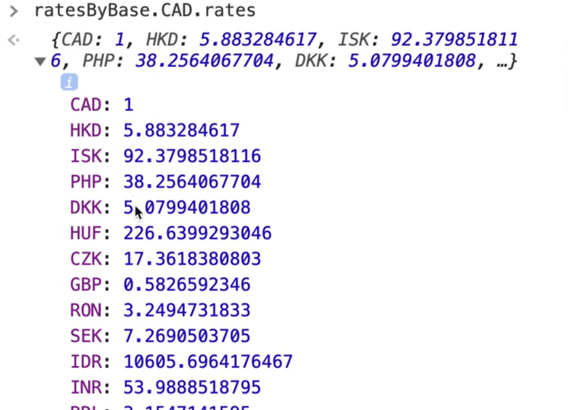

Now we will take that `rate` and calculate the `convertedAmount` like so 👇

```js
function convert(amount, from, to) {
  // first check if we even have the rates to convert from that currency
  if (!ratesByBase[from]) {
    console.log(`Oh no! we don't have ${from} to convert it ${to}, so let's go get it!`);
    const rates = await fetchRates(from);
    console.log(rates);
    // store them for next time
    ratesByBase[from] = rates;
  }

  const rate = ratesByBase[from].rates[to];
  const convertedAmount = rate * amount;
  console.log(`${amount} ${from} is ${convertedAmount} in ${to}`);
  return convertedAmount;
}
```

If you refresh the page and try that, you should see something like the following..

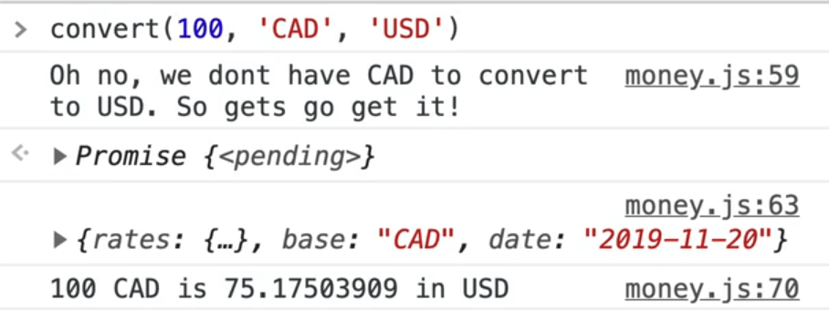

At this point, we have built the main functionality of the app so at this point we can start hooking it up to our UI.

## Hooking Up The UI

There are three inputs that we need to listen on:
- the amount,
- 2 currency select inputs

### Input Event on a Form

There is a trick we can use here, which is listening for an input event on the form. That one event will cover all of them, which is pretty cool.

Let's go up to the top of our script file and select the form.

```js
const form = document.querySelector('.app form');
```

At the very bottom of the script tag, add an event listener which will listen for the `input` event and handle it in a function we will define called `handleInput`, like so 👇

```js
form.addEventListener('input', handleInput);
```

Let's define that `handleInput` function, and for now just log `e.target` and `e.currentTarget` to see what we are working with.

```js
function handleInput(e) {
  console.log(e.target);
  console.log(e.currentTarget);
}
```

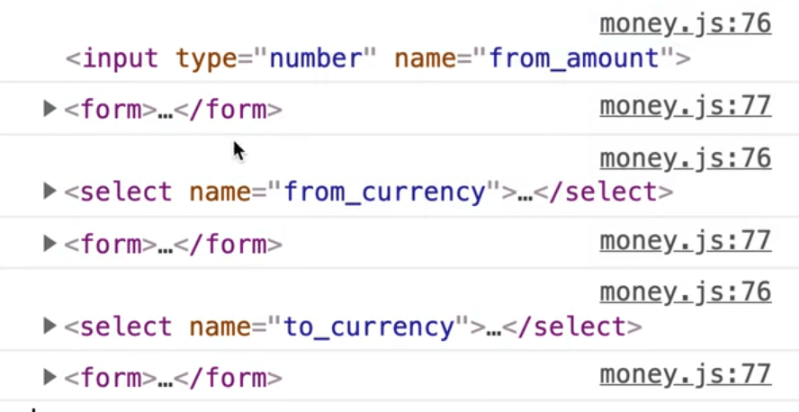

If you refresh the page and try typing into the amount input or selecting an item from the drop downs, you will see that `e.target` is changing every time but `e.currentTarget` which is the form stays the same.

That is because we are listening to the event on the form, but the actual event happens on the input or select box.

Those events bubble up to the form where we handle them in our `handleInputs`.

So remember that trick, you can listen on the "input" event on a form and that will cover all of your inputs that are inside of that form.

### Wiring up Handlers

Let's start wiring up the handler to call our functions.

We forgot to grab our "amount" input, so let's go ahead to the top of the page and add that.

```js
const fromSelect = document.querySelector('[name="from_currency"]');
const toSelect = document.querySelector('[name="to_currency"]');
const fromInput = document.querySelector('[name="from_amount"]');
```

Now let's make `handleInput` an async function so we can call `convert`. We can pass the variables easily using the value of the three inputs like so 👇

```js
async function handleInput(e) {
  const rawAmount = await convert(
    fromInput.value,
    fromSelect.value,
    toSelect.value
  );

  console.log(rawAmount);
}
```

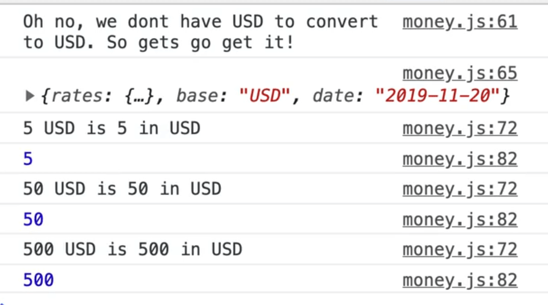

If you refresh the page and try entering an amount into the "from_amount" input, you should see something like shown above 👆 logged in the console.

Now we need to actually show that amount in the `to_amount` paragraph tag.


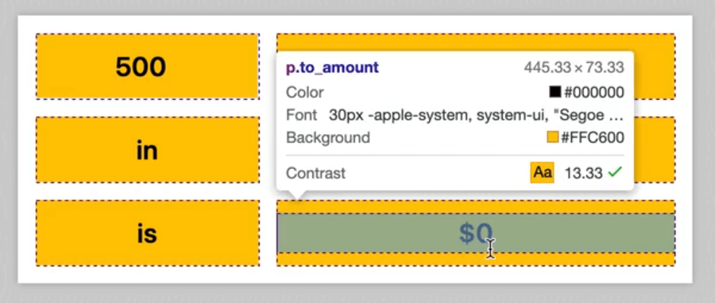

Let's go back to the top of our page and select that element and name it `toEl`.

```js
const fromSelect = document.querySelector('[name="from_currency"]');
const toSelect = document.querySelector('[name="to_currency"]');
const fromInput = document.querySelector('[name="from_amount"]');
const toEl = document.querySelector('.to_amount');
```

Now within `handleInput`, let's update the element to show the converted amount. 👇

```js
async function handleInput(e) {
  const rawAmount = await convert(
    fromInput.value,
    fromSelect.value,
    toSelect.value
  );

  toEl.textContent = rawAmount;
}
```

If you refresh the page and test it out, you should see the `to_amount` value updating.

Try changing the "to currency" and the "from currency" to ensure the value is still updating.

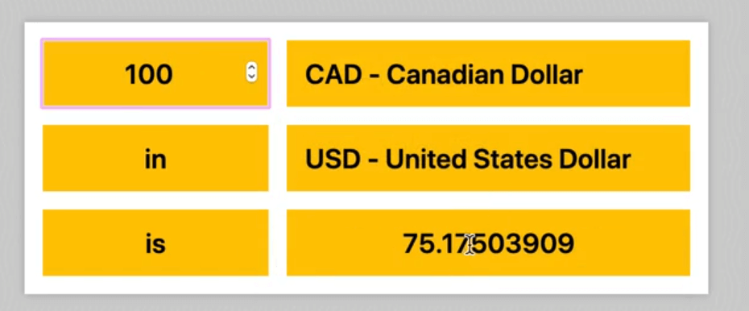

### Formatting Currency using Number Format API

The problem we have now is that it is not formatting it accordingly to what the locale is.

Money is New Zealand Dollars (NZD), or money in Indian Rupee (INR), may be formatted differently. Some currencies support cents, some do not.

We will use this really cool API called Number Format, and it knows how to handle currency formatting, which is really cool.

Make a function `formatCurrency` which will take in the amount and the currency and return a formatted number.

We will be using the `Intl.NumberFormat()` method which takes in an argument of the language of the reader `Intl.NumberFormat("en-us")`, or if you leave it blank it will detect the language based no the browser, which is almost always what you want.

We will leave it blank.

And as the second argument you pass it an options object.

Within that object we will pass a value for the `style` property which will be `'currency'`, since we want to format the amount as a currency, and then we need to pass the currency argument which we can do using the shorthand since both the property and value have identical names.


The code highlighted above is the "formatter", and then the method is just a `.format()` method on the formatted to which you pass your amount like so:

```js
function formatCurrency(amount, currency) {
  return Intl.NumberFormat({
    style: 'currency',
    currency
  }).format(amount);
}
```

So now instead of just setting the `toEl` value to `rawAmount` we will modify it like so:

```js
async function handleInput(e) {
  const rawAmount = await convert(
    fromInput.value,
    fromSelect.value,
    toSelect.value
  );

  toEl.textContent = formatCurrency(rawAmount, toSelect.value);
}
```

Refresh the page and check whether that works.


Unfortunately that does not seem to be working. Let's look at the console to debug.

When Wes runs into a problem like this, when there are many things calling each other, he just works on them one by one.

Lets start by testing `formatCurrency` in the console.


We do not get the formatted amount back. Try manually passing the locale to `Intl.NumberFormat` method.

Modify the code like below to include it.

```js
function formatCurrency(amount, currency) {
  return Intl.NumberFormat("en-US", {
    style: 'currency',
    currency
  }).format(amount);
}
```

Now if you refresh it, it should be working.


