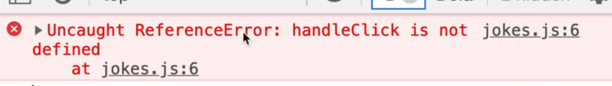
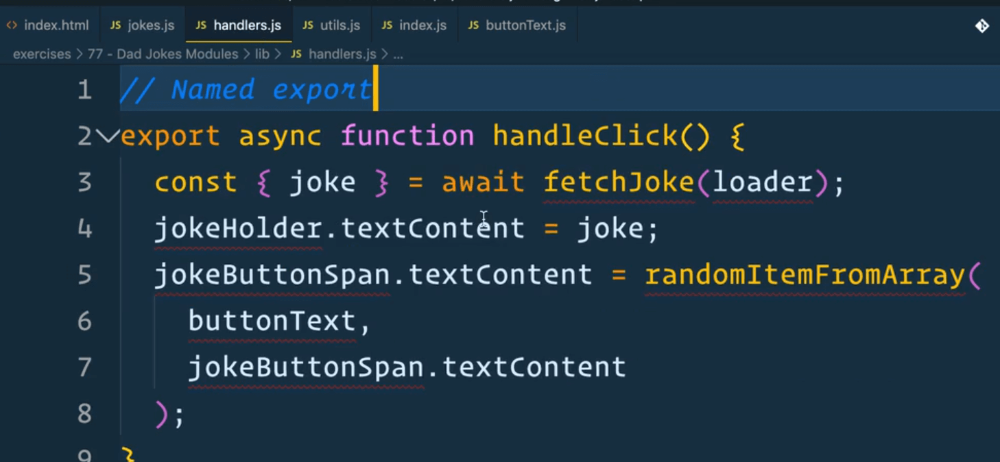
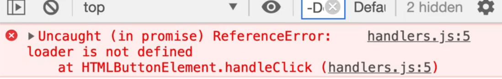
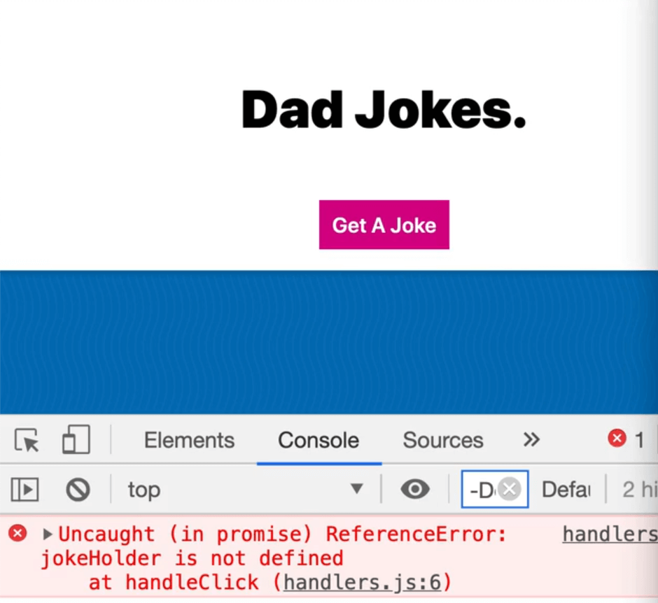
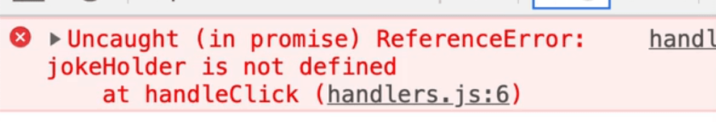
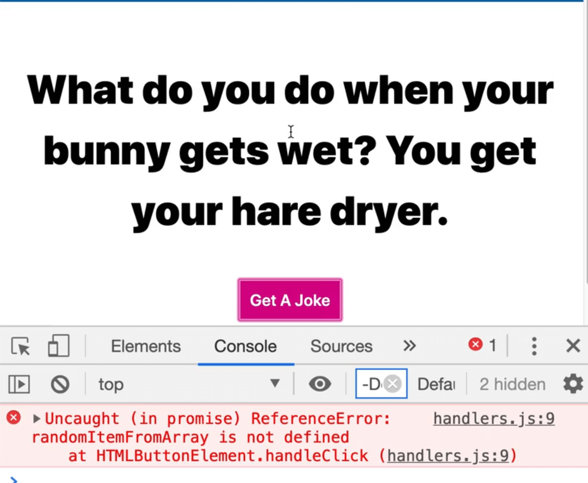
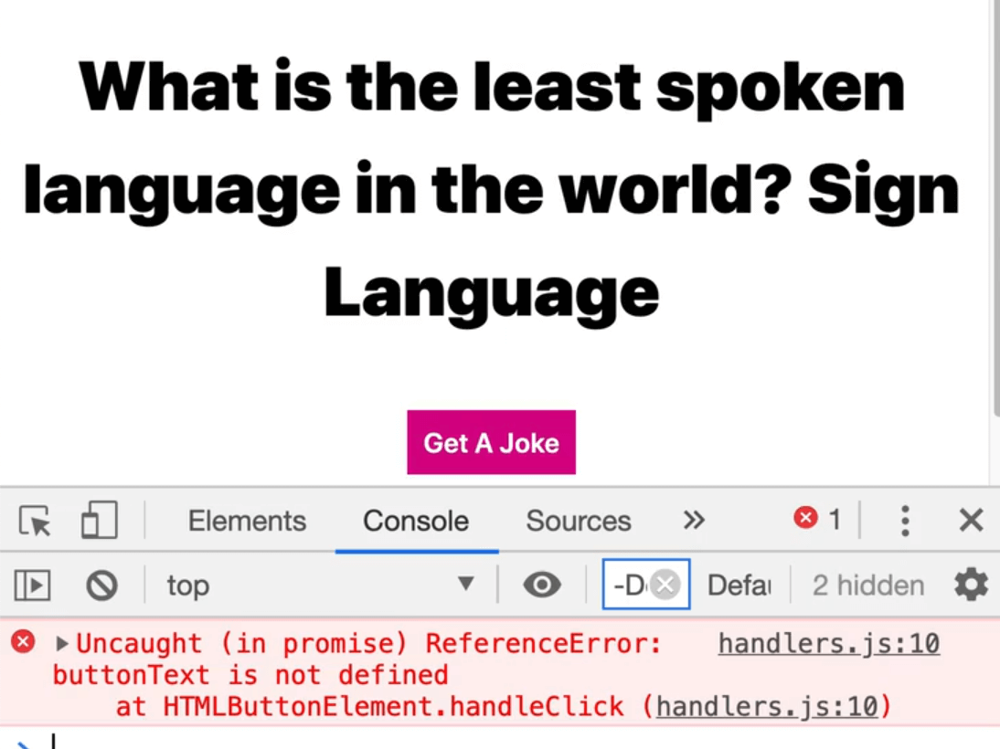

In this lesson we will refactor our dad jokes exercise so you can see how Wes would structure it.

1. Start by duplicating the `76 - Dad Jokes` folder within the `exercises/` directory and renaming it to `80 - Dad Jokes Modules`.
1. Take all the code in `jokes-FINISHED.js` and put it `jokes.js` and then delete the finished version of the file.
1. Convert this exercise to use modules by first putting an attribute of `type="module"` on the script tag on the HTML page.
1. Run the exercise under a server which we can do in VS Code by right clicking the file in VS Code and selecting "open with live server".

Now when the server loads, the dad jokes app should be working as expected.

Let's start the refactor by first looking at the code within `jokes.js`, and then we can begin splitting it out line by line, function by function.

```js
// jokes.js
const jokeButton = document.querySelector(".getJoke");
const jokeButtonSpan = jokeButton.querySelector(".jokeText");
const jokeHolder = document.querySelector(".joke p");
const loader = document.querySelector(".loader");

const buttonText = [
  "Ugh.",
  "🤦🏻‍♂️",
  "omg dad.",
  "you are the worst",
  "seriously",
  "stop it.",
  "please stop",
  "that was the worst one",
];

async function fetchJoke() {
  // turn loader on
  loader.classList.remove("hidden");
  const response = await fetch("https://icanhazdadjoke.com", {
    headers: {
      Accept: "application/json",
    },
  });

  const data = await response.json();
  // turn the loader off
  loader.classList.add("hidden");
  return data;
}

function randomItemFromArray(arr, not) {
  const item = arr[Math.floor(Math.random() * arr.length)];

  if (item === not) {
    console.log("Ahh we used that one last time, look again");
    return randomItemFromArray(arr, not);
  }

  return item;
}

async function handleClick() {
  const { joke } = await fetchJoke();
  jokeHolder.textContent = joke;
  jokeButtonSpan.textContent = randomItemFromArray(
    buttonText,
    jokeButtonSpan.textContent
  );
}

jokeButton.addEventListener("click", handleClick);
```

## Refactoring into Modules

The entry point to our JavaScript will be `jokes.js` because that is what we have linked on the HTML page.

In the entry point, Wes like to do his selecting and event listeners but everything else, all of the data, functionality, utilities and handlers will all be in separate files in their own modules. We will use this approach.

Starting at the top of `jokes.js`, the first 4 lines of code are simply selecting elements, so let's leave those for now.

Where should we put the `buttonText` variable?

Sometimes people will organize their code into folders, so to demonstrate that, we will put this in a folder called `data`, which you need to create.

Within the folder, add a file called `buttonText.js`. Copy and paste the buttonText variable in that file.

_We will worry about importing and exporting these functions between modules later, for now we just want to get all of the different functions into their own files._

Next is the `fetchJoke` function.

That is core to what the application does so often people will make a `lib` folder for this. Make that folder.

_(Note: you don't have to do this, Wes personally finds it confusing when people have hundreds of folders for organization sakes. Feel free to just make files in the root directory or organize your files however you like. Wes suggests starting simple and the coming back and refactoring if you need more organization.)_

Within that new folder, create a file `index.js` which will contain all of the library JavaScript.

Copy and cut the `fetchJoke` function into the `index.js` file.


Once you do that, you may notice that in your VS Code that the loader variable within `fetchJokes` is underlined as red. VS Code is complaining because the function requires the loader, but we have not passed it a reference to the loader in this file. Due to modules have their own scope, we are no longer able to reference the `loader` variable from the `jokes.js` module.

There are 2 ways we can fix this:

- we can either select the loader within that function
- we can pass it in as a parameter.

We will pass it as a parameter, and export the function as a named function.

```js
// lib/index.js
// named export, you can have lots of these
export async function fetchJoke(loader) {
  // turn loader on
  loader.classList.remove("hidden");
  const response = await fetch("https://icanhazdadjoke.com", {
    headers: {
      Accept: "application/json",
    },
  });

  const data = await response.json();
  // turn the loader off
  loader.classList.add("hidden");
  return data;
}
```

Next modify the function that calls `fetchJoke` so it can pass the loader 👇

```js
// money.js
async function handleClick() {
  const { joke } = await fetchJoke(loader);
  jokeHolder.textContent = joke;
  jokeButtonSpan.textContent = randomItemFromArray(
    buttonText,
    jokeButtonSpan.textContent
  );
}
```

Earlier when we created the `buttonText` file, we forgot to export it. Go back to `buttonText` and make it a default export.

```js
// data/buttonText.js
const buttonText = [
  "Ugh.",
  "🤦🏻‍♂️",
  "omg dad.",
  "you are the worst",
  "seriously",
  "stop it.",
  "please stop",
  "that was the worst one",
];

// default export, you can only have one.
export default buttonText;
```

Why did we put the `buttonText` in it's own file? Unlike with the `index.js` file and `lib` folders which may contain multiple functions, `buttonText.js` is likely not doing to have any other functionality, so we can just make it the default export of it's own file.

The next function is `randomItemFromArray`, which is a utility function. Inside of the `lib` folder, create the file `utils.js`.

People will often make an entire folder dedicated to utils, it doesn't matter, go with what you prefer. Wes likes to make a `utils.js` file and stick anything in there and then if it gets too large, he will break it up into separate functions. We will go with that approach.

```js
// lib/utils.js
// named export
export function randomItemFromArray(arr, not) {
  const item = arr[Math.floor(Math.random() * arr.length)];

  if (item === not) {
    console.log("Ahh we used that one last time, look again");
    return randomItemFromArray(arr, not);
  }

  return item;
}
```

Next up is `handleClick`.

Make another file in `lib` called `handlers.js`. Copy and cut the `handleClick` function out of `jokes.js` and put it the new file.

```js
// lib/handlers.js
// named export
async function handleClick() {
  const { joke } = await fetchJoke();
  jokeHolder.textContent = joke;
  jokeButtonSpan.textContent = randomItemFromArray(
    buttonText,
    jokeButtonSpan.textContent
  );
}
```

## Fixing Refactoring Errors

At this stage of the refactor, the code will be pretty broken.

Wes approaches it either by going through the errors in the console, or by ESLint errors. We will go with the former.

If you open the console, the first error you should see in the console is a reference error warning that `handleClick` is not defined.



Earlier we moved `handleClick` into our `handlers.js` module. Now if we need to access the function in another file, we must first import it, like so 👇

```js
// jokes.js
import { handleClick } from "./lib/handlers.js";

const jokeButton = document.querySelector(".getJoke");
const jokeButtonSpan = jokeButton.querySelector(".jokeText");
const jokeHolder = document.querySelector(".joke p");
const loader = document.querySelector(".loader");

jokeButton.addEventListener("click", handleClick);
```

When the page refreshes now, the console is not showing any errors but if you click the button, you should see an error logged complaining that `fetchJoke` is not defined.




As you can see above, the `fetchJoke` function is used within `handleClick`. How do we make it available within `handleClick`?

Do we....

- import `fetchJoke` in our `jokes.js` entry point?

or

- import `fetchJokes` into our `handlers.js` module?

The answer is you always import it where you need it, even if you have already imported it into another file.

For example, even if we imported `fetchJoke` in `jokes.js` and tried to refresh the page and click the button, we would see get the error `fetchJoke` is not defined.

Why is that?

Even though we imported it into our entry, we still have to import it where we need it to give the other modules reference to it.

There is no point of importing it into our entry file right now because we are not using it anywhere in the page. _There is no sense in importing things into a file where they are not used._

You simply import it where you need it. Go ahead and do that in `handlers.js`.

```js
// lib/handlers.js
import { fetchJoke } from "./index.js";

// named export
async function handleClick() {
  const { joke } = await fetchJoke();
  jokeHolder.textContent = joke;
  jokeButtonSpan.textContent = randomItemFromArray(
    buttonText,
    jokeButtonSpan.textContent
  );
}
```



The next error is complaining that loader is not defined within `handlers.js`.

Earlier we modified the `fetchJoke` function to accept a reference to the loader, but now we are calling it from a separate file.

How do we pass it? We can pass it as an argument to `handleClick` like so 👇

```js
// jokes.js
import { handleClick } from "./lib/handlers.js";

const jokeButton = document.querySelector(".getJoke");
const jokeButtonSpan = jokeButton.querySelector(".jokeText");
const jokeHolder = document.querySelector(".joke p");
const loader = document.querySelector(".loader");

jokeButton.addEventListener("click", () => handleClick(loader));
```


However, the console is still complaining that it loader.

That is because we have to modify our `handleClick` function to accept the `loader` reference as a parameter, like so 👇

```js
// lib/handlers.js
import { fetchJoke } from "./index.js";

// named export
async function handleClick(loader) {
  const { joke } = await fetchJoke();
  jokeHolder.textContent = joke;
  jokeButtonSpan.textContent = randomItemFromArray(
    buttonText,
    jokeButtonSpan.textContent
  );
}
```



The loader is showing up now!

An alternative solution would have been to add `jokeButton.addEventListener('click', handleClick.bind(null, loader))` to `jokes.js`.

In that example, we are passing null to `bind` because we don't care about `this` as we are not using it, and then we can pass it the loader as an argument.

Another alternative would have been to have a regular function that will call `handleClick`. We will use an anonymous function.

```js
jokeButton.addEventListener("click", function () {
  handleClick(loader);
});
```

Sometimes you have to pass things around like we are with the `loader`. We selected it in `jokes.js`, passed it to `handleClick`, and then from `handleClick` we passed it to `fetchJoke`. We could have also selected it right inside of `handleClick` as well, it is up to you to choose an approach.



Now that the loader is showing up, let's move onto the next error.

The console is complaining that `jokeHolder` is not defined within `handlers.js`.

This refactor is a bit trickier because `handleClick` needs the `loader`, the `jokeButtonSpan` and the `jokeHolder`.

Do we modify `handleClick` to take two more arguments?

Instead of doing that, let's solve the issue by creating another module that will do all of our selecting.

Go into our `lib` folder and create a file called `elements.js`. Copy all the `querySelectors` from `jokes.js` and paste them into `elements.js`. Add an export in front of each.

```js
// elements.js

export const jokeButton = document.querySelector(".getJoke");
export const jokeButtonSpan = jokeButton.querySelector(".jokeText");
export const jokeHolder = document.querySelector(".joke p");
export const loader = document.querySelector(".loader");
```

We no longer have to pass the loader. Modify the call to `handleClick` in `jokes.js`, and also import the `jokeButton`.

```js
//jokes.js
import { handleClick } from "./lib/handlers.js";
import { jokeButton } from "./lib/elements.js";

jokeButton.addEventListener("click", handleClick);
```

Next we will go into `handlers.js` and fix that file.

We no longer have to pass the loader to `handleClick` so remove that parameter.

Take the `loader`, `jokeHolder`, `jokeButtonSpan` and import them.

```js
// handlers.js
import { loader, jokeHolder, jokeButtonSpan } from "elements.js";
import { fetchJoke } from "./index.js";

export async function handleClick() {
  const { joke } = await fetchJoke();
  jokeHolder.textContent = joke;
  jokeButtonSpan.textContent = randomItemFromArray(
    buttonText,
    jokeButtonSpan.textContent
  );
}
```

Now when you press the button, it will fetch a joke and display it but we get another error in the console.



Now it's complaining that `randomItemFromArray` is not defined in `handlers.js`. Import it from `utils.js`. 👇

```js
// handlers.js
import { loader, jokeHolder, jokeButtonSpan } from "elements.js";
import { fetchJoke } from "./index.js";
import { randomItemFromArray } from "./utils.js";

export async function handleClick() {
  const { joke } = await fetchJoke();
  jokeHolder.textContent = joke;
  jokeButtonSpan.textContent = randomItemFromArray(
    buttonText,
    jokeButtonSpan.textContent
  );
}
```

When the page refreshes, if you try it again, you will see another error ,this time about `buttonText` not being defined. Import `buttonText` 👇



```js
// handlers.js
import { loader, jokeHolder, jokeButtonSpan } from "elements.js";
import { fetchJoke } from "./index.js";
import { randomItemFromArray } from "./utils.js";
import buttonText from "../data/buttonText.js";

export async function handleClick() {
  const { joke } = await fetchJoke();
  jokeHolder.textContent = joke;
  jokeButtonSpan.textContent = randomItemFromArray(
    buttonText,
    jokeButtonSpan.textContent
  );
}
```

Now if you try it, it will work!

## Recap

So in this lesson we chopped up the code into separate files.

Sometimes for beginners it may seem harder to do it this way because everything is in different files and you don't know where to look for things.

That is where you need to get good at following the stack trace and seeing where errors go.

It is much better for maintainability and shareability to go with this approach than having it all in one file.
