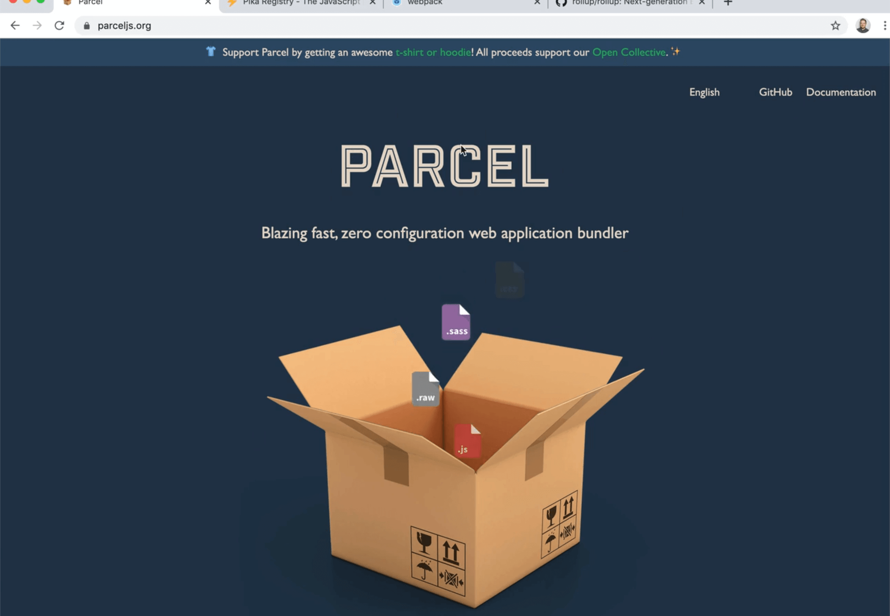
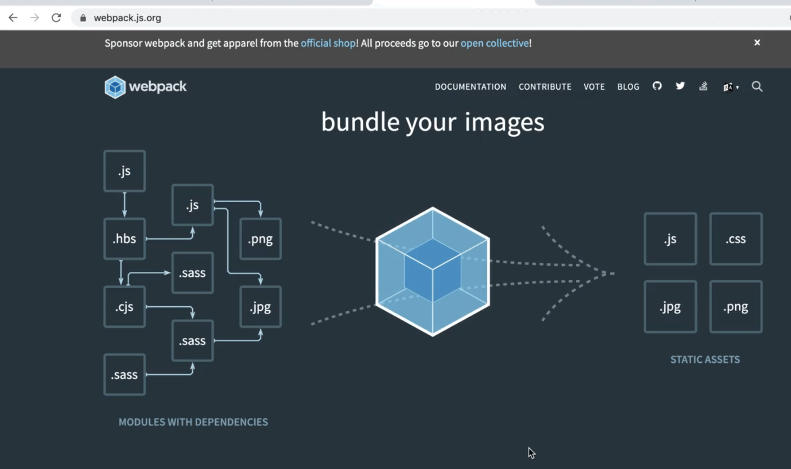
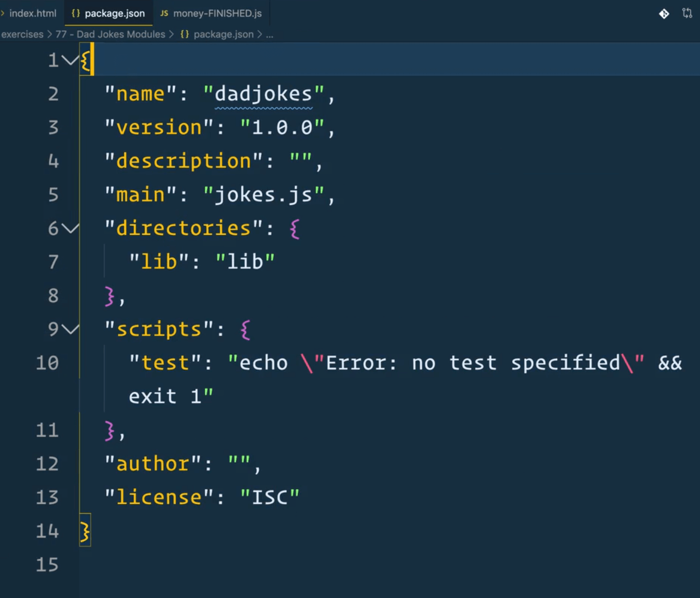
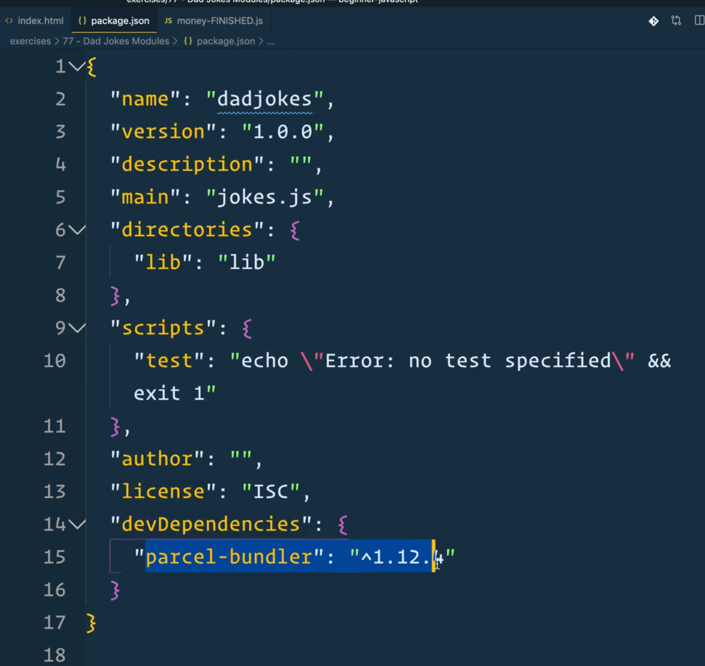
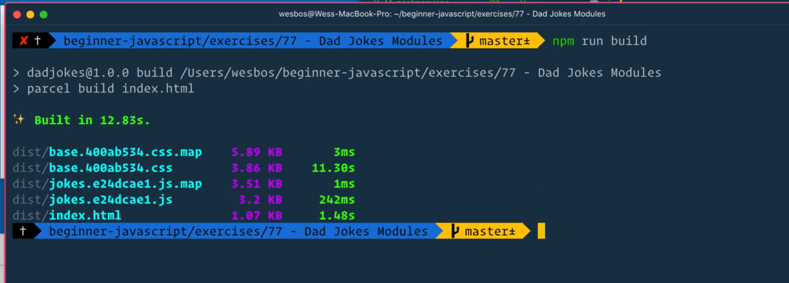
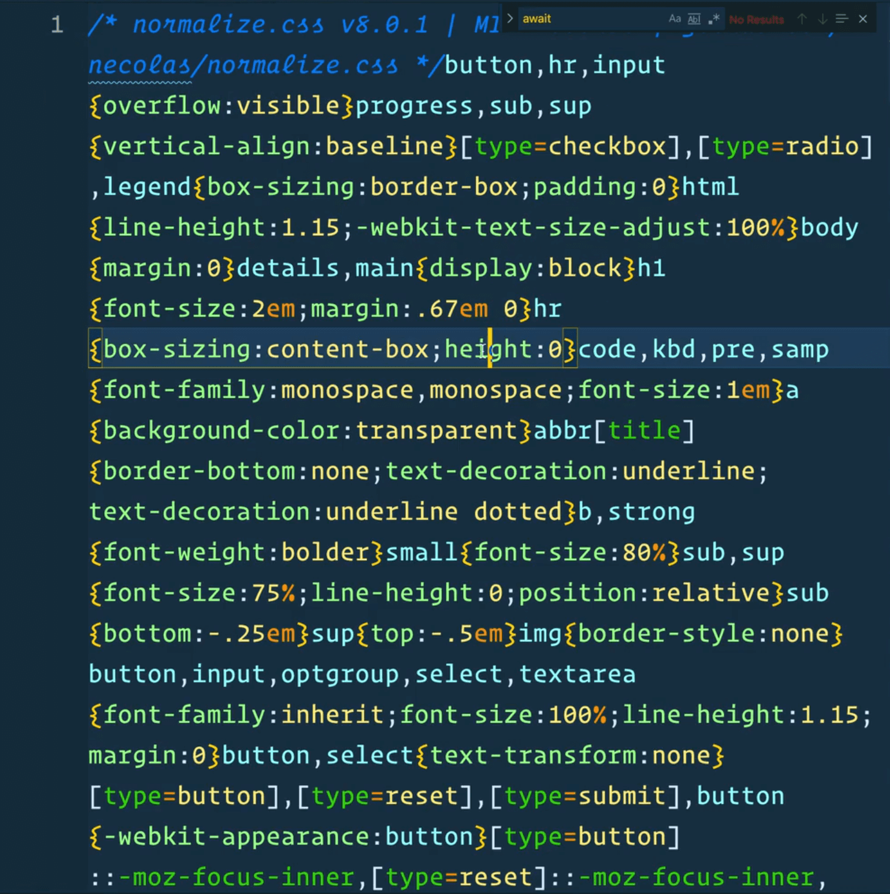
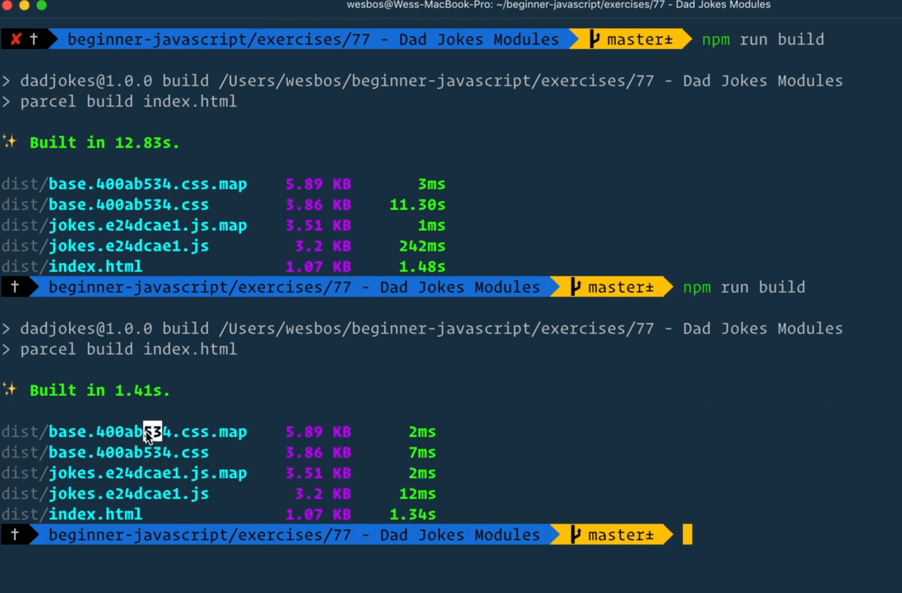

So the idea with modules is eventually we will be able to ship this script tag to the browser.

Meaning we can upload our entire project and the idea is we have this thing `HTTP2` and `HTTP3`, which even though you are requesting multiple files, they can all be delivered at once.

Your server will know exactly what JavaScript files to deliver to you.

That currently isn't the situation and most developers will each for what is called a **bundler**.

Why might someone use a bundler over a regular module?

## Benefits of Bundlers

There are a few benefits.

- a bundler is able to compress all your code.
- bundler will minify all the code. The way **minification** works is longer variables are replaces with shorter ones to save space. For example `options` would be replaced with `o`.
- make your code as small as possible.
- **dead-code elimination** - if you have a function that is never used, it will detect that and remove that.

### Bundler Options / Alternatives

We talked about **Babel** earlier, which will transpile newer JavaScript code and syntax into JavaScript that older browsers will recognize. It will also handle things like JavaScript, **SASS** or **LESS**, or some of the newer **CSS auto-prefixer** stuff.

There are a bunch of different bundlers out there, and generally a bundler will include both a bundler and a dev server. In this course, whenever we used the command `parcel start`, that was to start the dev server that is part of the Parcel bundlers.



Parcel is a popular bundler.

There is a new one called Pika which is newer.


Webpack is the most popular one at the moment, but hard to get up and running in Wes' opinion.



Both Parcel and Webpack also do image compression which is neat.

Bundlers let us ship code to a browser and have it be as performant as possible.

### Using Parcel

Wes is going to show us how to do that using Parcel. He will be using Parcel One in this lesson, but Parcel Two will work the same way.

We will begin by converting both the modules for dad jokes and currency conversion, so Wes can show us what the process is for that.

## Dad Jokes Module

First we will do the Dad Jokes module.

Open up the terminal and navigate into that `exercise` folder.

The first thing we need is a **package.json**.

A `package.json` is a file that contains information about your dependencies, what scripts you have and bunch of information about your project.

If you don't have a package.json, you can get one by typing `npm init`. We have done this a few times in the course already.


You will be prompted to answer a bunch of questions, starting with the name of the package, which we will call `dadjokes`, and then it asks you a bunch of other questions. You can just hit enter to select the default answer for each question.



```json
{
  "name": "dadjokes",
  "version": "1.0.0",
  "description": "",
  "main": "jokes.js",
  "directories": {
    "lib": "lib"
  },
  "scripts": {
    "test": "echo \"Error: no test specified\" && exit 1"
  },
  "author": "",
  "license": "ISC"
}
```

If you take a look at the `package.json` file that was generated 👆, you will see it contains all this info about our project.

### Installing Parcel

In the terminal, let's install the Parcel bundler.

In previous lessons, Wes showed us how to globally install it, which is great when you need a quick server up and running. However, for longer projects that span multiple days, it is best you install Parcel to that project as well.

When you install it to the project, anyone else who downloads your source code off github will also have the same version of Parcel, which makes it easy to get up and running.

In the terminal, navigate to the dad jokes module refactor exercise folder and install it as a **dev dependency** using the following command 👇

```sh
npm install parcel-bundler --save--dev
```

Instead of `--save-dev` you could also type `-D` which is a short form.

That will add Parcel as a **dev dependency** in our `package.json` file.

Dev dependencies are things that are not needed for the application to run, but they are needed in order for someone to work on the application. For example React or Vue is a dependency, and a dev dependency would be the tooling needed in order to work on React or Vue projects.

After a couple of minutes it will finish installing and it will be listed under `devDependencies`.

```json
{
  "name": "dadjokes",
  "version": "1.0.0",
  "description": "",
  "main": "jokes.js",
  "directories": {
    "lib": "lib"
  },
  "scripts": {
    "test": "echo \"Error: no test specified\" && exit 1"
  },
  "author": "",
  "license": "ISC",
  "devDependencies": {
    "parcel-bundler": "^1.12.4"
  }
}
```



_(Note: if you see Parcel 2 as your Parcel version that is fine, it will still work!)_

### Adding an NPM Script to package.json

In order to run our local version of Parcel, we need to add an npm script that will use it. We will call it `start`.

To run parcel, you just call it and then pass it the entry file which is `index.html`.

```json
{
  "name": "dadjokes",
  "version": "1.0.0",
  "description": "",
  "main": "jokes.js",
  "directories": {
    "lib": "lib"
  },
  "scripts": {
    "start": "parcel index.html"
  },
  "author": "",
  "license": "ISC",
  "devDependencies": {
    "parcel-bundler": "^1.12.4"
  }
}
```

Now in the terminal, you can type `npm start` and that will run `parcel index.html` for us. You should see a message in the terminal that Parcel is running on localhost:1234.


Open up the server, and take a look at the error in the console. We have run into this issue before.


> handlers.js:7 Uncaught ReferenceError: regeneratorRuntime is not defined
>    at HTMLButtonElement._handleClick (handlers.js:7)
>    at HTMLButtonElement.handleClick (handlers.js:7)


We are getting that error because we are using `async await`, and to fix this error, we need to modify our `package.json` to add a `browserslist` property like so 👇

```json
{
  "name": "dadjokes",
  "version": "1.0.0",
  "description": "",
  "main": "jokes-FINISHED.js",
  "directories": {
    "lib": "lib"
  },
  "scripts": {
    "start": "Parcel index.html"
  },
  "author": "",
  "license": "ISC",
  "devDependencies": {
    "parcel-bundler": "^1.12.4"
  },
  "browserslist": ["last 1 chrome versions"]
}
```

Now you should no longer see that error.

_Note: if you ever have issues with Parcel being weird where you fixed something but it doesn't seem to be fixed, open up your folder and find the `.cache` and `dist` directories. Those are two folders that are generated by Parcel. You can go ahead and delete them and re-run `npm start` and the folders will regenerate._

Now that Parcel is running, let's get started on the code.

Parcel supports **hot reloading** and will automatically refresh the server whenever you make a change while developing. Once you are finished with developing, you can go ahead and build a compiled version of your JavaScript file.

### Building with Parcel

To do that, we need to add another script, `build`, in `package.json` 👇

```json
{
  "name": "dadjokes",
  "version": "1.0.0",
  "description": "",
  "main": "jokes-FINISHED.js",
  "directories": {
    "lib": "lib"
  },
  "scripts": {
    "start": "parcel index.html",
    "build": "parcel build index.html"
  },
  "author": "",
  "license": "ISC",
  "devDependencies": {
    "parcel-bundler": "^1.12.4"
  },
  "browserslist": ["last 1 chrome versions"]
}
```

`npm start` will always look for a script called start, but for all the other scripts you need to type `npm run` and then the script name.

_Note: `build` is not a reserved script name, Wes just made it up._

In the terminal run the following command 👇

```sh
npm run build
```

As Parcel is working you will see the terminal updating and then when it is finished you should see a message similar to the one below 👇



What Parcel has does is it created a `dist` folder for us. If you look at that folder, there will be a lot of files.


If you open up the `index.html` file, you will see that Parcel has taken the file and compressed it as much as it can.


It also swapped out the `jokes.js` file for us.


In the `dist` folder we also have all these different JavaScript files, which is our code.

If you open up one of them, you can kind of see some of our code but a lot of it has been swapped out during minification. For example the original line of code `const data = await response.json();`, has been replaced in the finished version with `s=await t.json();`.

You will also see `.map` files within the `dist` directory. **Map files** make it easier to debug bundled code by mapping the compiled, unreadable version of the code back to original, more-readable version. Using map files, the error logs are able to find where an error is occurring and then map it to the same spot in the pre-compiled version of the code.

For example, if there is an error that occurs in the JavaScript code, the bundler will not tell you where the error is in `jokes.e24dcae.js`, because that would not be useful. The JavaScript code is too minified for us to be able to debug. Instead it would tell us where the equivalent code is in `jokes.js`.

Parcel will also compile all of the CSS for us.



```html
<script src="jokes.js" type="module"></script>
```

Wes has had issues with Parcel in the past where he has had to remove the type of module from his script source tag on the HTML page, even though they are the same thing. So if you run into those problems, delete the `type="module"` from the script and rerun the `build` command.

```html
<script src="jokes.js"></script>
```

You want to run the Parcel build every time you change your application.

If you were to rerun `npm run build`, you will notice that the numbers in the files stay the same.



If we were to change some of our files, like adding a `console.log('hey')` at the bottom of `jokes.js`, and rerun the build, you will see that the numbers in the `jokes` JavaScript file have changed.


Parcel is able to detect when your files have changed and it will only rerun the build on those files. The random keys that you see in the file name is usd to bust ay caches that your users might have of previous builds.

That wraps up Parcel. It is very simple to use and the only one Wes reaches for these days.

Wes does use some other stuff like **create-react-app** or **Next.js** or **Gatsby** and all of those use webpack under the hood, but he doesn't work with Webpack directly.
