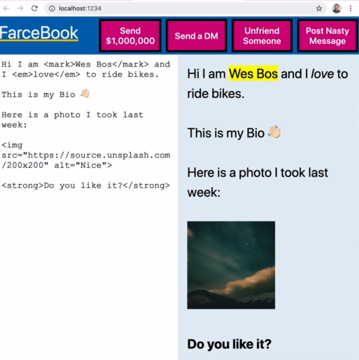
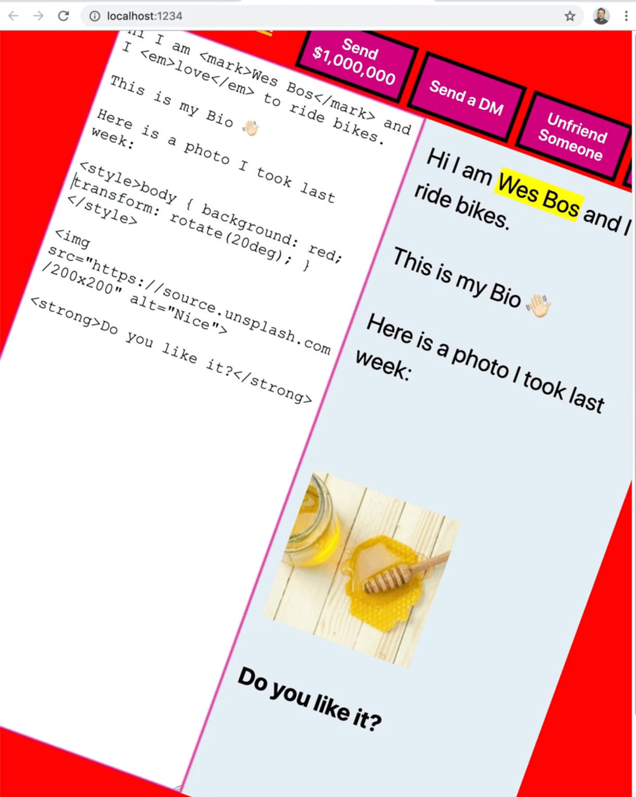
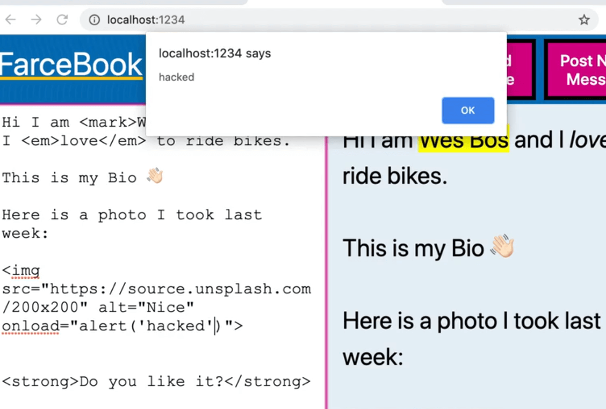
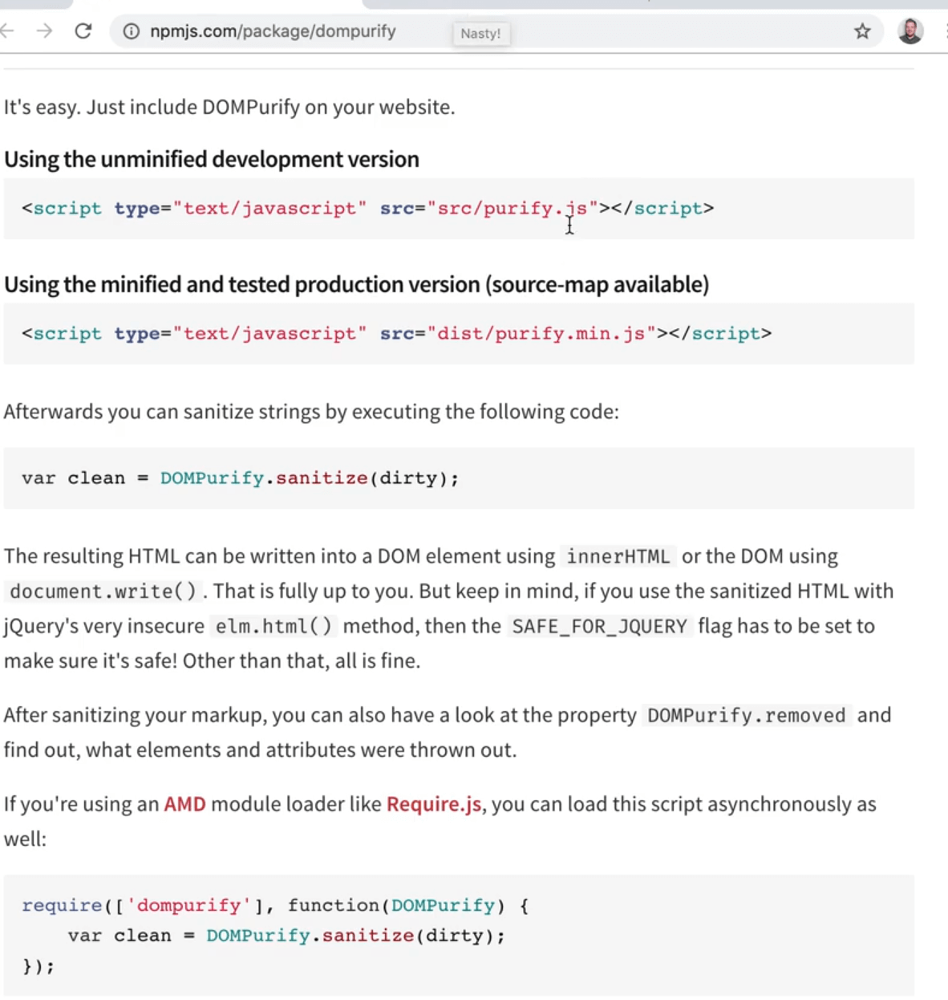
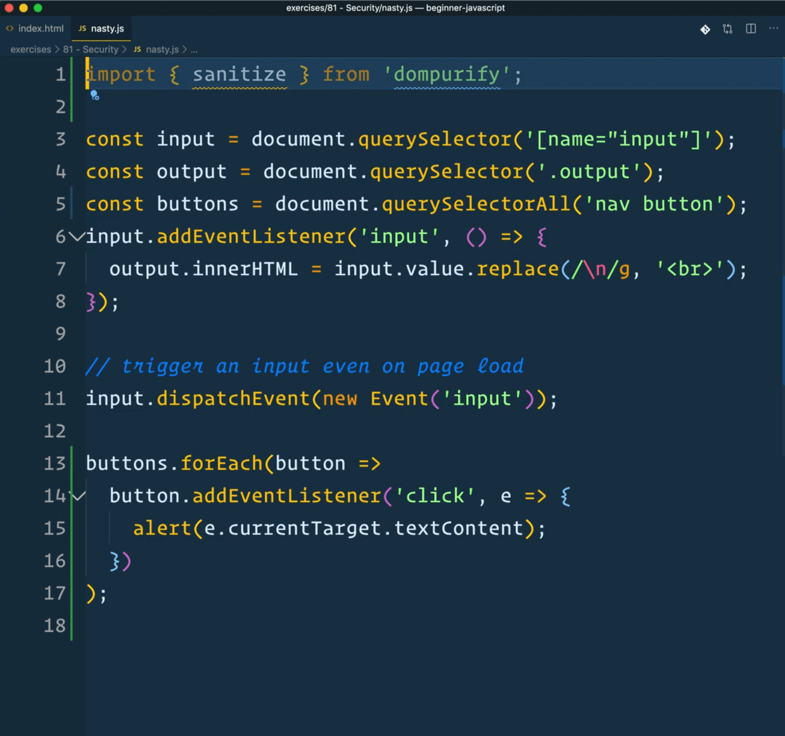
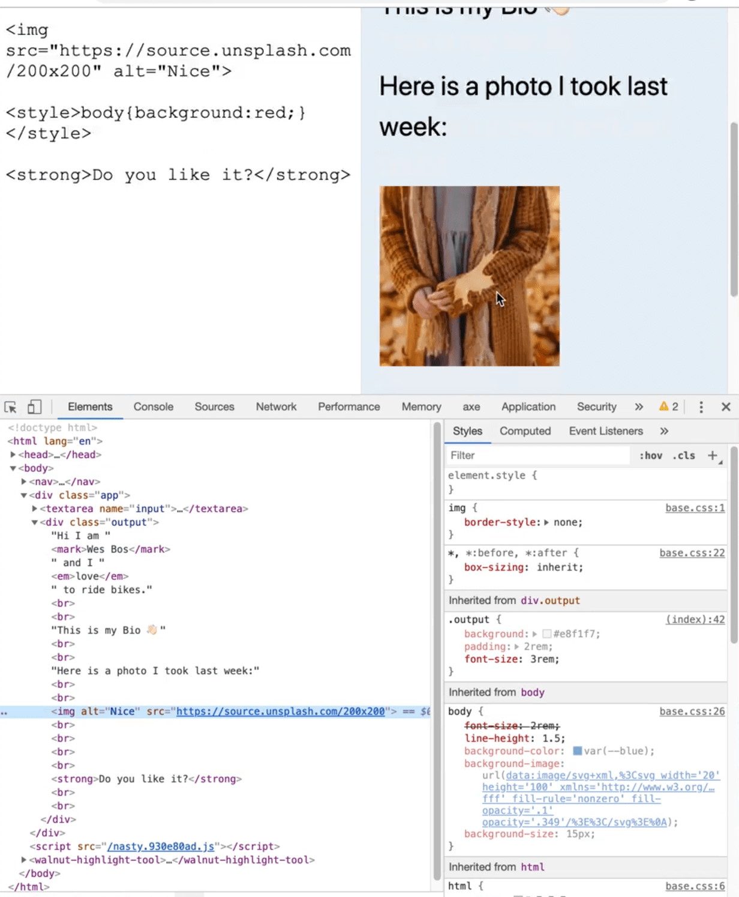

In this video we will discuss security in JavaScript.

Much of security comes from running JavaScript on the server, or any server side language. That is where most of your security comes in, in things like encryption, certificates, firewalls, whitelisting IPs, rate limit, those things generally all happen on the server side.

However when you are writing front-end JavaScript, there are a couple of places when you are building stuff in the browser that you want to be aware of so you don't accidentally shoot yourself in the foot.

In this video, we will go over those things that you should be aware of so that you do not accidentally commit security violations.

## JavaScript is public

The first thing is that JavaScript is totally public. What does that mean?

We already know this, because if you open up your dev tools, and go to the sources or network tab, you are able to see all of the code that is related to your website. You are shipping all of your code off to the browser and telling the browser to run it, which means that your source code is not safe.

You **should not** put sensitive information in your client-side JavaScript, because even if you obfuscate it, and try to hide it in a whole bunch of ways,or encrypt is, if the browser can read it, it can be reverse engineered.

An example of that is API keys.

Sometimes it is okay to put API keys in the browser (we will look at an example like that), and sometimes it is not okay to put API keys in the browser.

Generally, when it is not okay to put API keys in the browser, they will usually restrict you via CORS.

Something like a google maps API key, it is completely find to put it into your client-side JavaScript because Google will limit those per domain, or per visitor so you don't have to worry about that.

Another example is links to private downloads.

Let's say you have an object on your page somewhere and you need to be able to download a zip file of something, people will be able to find it.

Prices are another big one. Wes runs into this all the time with his courses. People will building a client-side JavaScript checkout and they will put the price in a button, for example. If someone is able to change the price of that button or change the code, then they will be able to change the price to whatever they want.

When you are working with prices, we calculate the price on the client-side so we can show the total of the person's cart. However, you should also recalculate the total on the server where it cannot be tampered with.

Anything that is sensitive must be recalculated or done on the server, where it is in a secure environment.

## XSS and Sanitizing your Inputs

Wes has created this little example to demonstrate the concept of Cross Site Scripting (XSS) called FarceBook.

On a lot of websites, it is common to give a user a place on the page to fill out information about themselves, like a bio, and then in turn display that data once the user submits it.

In some cases you just have a text input with raw text. However, in some other cases, you want to generate HTML or even take in HTML from the user and display it on the page.

We have done this in a lot of our previous examples, when from within a loop we set the innerHTML of an element.

**The rule is that anytime you are taking data from the user and embedding it in HTML you must first sanitize it**.

Anywhere that you are using `.innerHTML` or using `insertAdjacentHTML`, or really **_anywhere that you are taking user data and generating HTML from that, you must first sanitize the data_**.

## FarceBook



In this really simple example Wes has made, FarceBook, there is a field where the user is allowed to type and when it's typed, we are automatically dumping that into the profile on the right hand side.

The data could be coming from anywhere. Most often the way it works is you give someone a field to type in on the backend and they save it and it displays on their profile page or on a form etc.

You may want to allow people to put images tags, to be able to use strong, emphasis and mark tags, and things like that.

We could do something like add a style tag and make the background red. Then we can tilt the entire page.



That is not something you would want someone doing that and that is probably the least of your worries, someone goofing like that.

The reality is much scarier security thing is if someone can run JavaScript on your page.

Anytime a user is able to run JavaScript on your page, then you are in trouble.

Let's try it by adding a script tag and seeing what happens.


As you can see, even though we added a script tag with an alert, there is no alert popping up. That is because script tags will not run.

### Image Event Hijacking

But what you can do is take an image tag and hijack the onload event of the image tag and then within it we can add any JavaScript we want.



If Facebook allowed that, then you would be able to run code on anyone who is viewing your Facebook profile. That is not secure.


It is **_not good_** to have someone else run JavaScript on your page because then they become a puppet of your own account and they can do things like click buttons as if they are you, or grab your messages and send fetch requests back to their own server.

The `onerror` attribute of img tags will also run JavaScript.

Let's say you set the source of the image tag to be an image that doesn't exist. That would cause the `onerror` attribute JavaScript would run.

Using the onerror attribute, we can trigger an alert like so 👇


That is how people do **cross site scripting**.

They find a way to remotely run JavaScript on somebody's page and almost always what they will do is just hook up an image tag and say `onerror` of the image and then fetch malicious JavaScript and then you have someone you don't trust running JavaScript on your website to logged in users which is very very scary and very bad.

Even if it is just a tiny little input box, you have to be careful when you are taking data from a user.

### Sanitizing User Data with DOMPurify.

So how can you **sanitize** user data?

Luckily there is a very easy library to use called **DOMPurify**.



It works by taking in a string and scrubbing it of all the security issues for us.

Wes has already npm installed DOMPurify, and at the top of the file he has imported the `sanitize` method from DOMPurify.



All we need to do to fix the code is modify the input event listener function to use the sanitize method.

```js
input.addEventListener("input", () => {
  const clean = sanitize(input.value);
  output.innerHTML = clean.replace(/\n/g, "<br>");
});
```

In the code above, we are simply replacing line breaks with a `<br>` tag so the HTML is properly formatted.

If you try adding an alert in the onload attribute of the image tag again, nothing will happen this time.


Why is that?

Open the dev tools and look at the code in the elements tab. You will see that the onload and onerror attributes have been stripped out, as well as all the other inline event handlers on image tags.


If yu tried to add a style tag, it would still work however.

Why is that? That is because the style tag, if you look at it in the console is still being embedded.

To fix that, we need to pass `options` to DOMPurify. The default simply strip the nasty JavaScript stuff out of there but there are lots of options you can use.


The options Wes usually chooses are `FORBID_TAGS` and `FORBID_ATTR`.

Modify the code like so:

```js
input.addEventListener("input", () => {
  const clean = sanitize(input.value, {
    FORBID_ATTR: ["width", "height", "style"],
    FORBID_TAGS: ["style"],
  });

  output.innerHTML = clean.replace(/\n/g, "<br>");
});
```

Now if you try to use the style tag, you will see that it has been completely removed.



That the basics of security.

### HTTPS Origin

The last thing we need to cover is that when you are sending data, make sure that you are sending it to an HTTPS origin.

The reason behind that is if you have an API, like https://dogsapi.com, and you are getting (which means pulling) data over an insecure origin (http), there could be other people on the WIFI network on in the government or anywhere along the line of you requesting that, that would be able to just look into that request, peer in and see what you are requesting.

When you are pushing data to an API using POST, then they would be able to see all the data you and sending an possibly modify it.

If you make it HTTPS, all the data coming to and from the API will be encrypted and you want to make sure that every API that you are using is encrypted.

That isn't normally and issue, most APIs are encrypted but it's just something to keep in mind.

That is the basic security things to think about!
