In this exercise we will be using the Speech Recognition API that is currently only available in the Chrome broswer to practice our JavaScript skills by building a little game.

The way it will work is when you say a colour, the background colour of the website should change to reflect that.

Let's start by opening chrome and navigating to `chrome://flags` in the browser. On this page, we need to make sure that "Experimental Web Platform features" are turned on.

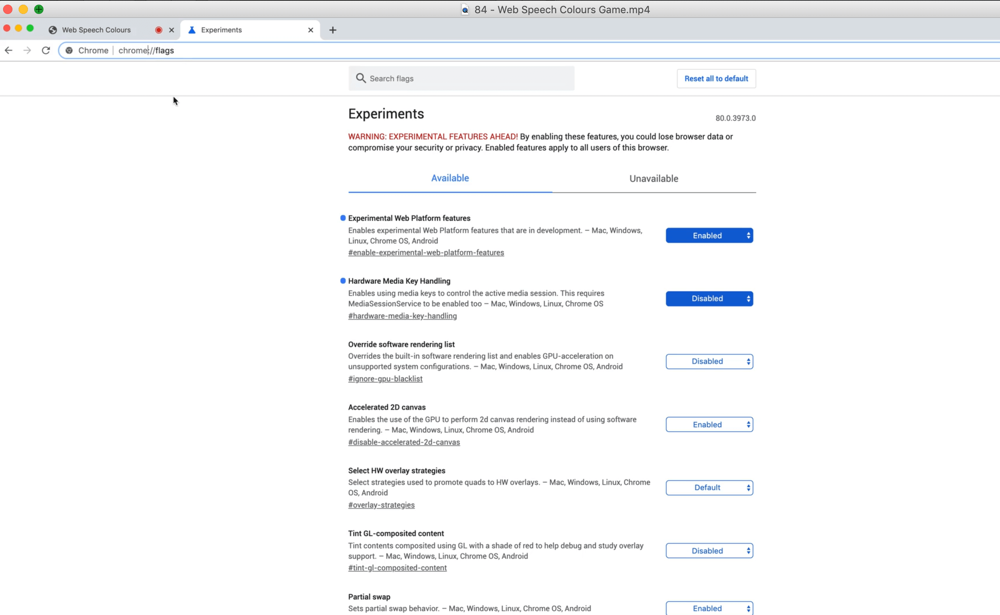

We also need to get a server going.

If you open up the `84 - Web Speech Colour Game` folder within the `exercises` directory, lets take a look at what we are working with.

Wes has given us `colors.js` which gives us an object containing every color that is available in CSS, and it's corresponding hex code.

Within the file there is also a function called `isDark` which Wes grabbed from StackOverflow which takes in a color name and figures out if it is a dark or light color.

Then there is `style.css` which contains a few styles and animations, like the word popping up and getting crossed off when you say it.


If look at the `package.json`, you will see we have `parcel-bundler` and `browserslist`, both of which we have used before.

Open up the terminal and navigate to the exercises folder and type `npm install` and that will install the dev dependencies for us.

After that is finished installing, simply type `npm start` and open up the server in a browser to see what we are starting with.


Let's start by getting the web speech part working and then later we will connect the colours.

## Web Speech

We need to check if there is something called `window.SpeechRecognition`. However if you try to reference that in the console, you will get undefined because it is actually `window.webkitSpeechRecognition`.

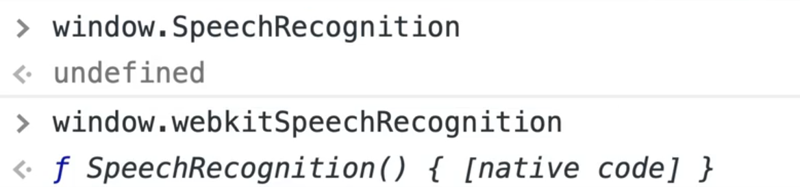

Add the following to `speech.js`.

```js
// speech.js
function start() {
  // see if their browser supports this
}

start();
```

That is what is referred to as **vendor prefix** (adding `webkit`). That means that the API is not completely done, so they will vendor prefix it by adding webkit infront of it.

Chrome engine used to be called WebKit, it is now called blink.

At the top of our JavaScript file, let's normalize that like so:

```js
// speech.js
window.SpeechRecognition = window.SpeechRecognition || window.webkitSpeechRecognition.
```

Now in our chrome tools we can access it like so:

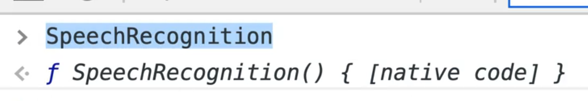

Now within `start` let's check for the existance of a property called `SpeechRecognition` that is in the window.

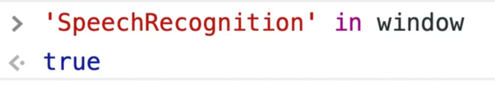

```js
// speech.js
function start() {
  // see if their browser supports this
  if (!("SpeechRecognition" in window)) {
    console.log("Sorry your browser does not support speech reco.");
    return;
  }

  console.log("Starting...");
}

start();
```

If the API does exist in the user's browser, let's create a new speech recognition instance.

```js
const recognition = new SpeechRecognition();
```

Next we need to set a few options.

One of those options gives us the ability to specify whether we want to listen continuously for speech recognition, or stop after the speech has been recognized (similar to how Siri stops listening after completing actions).

Add the following code to set it to continousy listen👇

```js
const recognition = new SpeechRecognition();
recognition.continuous = true;
```

Let's also set `recognition.interimResults = true`, which will give us the results as we are speaking instead of waiting until we are done.

We also need to hook up an event listener.

This is a little bit different than most event listeners because normally you would add `.addEventListener`. but if you try to log the `recognition` variable and look at the prototype, you will see there is no method like `addEventListener`.

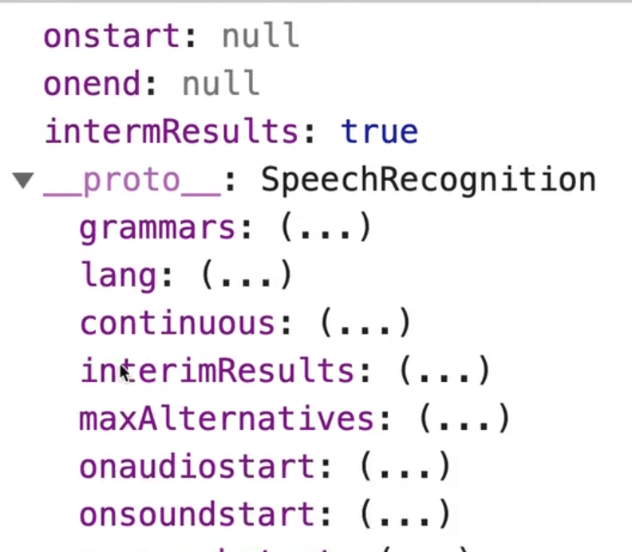

To listen for a result, we will use `onresult` like so 👇

```js
recognition.onresult = handleResult;
```

Next we need to start it.

```js
recognition.start();
```

Go ahead and create another file called `handlers.js`.

Inside of that, we will have a function `handleResult` which will just log the event for now. Export that function.

```js
// handlers.js
export function handleResult(event) {
  console.log(event);
}
```

Now within `speech.js` we will import it.

```js
// speech.js
import handleResult from "./handlers";
```

This time we do not have to include the `.js` extension when importing from `handlers.js` because we are using Parcel.

When the page refreshes after adding the import statement, you may be prompted to accept permissions to the microphone.


We want to allow access to the microphone so that the SpeechRecognition API picks up our voice. Go ahead and allow it.

Once you do that, it should start listening to your voice and you should see events streaming in the console as you speak.


If you open up one of the `SpeechRecognitionEvents` that have been logged in the console, you will see it is very similar to an event object.

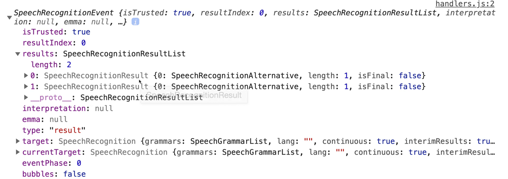

However there is a `results` property, which contains a few items that the speech recognition thinks you said. In our case, we will be taking both of the results.


The speech recognizer will continue giving us words as it tries to figure out what you said. Even after you stop talking, it keeps streaming the results in until it is confident in the result.

Within our `handlers.js` file, let's create another function `logWords` that takes in the results, and logs them (for now).

We will call this new function from our `handleResult` method.

```js
// handlers.js
function logWords(results) {
  console.log(results);
}

export function handleResult(event) {
  logWords(event.results);
}
```

Sometimes the SpeechRecognition event will return a list, from which we want to grab the last one.


Within the last item there is a `SpeechRecognitionAlternative`, which we can use to grab the transcript. Wes has only ever run into there being one `SpeechRecognitionAlternative` item.

Let's log that in our `logWords` function by modifying it like so:

```js
// handlers.js
function logWords(results) {
  console.log(results[results.length - 1][0].transcript);
}
```

Now if you refresh the page and try to say something like "I love Pizza", you will see that logged in the console.

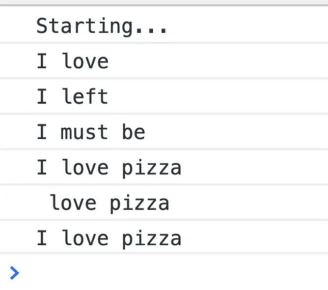

In the code above, we are accessing the deeply nested property on the `results` object.

Now that we have the speech working, let's get the color layout working.

## Colour Layout

We want to loop over each of the colours in `colors.js` and display it as a span on our page.

One thing you might have noticed is Wes final example is that the colors are sorted by the length of the name.

Within that file, let's add the following code and export it.

```js
// colors.js
export const colorsByLength = Object.keys(colors);

console.log(colorsByLength);
```

Let's import that function into `speech.js` like so:

```js
//speech.js
import { handleResult } from "./handlers";
import { colorsByLength } from "./colors";
```


If you look at the console when the page refreshes you will see that it gives us an array of all the colors.

Add the following function, which will sort the colors array based on their length.

```js
export const colorsByLength = Object.keys(colors).sort((a, b) => {
  return a.length - b.length;
});

console.log(colorsByLength);
```

_Sorting Refresher_

The `sort()` method works like so:

- If you return a positive number, it will put the item in front.
- If you return a negative number it will put it behind.
- If you return 0 it will not move that item.

When the page refreshes, you will see that the colors are now sorted by length.

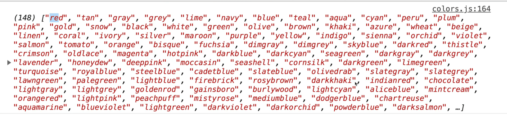

Next, we will write a function to display the colors within `speech.js`.

```js
// speech.js
import { handleResult } from "./handlers";
import { colorsByLength } from "./colors";

function displayColors(colors) {
  return colors.map((color) => `<span class="color">${color}</span>`);
}
```

At the very bottom of the file, let's call that right away.

```js
// speech.js
start();
displayColors();
```

Within `displayColors`, let's map through each color and return a span with the class of color and the colors name.

```js
// speech.js
function displayColors(colors) {
  return colors.map((color) => `<span class="color">${color}</span>`);
}
```

Let's take a look at the HTML we are working with.

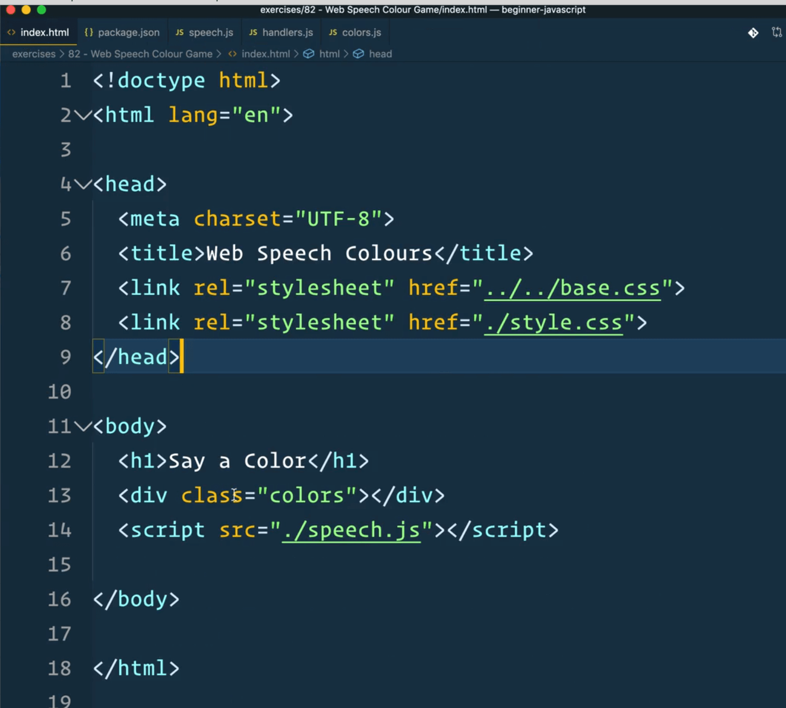

As you can see, in our `index.html`, we have a div with the class of colors. We will select that on page load.

```js
// speech.js
import { handleResult } from "./handlers";
import { colorsByLength } from "./colors";

const colorsEl = document.querySelectors(".colors");
```

Next we will replace where we call `displayColors` and instead set the value of `colorsEl.innerHTML` to the value returned from `displayColors()`

```js
// speech.js
import { handleResult } from "./handlers";
import { colorsByLength } from "./colors";

const colorsEl = document.querySelectors(".colors");

function displayColors(colors) {
  return colors.map((color) => `<span class="color">${color}</span>`);
}

window.SpeechRecognition = window.SpeechRecognition || window.webkitSpeechRecognition;

function start() {
  // see if their browser supports this
  if (!("SpeechRecognition" in window)) {
    console.log("Sorry your browser does not support speech reco.");
    return;
  }

  // it does work
  console.log("Starting...");

  // make a new speech reco
  const recognition = new SpeechRecognition();
  recognition.continuous = true;
  recognition.interimResults = true;
  recognition.onresult = handleResult;
  recognition.start();
}

start();
colorsEl.innerHTML = displayColors();
```

When the page refreshes, you will notice that we get the following error:

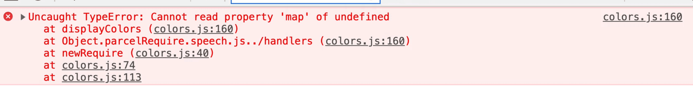

That issue is happening because we did not pass the list of colors as an argument. Let's fix that.

```js
// speech.js
colorsEl.innerHTML = displayColors(colorsByLength);
```

Now, when the page refreshes we just see undefined and there is nothing in the console. What is going on?


If you look at our `speech.js` file, you will see that we forgot to return the colors map in our `displayColors` function. Fix that by adding the return keyword before the map.

```js
// speech.js
function displayColors(colors) {
  return colors.map((color) => `<span class="color">${color}</span>`);
}
```

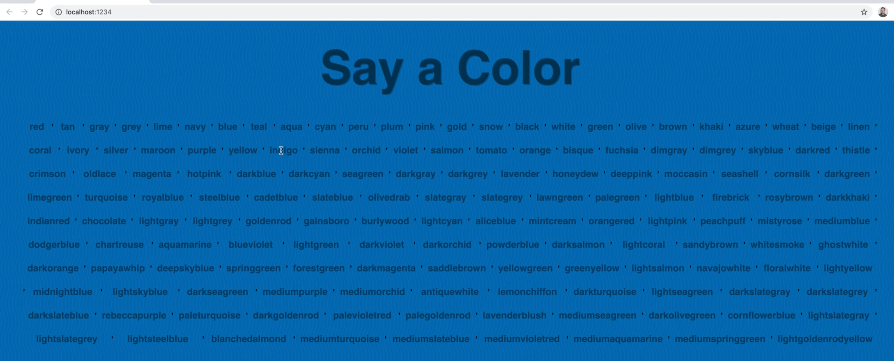

As you can see, now it works! That gives us a list of all the colors.

To get rid of the commas we can call `.join('');` like so:

```js
// speech.js
function displayColors(colors) {
  return colors.map((color) => `<span class="color">${color}</span>`).join("");
}
```


Let's add some style properties to each of the colors. We will set the background to be the name of the colors, like so 👇

```js
//speech.js

function displayColors(colors) {
  return colors
    .map((color) =>
      `<span class="color" style="background: ${color};">${color}</span>`
    )
    .join("");
}
```


We want to know if the color is light or dark so we can change the color of the text accordingly. Wes wrote some CSS ahead of time to handle this.

To do that we can import the `isDark` function from our `colors` module like so:

```js
// speech.js
import { handleResult } from "./handlers";
import { colorsByLength, isDark } from "./colors";
```

`isDark` will return true or false so we can use that within our back ticks to determine what text color to show.

```js
// speech.js
function displayColors(colors) {
  return colors
    .map((color) =>
      `<span class="color ${
        isDark(color) && "dark"
      }" style="background: ${color};">${color}</span>`
    )
    .join("");
}
```

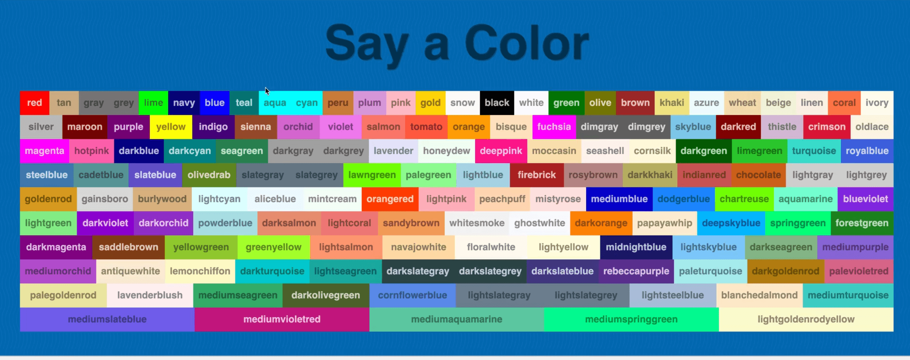

What should happen is the dark ones have a class of "dark" and the lighter colors should have no class appended.

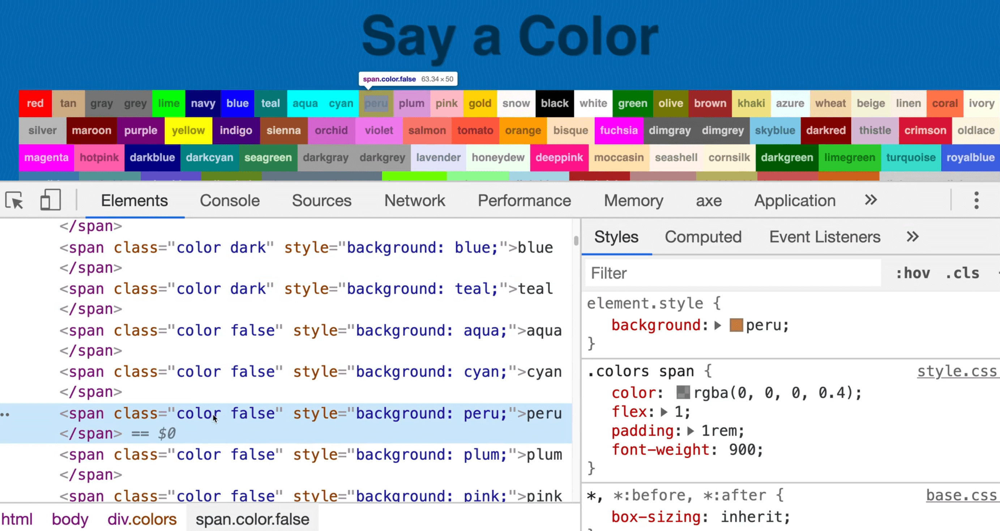

However, if you inspect the element in the dev tools, you will see that the classes that are dark have the "dark" class, but the light colors have a "false" class, which is incorrect.

Let's fix that by using at ternary statement instead of the `&&`.

```js
// speech.js
function displayColors(colors) {
  return colors
    .map((color) =>
      `<span class="color ${
        isDark(color) ? "dark" : ""
      }" style="background: ${color};">${color}</span>`
    )
    .join("");
}
```


As you can see, the light colors only have the "colors" class now.

### Combining Speech and Words

Next, go into `handlers.js` and let's start hooking up the speech with actions. Add the following code 👇

```js
// handlers.js
function logWords(results) {
  console.log(results[results.length - 1][0].transcript);
}

export function handleResult(event) {
  logWords(event.results);
  const words = results[results.length - 1][0].transcript;
  console.log(words);
}
```

If you refresh the page and try to say red, you will see an error logged complaining that `results` is not defined.

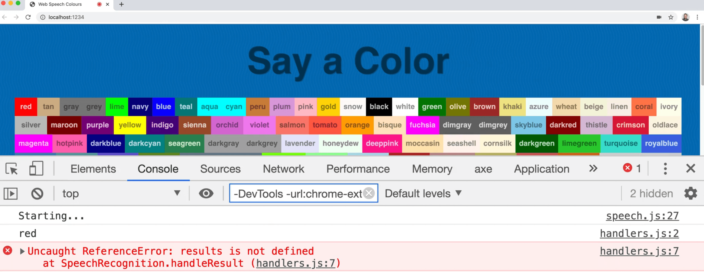

To fix that, let's destructure the results property in the function definitions.

```js
export function handleResult({ results }) {
  logWords(results);
  const words = results[results.length - 1][0].transcript;
  console.log(words);
}
```

When the page refreshes, you will see the speech streaming in.

We need to add a check to see if the word that is streaming is a valid color.

To perform this check, we must first lowercase everything, so we don't have to deal with upper and lowercase versions when comparing. We also want to strip any spaces out because sometimes the SpeechRecognition will return spaces in front of the word.

If it is a valid color, let's show the UI for that. Add the following code 👇

```js
export function handleResult({ results }) {
  logWords(results);
  const words = results[results.length - 1][0].transcript;
  console.log(words);
  // lowercase everything
  // strip any spaces out
  // check if its a valid colour
  // if it is, then show the UI for that
}
```

Let's start with lowercasing.

```js
// handlers.js
// lowercase everything
const color = words.toLowerCase();
```

Next we will strip any spaces out by replacing whitespace with nothing. Start by modifying the `color` variable to be a `let` instead of a `const`.

When you are replacing characters in JavaScript, if you have only one space to replace you can use the `replace` method like so: `color = color.replace('', '');`.

However if there is more than one space, you have to use a **Regex**. There is a new `replaceAll` method coming, which will do that for you but it is not in the browsers yet.

We will use a Regex that will match all the spaces. The regex to match whitespace is `/\s/` and the if you pass a `/g` flag that means global, so it tells the Regex to find all instances, not just the first.

```js
// handlers.js
// strip any spaces out
color = color.replace(/\s/g, "");
```

Next we want to check if it is a valid color.

Lets go into our `colors.js` module and add a new function and immediately export it.

```js
// colors.js
export function isValidColor(word) {
  return colors[word];
}
```

If there is a match, the code above will return the actual hex code. If there is no match, it will return undefined.

In our case, we do not want the hex, we want a boolean.

To achieve that, we can add a double bang (`!!`) to **coerce** it to return true or false like so:

```js
export function isValidColor(word) {
  return !!colors[word];
}
```

That code above works like this:

Calling `colors.red` will return the hex, but calling `!!colors.red` will return `true` and if the property doesn't exist, it will return `false`.

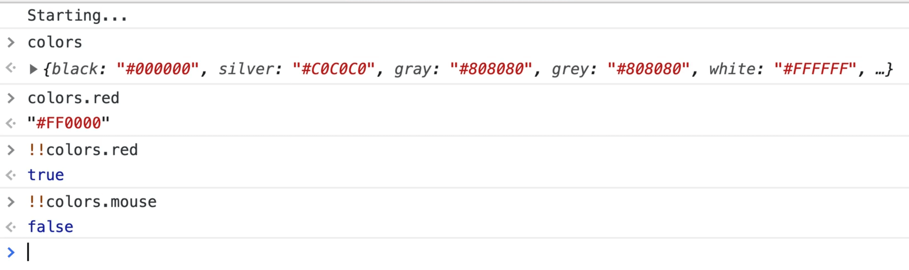

We could also use the `in` syntax and it would give us the same results.


Next we can import that into our `handlers.js`.

```js
// handlers.js
import { isValidColor } from "./colors";

function logWords(results) {
  // console.log(results[results.length - 1][0].transcript);
}

export function handleResult({ results }) {
  logWords(results);
  const words = results[results.length - 1][0].transcript;
  // lowercase everything
  let color = words.toLowerCase();
  // strip any spaces out
  color = color.replace(/\s/g, "");
  // check if it is a valid colour
  if (!isValidColor(color)) return; // thats all folks
  console.log("This is a valid color!");
}
```

Now if you try talking and say a valid color, you should see the message "This is a valid color!" pop up.

Let's start working on the UI to display if it is a valid color.

When a color is spoken, we will first cross the word out. To do that, we need to select the span corresponding to the color.

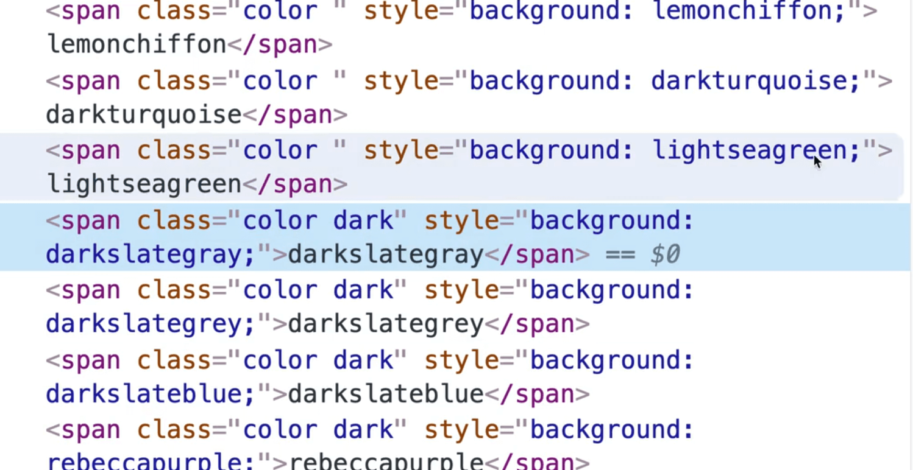

However, we have run into an issue. We need a way to select a specific span and as you can see above, there is no way to identify the correct span. Let's fix that to add the color's name as a class in addition to the `color` class.

Modify `speech.js` like so:

```js
// speech.js

function displayColors(colors) {
  return colors
    .map((color) =>
      `<span class="color ${color} ${
        isDark(color) ? "dark" : ""
      }" style="background: ${color};">${color}</span>`
    )
    .join("");
}
```

Back in our `handleResults` function, we can select the color span that was spoken like so 👇

```js
// if it is, then show the UI for that
const colorSpan = document.querySelector(`.${color}`);
console.log(colorSpan);
```


If you try speaking the color red when the page refreshes, you should see the red color span logged.

Let's take a look at the CSS. We have a class of `.got` with the following styles set:

```css
// style.css
colors span.got {
  text-decoration: line-through;
  animation: jump 0.2s ease-in-out 2 alternate-reverse;
}
```

That gives the UI a jump animation which scales the span up and then back down.

Let's add code to also include this class to the span once it has been spoken.

```js
export function handleResult({ results }) {
  logWords(results);
  const words = results[results.length - 1][0].transcript;
  // lowercase everything
  let color = words.toLowerCase();
  // strip any spaces out
  color = color.replace(/\s/g, "");
  // check if it is a valid colour
  if (!isValidColor(color)) return; // thats all folks
  // if it is, then show the UI for that
  const colorSpan = document.querySelector(`.${color}`);
  colorSpan.classList.add("got");
  console.log(colorSpan);
  console.log("This is a valid color!");
  console.log(color);
}
```

That will give the span the class of `got` and animate it once the color is spoken.

We also want to change the background color to the word that was spoke, like so: `document.body.style.backgroundColor = color;`.

Add the following code 👇

```js
export function handleResult({ results }) {
  logWords(results);
  const words = results[results.length - 1][0].transcript;
  // lowercase everything
  let color = words.toLowerCase();
  // strip any spaces out
  color = color.replace(/\s/g, "");
  // check if it is a valid colour
  if (!isValidColor(color)) return; // thats all folks
  // if it is, then show the UI for that
  const colorSpan = document.querySelector(`.${color}`);
  colorSpan.classList.add("got");
  console.log(colorSpan);
  console.log("This is a valid color!");
  console.log(color);
  // change the background color
  document.body.style.backgroundColor = color;
}
```


As you can see, now the background color is changing when the word is spoken.

That's a wrap for this exercise!
