There is a whole spectrum of JavaScript related to working with audio. In this lesson, we will be working with the Web Audio API which is really cool.

Although Wes doesn't know a lot about how audio works, he understands the basics about things like frequency and time. We will be using frequency and time to build the cool audio visualizer shown in the gif above.

The visualizer has a rainbow bar graph along the bottom which represents the frequencies. The yellow line is time data of the audio coming in. We are just painting those two things to canvas.

The entire visualizer should only take about 100 lines of code!

For this lesson, we are working out of the `85 - Audio Visualizer Oscilloscope` exercise folder.

Open up a terminal, cd into that directory and run `npm install`.

If you take a look at our `package.json` file, you will see we have one dev dependency, Parcel, a start script and browserslist.

We will be starting with the following HTML.

```html
<!DOCTYPE html>
<html lang="en">

<head>
  <meta charset="UTF-8">
  <meta name="viewport" content="width=device-width, initial-scale=1.0">

  <title>Audio Analyzer</title>
</head>

<body>
  <canvas></canvas>
  <script src="./sound.js"></script>

  <style>
    html {
      margin: 0;
      background: black;
    }

    canvas {
      width: 100%;
      height: 100%;
    }

    body {
      min-height: 100vh;
      display: grid;
      grid-template-rows: 1fr;
      margin: 0;
    }
  </style>
</body>

</html>
```

As you can see above, we are starting with a blank canvas, a script tag linking the `sound.js` file and some basic styles which stretch the canvas to be whatever the dimensions of the window are.

We will be demonstrating how to make this work with a microphone, but if you want the visualizer to work with music, you have a few options.

_Audio Visualizer with Music_
There are some APIs to pipe it in from an audio element. We are not going to go into those, because we are just doing microphone for now. You can always just unplug your headphones and play your music over your speakers and that will make it back into your microphone. The last option is this app called LoopBack which allows you to take apps like Spotify and pipe that into the microphone. That is a paid app however, and not something you probably need. Wes just wanted to show us how he is doing it.

Open up `sound.js`. The first thing that we want to do is create a `WIDTH` and a `HEIGHT` variable.

The value we assign to those two variables doesn't actually matter that much. If you assign them a lower number, it is going to be much more responsive. If you do a higher number, it is going to really slow down your computer. You have to find what works for you. Wes has found the following values work well on his computer.

```js
const WIDTH = 1500;
const HEIGHT = 1500;
```

If you find that those values are causing your computer to slow down, feel free to adjust them. All the calculation we will be doing will be based off these variables, so there is no issue swapping out that variable value.

Next we need to grab the canvas element and the context. We will use those to size up the canvas to be the width and height values that we set in the variables.

```js
const WIDTH = 1500;
const HEIGHT = 1500;
const canvas = document.querySelector('canvas');
const ctx = canvas.getContext('2d');
canvas.width = WIDTH;
canvas.height = HEIGHT;
```

If the `npm install` you ran earlier is finished, you can go ahead and run `npm run start` to start the server.
Click the link in the terminal to open up the server in your browser.

There are 2 things that are going to go on here.

1. We need to actually get the audio and the data about the frequency, time and all that.
1. Then we want to draw the frequency bars that are along the bottom as well as draw the time data.

Let's start with the audio.

## Audio

We need to make an async function called `getAudio` and within that function we need to get access to the user's microphone. That is why we are running this example on a server, a microphone can only be accessed on a server that is secure origin on HTTPS or localhost. The browser will not allow you to have access to the webcam, microphone or any of those API's unless you are on a secure origin.

Add the following code 👇

```js
// sound.js
const stream = await navigator.mediaDevices.getUserMedia({ audio: true });
```

This is exactly the same API we used in previous lessons, the only difference is this time we are passing `audio: true` because we do not want access to use the webcam.

Next we need to get the audio context in the browser. The audio context will be where all the processing is done.

```js
const audioCtx = new AudioContext();
```

Now that we have the audio context, inside of there we can create an analyzer. We will also write a few functions that will need access to that analyzer.

Those functions will be responsible for:

- getting the audio
- drawing the frequency bars
- drawing the time bars.

All three of those need access to the audio context.

To solve this, let's create a variable at the top of the file. We could also pass it in as an argument to the functions, but because the logic of this will already be complex, we want to make it as simple as possible so we will scope it to the `sound.js` module.

```js
// sound.js
const WIDTH = 1500;
const HEIGHT = 1500;
const canvas = document.querySelector("canvas");
const ctx = canvas.getContext("2d");
canvas.width = WIDTH;
canvas.height = HEIGHT;
let analyzer;
```

Take that variable and assign it to the value of `audioCtx.createAnalyser()`.

```js
async function getAudio() {
  const stream = await navigator.mediaDevices.getUserMedia({ audio: true });
  const audioCtx = new AudioContext();
  analyzer = audioCtx.createAnalyser();
}
```

Next we need to create a source which will take our stream and pipe that into the audio context. The idea with the whole context thing is that you can take data and then pipe it through your context, do stuff to it like change frequency and time and then you pipe the data out, very similar to how it would work if you had physical audio devices.

Let's take the audio context and call `createMediaStreamSource(stream)` on it.
Then we will need to take that source and connect it to the analyzer, like so 👇. That should have wired everything up for us.

```js
async function getAudio() {
  const stream = await navigator.mediaDevices.getUserMedia({ audio: true });
  const audioCtx = new AudioContext();
  analyzer = audioCtx.createAnalyser();
  const source = audioCtx.createMediaStreamSource(stream);
  source.connect(analyzer);
}
```

Now that we have the analyzer, we need to figure out how much data we want access to because you can get really detailed and sample a lot of data or sample just a bit of data.

Here is an example with a lot of data:


And here is an example with just some data:


It is up to us how much data we want to collect. To set that we use the `fftSize` property of the analyzer. If you are curious you can look up the docs for that property but essentially that is what we use to set how much data should be collected.


We will set it to be 2 to the power of 10, which you represent using two multiplication signs like so:

```js
analyzer.fftSize = 2 ** 10;
```

Now that we have that, let's go ahead and pull the data off the audio. We will grab that in an array.

```js
const timeData = new Uint8Array(analyzer.frequencyBinCount);
```

Let's break that down starting with looking up the docs for the Uint8Array.

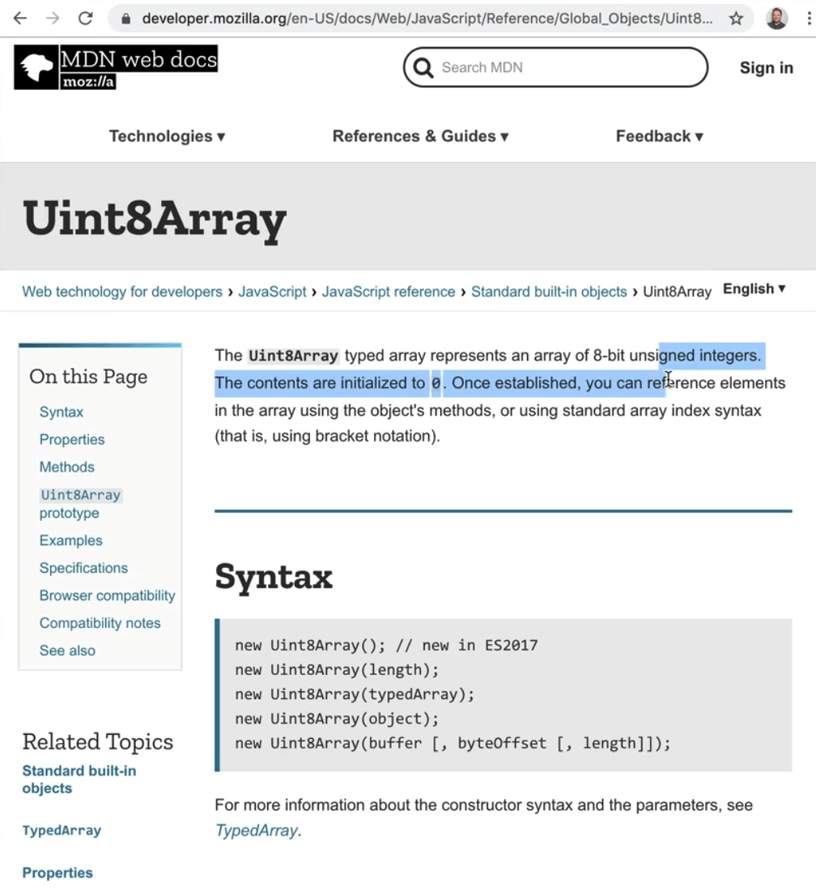

What does that all mean? Well the data that we are getting back from the time data is 8 bits or 1 byte. This is getting pretty nerdy but essentially if you have an array, normal arrays you can put as much data as you want in every single item. However with this special array, each item can only ever be 8 bits of 1 byte (8 bits is 1 byte).

What that allows us to do is if we know ahead of time how big each of them are, we can make really big arrays, meaning that they are typed and we are not accidentally going to put some data in there that does not work for us. This is useful for heavy lifting like data analysis. You also see those special types of arrays when working with graphics as well.

Go ahead and log `timeData`, which is our new array containing data about the time. Let's also add a call to run `getAudio()` on runtime.

```js
async function getAudio() {
  const stream = await navigator.mediaDevices.getUserMedia({ audio: true });
  const audioCtx = new AudioContext();
  analyzer = audioCtx.createAnalyser();
  const source = audioCtx.createMediaStreamSource(stream);
  source.connect(analyzer);

  // How much data should we collect
  analyzer.fftSize = 2 ** 10;
  // pull the data off the audio
  const timeData = new Uint8Array(analylzer.frequencyBinCount);
  console.log(timeData);
}

getAudio();
```

When the page refreshes, we expected to see an array of audio logged to the console. However, we are currently seeing an error "Uncaught (in promise) DOMException: Permission denied"

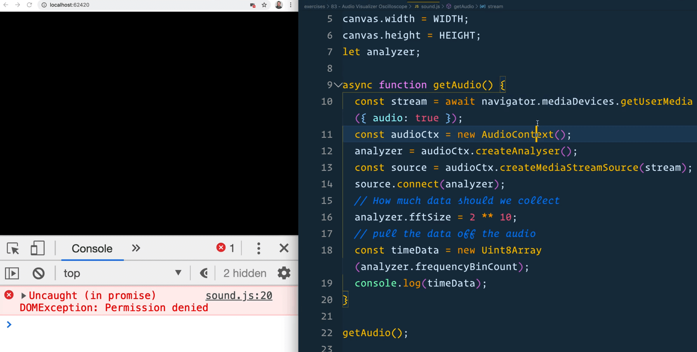

What is happening there is our call to `getUserMedia` has been denied.

Create a `handleError` function that logs "You must give access to your mic in order to proceed". Then modify the call to `getUserMedia` to chain a `catch()` on it and pass it our `handleError` function, like so 👇

```js
// sound.js
function handleError(err) {
  console.log('You must give access to your mic in order to proceed');
}

async function getAudio() {
  const stream = await navigator.mediaDevices
    .getUserMedia({ audio: true })
    .catch(handleError);
```

Now we see the following message in the console 👇

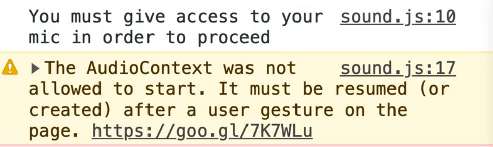

To allow access, you need to allow the webpage access to the microphone within chrome, as shown in the image below.

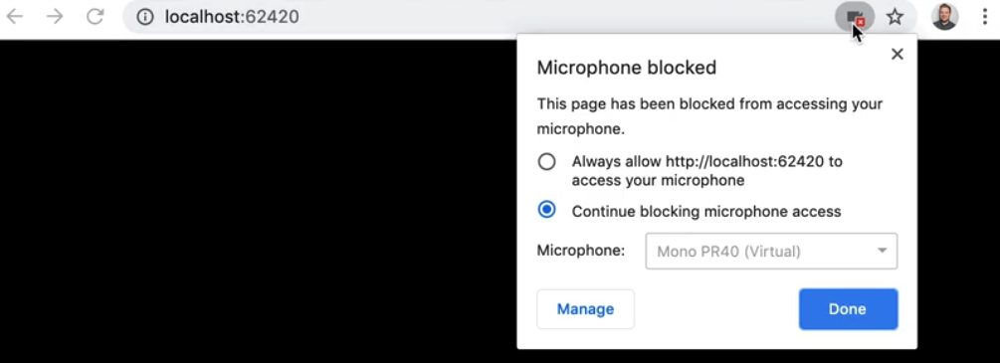

Now when you refresh the page, you will see we get an array.

At first they will all contain zeros but as we keep talking and keep sampling the data, it will fill up with a bunch of numbers that represent the frequencies and the time data in what we say.

Let's make the second one as well for frequency.

```js
const frequencyData = new Uint8Array(analyzer.frequencyBinCount);
console.log(frequencyData);
```

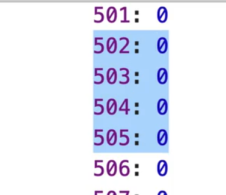

We now have two empty arrays with the right amount of slots that we are going to be filling up with data.

## Time Data Visualization

Make a function called `drawTimeData(timeData)`, which will need to run as frequently as possible. Let's call it within the `getAudio` method initially, like so 👇

```js
async function getAudio() {
  const stream = await navigator.mediaDevices
    .getUserMedia({ audio: true })
    .catch(handleError);

  const audioCtx = new AudioContext();
  analyzer = audioCtx.createAnalyser();
  const source = audioCtx.createMediaStreamSource(stream);
  source.connect(analyzer);

  // How much data should we collect
  analyzer.fftSize = 2 ** 8;
  // pull the data off the audio
  // how many pieces of data are there?!?
  bufferLength = analyzer.frequencyBinCount;
  const timeData = new Uint8Array(bufferLength);
  const frequencyData = new Uint8Array(bufferLength);
  drawTimeData(timeData);
}
```

Within `drawTimeData` we will log the `timeData` array, and we will make the function call itself as soon as possible. To do that, we will use `requestAnimationFrame`.

We will use that method to tell the browser to run the `drawTimeData` function again the next time it is possible to paint the screen. To do that we will use an array function like so:

```js
function drawTimeData(timeData) {
  console.log(timeData);
  // call itself as soon as possible
  requestAnimationFrame(() => drawTimeData(time));
}
```

Now when you refresh you will see we have this stream of data coming in.

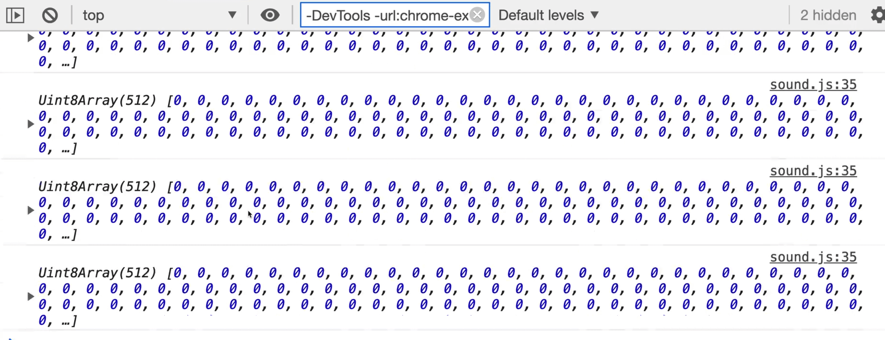

It is all still zeros because it was 0 initially but we have another method that will allow us to pull the data out of it: `analyzer.getByteTimeDomainData(timeData);`

This method is a bit weird. How it works is it allows us to inject our time data into our `timeData` array.

Now when we log `timeData`, you should see as you talk, the numbers go from 128 all the way to 255.

```js
function drawTimeData(timeData) {
  analyzer.getByteTimeDomainData(timeData);
  console.log(timeData);
  // call itself as soon as possible
  requestAnimationFrame(() => drawTimeData(time));
}
```

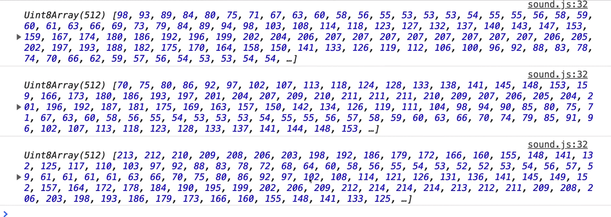

That data is a visual representation of the words that Wes is speaking.

Now that we have that data, let's turn it into something visual, starting with drawing with the canvas.

The first thing we would need to do is clear the canvas but for now, leave a TODO and move onto the next steps so you can see what happens when we do not clear the canvas.

The next steps involve setting the `lineWidth`, `strokeStyle` and calling the `beginPath()` method on the canvas context.

```js
function drawTimeData(timeData) {
  // inject the time data into our timeData array
  analyzer.getByteTimeDomainData(timeData);
  // now that we have the data, lets turn it into something visual
  // 1. Clear the canvas TODO
  // 2. setup some canvas drawing
  ctx.lineWidth = 10;
  ctx.strokeStyle = "#ffc600";
  ctx.beginPath();
```

Now we need to do is figure out how long each line will be.

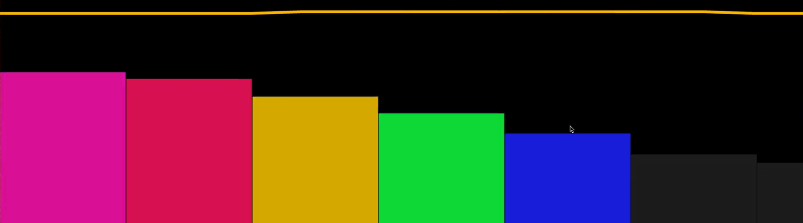

Let's use the example above and assume there are 8 pieces of data we have to represent that visual. We need to draw lines between each of those data points like a line graph. In order to that, we must figure out how wide each of those lines are going to be.

We have 1500 pixels, and then we have 8 pieces of data. 1500 / 8 = 187.5.

That means each line is going to be above 188 pixels wide. Or if we had 512 pieces of data, each line would be about 2-3 pixels wide (1500/512 = 2.9).

Every time we draw something, like the bar graph pieces you see in the visual above, we will refer to each piece as a "slice". Let's figure out what the slice's width is equal to.

To do that, take the `WIDTH` variable and divide it by the array of time data, which we will call a **buffer**.

Go ahead and make a new variable for that, and assign it the value of `analyzer.frequencyBinCount` which gives you the buffer length value.

```js
const WIDTH = 1500;
const HEIGHT = 1500;
const canvas = document.querySelector("canvas");
const ctx = canvas.getContext("2d");
canvas.width = WIDTH;
canvas.height = HEIGHT;
let analyzer;
let bufferLength;
```

To determine how big each slice will be, add the following code within `drawTimeData()` and log the value

```js
// sound.js
const sliceWidth = WIDTH / bufferLength;
console.log(sliceWidth);
```

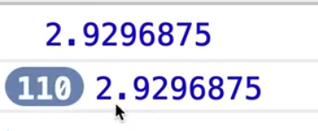

That gives us 2.9296875 pixels long. If we were to modify the `WIDTH` variable to 2500, that value will go up to 4.88 pixels wide per slice. Wes is not going to round that because canvas does a good enough job of rounding those values for us.

Now that we have the slice width, we need an `x` variable which we will set to 0.

```js
let x = 0;
```

The reason for that is we will loop over each piece of our time data and we will increment that by the slice width every time we loop over it.

We will use the `forEach` loop here. That will take in two arguments:

1. the data
2. the index variable

Within the loop, we will create a variable `v` that will be equal to the data, and then divide that by 128.

The reason we do that is because when you are not speaking, it returns 128 and then when you start speaking it goes up. So the `v` variable is going to be a multiplier that we will use in drawing the data (that will make sense in just a second).

We also want to make a `y` value.


Take the visual above as an example.

We have this line going left to right on the X axis, but we also need to know how high or how low that the line needs to go which will be based on our `y` value.

To calculate that we will take our `v` variable and multiply it by our `HEIGHT` variable and divide that by 2.

```js
const y = (v * HEIGHT) / 2;
```

You might be thinking that this is a lot of math, and you're not wrong. Math is how a lot of graphics are done, there is lots of division and multiplication to scale things up and down.

Back to the exercise --- let's start to draw our lines within the `forEach` loop.

We need to first check whether the item is the first item in the array.

To do this, we can use the `i` variable to which tells us the index of the current element that is being processed in the loop..

If it is the first element, we want to move it to the x and y coordinates. Otherwise, we will call `lineTo()` like so:

```js
if (i === 0) {
  canvas.moveTo(x, y);
} else {
  canvas.lineTo(x, y);
}
```

Next we need to call `x += sliceWidth;`. That will move our x axis along every time that we loop over.

However now if you refresh the page, you will see an error complaining that "canvas.moveTo is not a function".

That is because we are supposed to be calling `moveTo` and `lineTo` on the `ctx` not canvas. Modify the code like so:

```js
if (i === 0) {
  ctx.moveTo(x, y);
} else {
  ctx.lineTo(x, y);
}
```

Outside of the `forEach` we will call `ctx.stroke()`.

```js
function drawTimeData(timeData) {
  // inject the time data into our timeData array
  analyzer.getByteTimeDomainData(timeData);
  // now that we have the data, lets turn it into something visual
  // 1. Clear the canvas TODO
  // 2. setup some canvas drawing
  ctx.lineWidth = 10;
  ctx.strokeStyle = "#ffc600";
  ctx.beginPath();
  const sliceWidth = WIDTH / bufferLength;
  let x = 0;
  timeData.forEach((data, i) => {
    const v = data / 128;
    const y = (v * HEIGHT) / 2;
    // draw our lines
    if (i === 0) {
      ctx.moveTo(x, y);
    } else {
      ctx.lineTo(x, y);
    }
    x += sliceWidth;
  });

  ctx.stroke();

  // call itself as soon as possible
  requestAnimationFrame(() => drawTimeData(timeData));
}
```


What is happening there is that every single time we are drawing something, it is drawing that to the page.

We take our huge array of data, loop over each piece of that data, draw it to the canvas, and then finally run `stroke()` at the very end and that will just paint it to the thing.

Let's go back to the TODO that we left for the first step where we need to clear the canvas and actually add that code.

```js
// 1. Clear the canvas TODO
ctx.clearRect(0, 0, WIDTH, HEIGHT);
```


Now every single time that this runs, we first clear out the canvas so it looks like it is actually animating. That is just us painting very very quickly however.

Go back to the place in the code where we set the `fftSize`. Let's try modifying it to be `analyzer.fftSize = 2 ** 6;`


The higher limit is 32768. Let's try setting it to that like so: `analyzer.fftSize = 32768;`

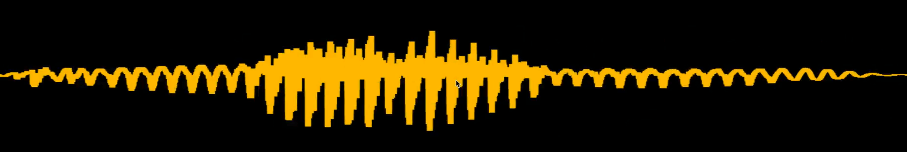

As you can see above, when we set it to the upper limit, we have tons of data streaming in. Let's bring that back to be 2 to the power of 10 instead.

That takes care of the time visualization.

### Frequency Visualization

Now let's do it again but this time for the frequency data.

Wes will demonstrate how the visualizer respond to different frequencies using a frequency app.

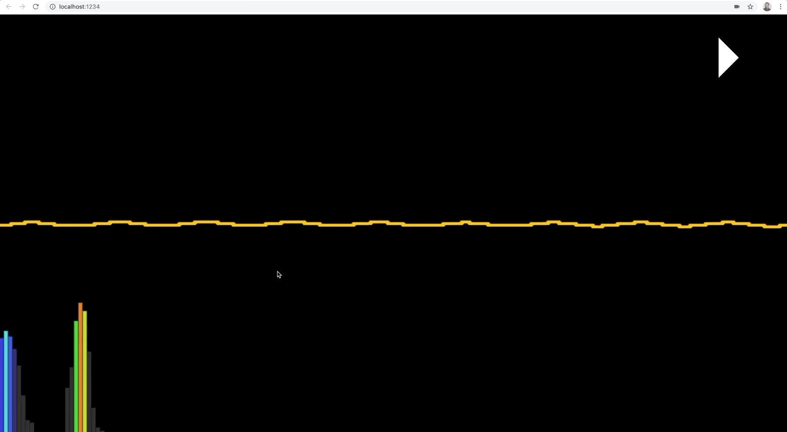

As you can see the different frequencies in the audio will affect how high the bars in the graph go.

Create another function called `drawFrequency` which will take in `frequencyData` as an argument.

Within that function, the first thing we need to do is get the frequency data into the `frequencyData` array. You can think of `frequencyData` like a holder that we will inject the data about frequency into.

We will do that using the method `getByteFrequencyData(frequencyData);` that we can call on the analyzer.

```js
function drawFrequency(frequencyData) {
  // get the frequency data into our frequencyData array
  analyzer.getByteFrequencyData(frequencyData);
  console.log(frequencyData);
}
```

We also have to run the `drawFrequency` function from within `getAudio` like so 👇

```js
//sound.js
async function getAudio() {
  const stream = await navigator.mediaDevices
    .getUserMedia({ audio: true })
    .catch(handleError);

  const audioCtx = new AudioContext();
  analyzer = audioCtx.createAnalyser();
  const source = audioCtx.createMediaStreamSource(stream);
  source.connect(analyzer);

  // How much data should we collect
  analyzer.fftSize = 2 ** 8;
  // pull the data off the audio
  bufferLength = analyzer.frequencyBinCount;
  // how many pieces of data are there?!?
  bufferLength = analyzer.frequencyBinCount;
  const timeData = new Uint8Array(bufferLength);
  const frequencyData = new Uint8Array(bufferLength);
  drawTimeData(timeData);
  drawFrequency(frequencyData);
}
```

Next we need to use `requestAnimationFrame` within the `drawFrequency` function so the function can call itself.

```js
// sound.js
function drawFrequency(frequencyData) {
  // get the frequency data into our frequencyData array
  analyzer.getByteFrequencyData(frequencyData);
  console.log(frequencyData);
  requestAnimationFrame(() => drawFrequency(frequencyData));
}
```

Now you should see that when Wes talks, the high and low ends are starting to fill each other up. If you zoom out while focused in the console and start talking, you will see that the data is streaming in.


Now we need to take that data and paint it to the canvas. It will be a similar approach to how we visualized the time data.

First we need to figure out the bar width by figuring out what the width of the canvas is and how many data points we have.

```js
const barWidth = WIDTH / bufferLength;
console.log(barWidth);
```


As you can see, we get the same width as we did for the time. Let's multiply that value by 2.5 like so: `const barWidth = (WIDTH / bufferLength) * 2.5;`.

The reason for that is when Wes was testing this, there was a whole lot of frequency on the left hand side that we never hit. In order to get the visualization to look it's best, we are cutting off over half of it by multiply the width to be 2.5.

Make an `x` variable and set it to 0.

```js
const x = 0;
```

Call the `forEach` method on the `frequencyData` list.

```js
frequencyData.forEach((amount) => {});
```

The frequency data comes in a range from 0 to 255. We need to figure out what height that will be. For example if it is 100%, we want it to go up to the center line, and if it is 0%, it should be at the bottom. We need to figure out what percent that is, how high will it go.

To do that we can take the amount, which comes in from zero to 255. If there is nothing on that frequency it's a zero, and if it's totally on that frequency than it is 255. Take the amount and divide it by 255 which will give us a percentage anywhere from 0 to 100%.

We also figure out the bar height by taking the height of the canvas, and multiplying that by the percent. That will tell us if it is 0 percent high or 100% high. We will modify that to go halfway up in just a second.

```js
frequencyData.forEach((amount) => {
  // 0 to 255
  const percent = amount / 255;
  const barHeight = HEIGHT * percent;
});
```

Let's add a TODO next to convert the colour to HSL. For now we will just set the fill style to be red.

```js
frequencyData.forEach((amount) => {
  // 0 to 255
  const percent = amount / 255;
  const barHeight = HEIGHT * percent;
  // convert the color to HSL TODO
  ctx.fillStyle = "red";
});
```

Then we run `ctx.fillRect()`, and pass it four options:

- the x of where we start
- the y of where we start
- bar width
- bar height

To calculate that y axis of where we start we will take our height, and subtract the bar height from it.

We have to do this because there is no way to tell it to anchor from the bottom. So what we need to do is tell it to anchor from the top plus the height of the bar. That will allow us to start at 100 in and 20 down.

Add the following code 👇

```js
ctx.fillRect(
  x,
  HEIGHT - barHeight,
  barWidth,
  barHeight
);
```


Now when you refresh the page, you will see the bar, and it is going all the way to the top. That is because we need to increment the `x` variable by the width of the bar, so they go all the way across.

Add the following code as the last line of the forEach: `x += barWidth`.

Now you should see the data is going all the way across.


If you wanted to space the bars out a bit more, you could do something like `x += barWidth + 1` or `x += barWidth + 10`.


Now let's fix the issue where the bars are going too high. We can do that by taking the barHeight variable and dividing it's value by 2 like so 👇

```js
const barHeight = (HEIGHT * percent) / 2;
```


Now you should notice that the bars don't go quite as high as they would.

We can also set the fillStyle to use an RGBA value like so:

```js
  ctx.fillStyle = `rgba(255, 255, 0, 0.2)`;
  ctx.fillRect(x, HEIGHT - barHeight, barWidth, barHeight);
  x += barWidth + 2;
});
```


That will cause the bars to be semi-transparent and allow the time data line to show through.

The cool thing we want to do is use HSL to figure out which color each of the bars will be.

If you go to the website https://mothereffinghsl.com, you will see that for HSL the hue goes from 0 to 360, and it goes through the entire rainbow.

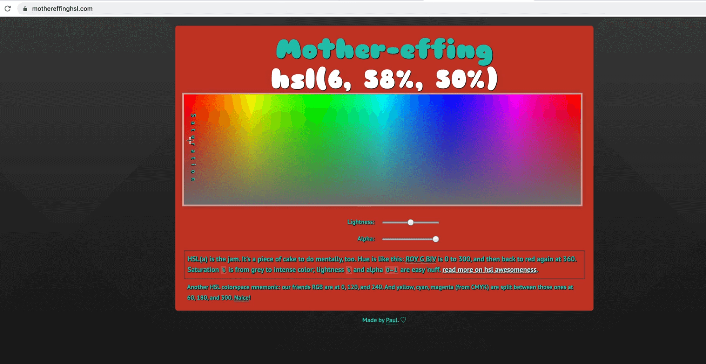

Now we can say something that has 0 will be 0 on the HSL and something that has a 255 frequency will be 360 on the HSL spectrum. We can use that as a base to go through the entire thing.

Let's make an array.

The first value in the array will be the hue which we will calculate like so: `360 / (percent * 360)`.

For the saturation and lightness, we do 0.5, 0.75 and that is it. That will affect the saturation of the color, the lower is less saturated, the higher the value the more saturated.

The lightness goes between white and black. We will keep it at .75.

```js
const [h, s, l] = [360 / (percent * 360), 0.5, 0.75];
```

What is good about HSL is that it is very easy to programmatically calculate values like hue, saturation and lightness, however we cannot use HSL on canvas.

To solve that, what Wes has done is in the `util.js` module, there is the following function:

```js
export function hslToRgb(h, s, l) {
  let r;
  let g;
  let b;

  if (s == 0) {
    r = g = b = l; // achromatic
  } else {
    const hue2rgb = function hue2rgb(p, q, t) {
      if (t < 0) t += 1;
      if (t > 1) t -= 1;
      if (t < 1 / 6) return p + (q - p) * 6 * t;
      if (t < 1 / 2) return q;
      if (t < 2 / 3) return p + (q - p) * (2 / 3 - t) * 6;
      return p;
    };

    const q = l < 0.5 ? l * (1 + s) : l + s - l * s;
    const p = 2 * l - q;
    r = hue2rgb(p, q, h + 1 / 3);
    g = hue2rgb(p, q, h);
    b = hue2rgb(p, q, h - 1 / 3);
  }

  return [Math.round(r * 255), Math.round(g * 255), Math.round(b * 255)];
}
```

The code above is taking in the hue, saturation and lightness value and will return to you an RGB value. We can use this method to convert it.

Let's import it into `sound.js`.

```js
// sound.js
import { hslToRgb } from "./utils";
```

Now we can use that function to convert the HSL value like so: `const [r, g, b] = hslToRgb(h, s, l);`

Then we use those deconstructed variables to set the rgb value using back ticks like so:

```js
// sound.js
frequencyData.forEach((amount) => {
  // 0 to 255
  const percent = amount / 255;
  const [h, s, l] = [360 / (percent * 360), 0.5, 0.75];
  const barHeight = HEIGHT * percent * 1.2;
  // TODO: Convert the colour to HSL TODO
  const [r, g, b] = hslToRgb(h, s, l);
  ctx.fillStyle = `rgb(${r},${g},${b})`;
  ctx.fillRect(x, HEIGHT - barHeight, barWidth, barHeight);
  x += barWidth + 2;
});
```


It is working, however the colors are a bit pastel.

Let's fix that. Wes found that to get vibrant colors, you can simply subtract 0.5 from the hue and it will offset where you start on the HSL spectrum which will give us a few more reds.

```js
const [h, s, l] = [360 / (percent * 360) - 0.5, 0.8, 0.5];
```

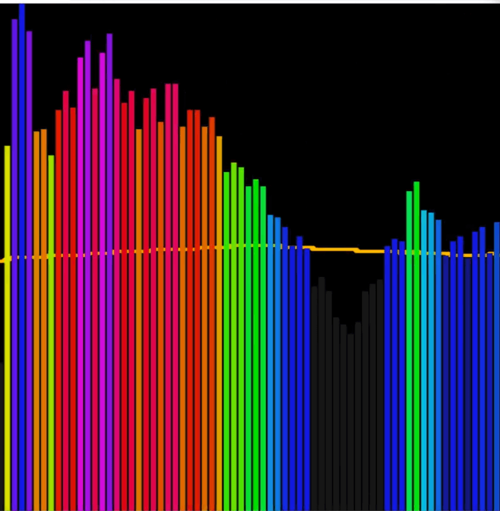

You can feel free to play with these hue, saturation and lightness values.

That is the very basics of visualizing data.

One cool thing Wes wanted to point out was that the method `getByteTimeDomainData`, it gives us decibel values. What would be cool is if you mapped that decibel value to HSL.
