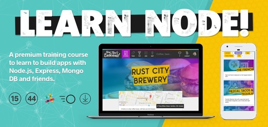
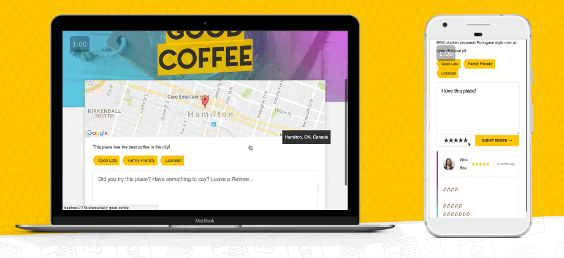

It's finally here! I'm super excited to announce my latest course - <a href="https://LearnNode.com?utm_source=wesboscom&utm_medium=blog&utm_campaign=launchpost">Learn Node</a>.

The last 5 months of my life have been spent creating this server side course and it's honestly <em>one of the best things I've ever made</em>. I know a lot of you have been waiting patiently (and some not so patiently 😂) so grab it now at the launch price over at <a href="https://LearnNode.com?utm_source=wesboscom&utm_medium=blog&utm_campaign=launchpost">LearnNode.com</a>

Learn Node is my latest premium training course in which we learn to build full stack web apps with Node.js, Express, MongoDB, Passport JS and a few other friends. This is an extremely in depth course that covers everything from the core concepts to user accounts and authentication to image uploading + resizing and all the way through to deploying live to the web.

If you want to up your JavaScript game and further your career while having fun building an application in Node.js, this course is you for.

<h2>Now That's Delicious!</h2>

Together we will build <strong>"Now That's Delicious!"</strong>, a full stack restaurant application which users can search, geolocate, review and curate their favourite restaurants from around the world.

The application has three main models — <strong>Users, Stores and Reviews</strong> — all of which are relational. It is designed to hit upon many of today's application needs such as user authentication, database storage, Ajax REST API, file upload and image resizing.

I've also added a bunch of new team licenses and snazzy new dashboard for distributing licenses. Forward this email to your boss and let them know they should grab it now.

<h2>Can you help?</h2>

It's been 10 months since I've launched a paid course (ES6 for Everyone) and about that long since I went full time on creating free + premium courses.

With this now being my primary income, it would mean the world to me if you could share my Learn Node course with a friend, co-worker or slack room.

<a href="https://twitter.com/home?status=Learn%20Node%20is%20a%20new%20course%20from%20%40wesbos%20on%20Node.js,%20Express,%20MongoDB%20and%20friends.%20Check%20it%20out!%20%E2%86%92%20https%3A//LearnNode.com">Tweet </a>, <a href="https://www.facebook.com/sharer/sharer.php?u=https%3A%2F%2FLearnNode.com">Facebook Share</a> or send a friend to LearnNode.com

<strong>Thank you and enjoy the course — see you on slack!</strong>