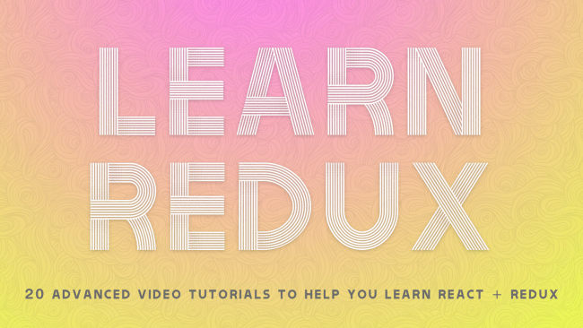

I'm super excited to announce my latest course Learn Redux.

Redux is a way to manage your state in your React (and other JavaScript) applications. I've had over 5,000 people take my <a href="https://ReactForBeginners.com">React For Beginners</a> and this is the answer to "What should I learn next?!".

It's 20 videos at just over 2.5 hours of content - easily doable in an afternoon. The videos are totally free and you can thank <a href="http://getsentry.com">Sentry</a> for sponsoring my time to create them.

Grab them at <a href="https://LearnRedux.com">LearnRedux.com</a> today!