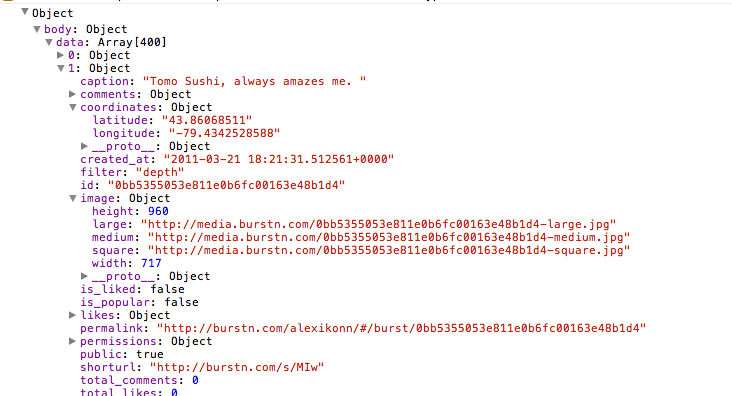

Every now and then I like to play with the API of a social networking site. <a href="http://burstn.com">Burstn</a> is an photo sharing website that allows users to quick snap photos and upload them to their website. Lucky for me, their API is fairly wide open, allows to easy calling, and returns a super nice JSON response. My idea is to ping the <a href="http://groups.google.com/group/burstn/web/api-documentation">Burstn API</a> for a timeline of public photos, parse the JSON response, and plot them on a Google Map based on their Lat and Long positions.  Sound fun? Lets go!<!--more-->

<a href="http://wesbos.com/demos/burstn-map">View Demo</a> <a href="http://wesbos.com/demos/burstn-map.zip">Download Files</a>
<h3>Setting up</h3>
You'll need three files: index.html, wb.js, and style.css. The bulk of our content will go into wb.js as we are loading everything in via JavaScript.Your index.html file should look like this:

```php
<!DOCTYPE html>
<html>
<head>
  <meta http-equiv="content-type" content="text/html; charset=UTF-8" />
  <title>Google Maps Burstn Mashup</title>
  <script type="text/javascript" src="http://ajax.googleapis.com/ajax/libs/jquery/1.4/jquery.min.js"></script>
  <script src="http://maps.google.com/maps/api/js?sensor=false"    type="text/javascript"></script>
  <script type="text/javascript" src="wb.js" ></script>
  <link rel="stylesheet" href="style.css" />
</head>
<body>
  <div id="map" ></div>
</body>
</html>
```
Getting the data from Burstn API

Pulling the data from Burstn couldn't be easier. A quick look at their documentation shows that we need to make a GET request to http://api.burstn.com/1/timeline/global. Since we want to load quite a few photos, we are going to set our limit to 400. We also need to append &callback=? to the end of our url so we can get around the "Origin null is not allowed by Access-Control-Allow-Origin." browser security.

Using jQuery's AJAX method, we pull in the JSON data as so:

```js
	$.getJSON('http://api.burstn.com/1/timeline/global?limit=400&callback=?', function(data) {
		console.log(data);
	});
```
Now if we take a look at our console. we'll see an object that was returned that looks like this:

This is all the data we need to start plotting it on our map. Using the Google Maps JavaScript 3.0 API, we will now modify the code above to be able to plot these pictures on a map.
<h3>First, setup your scripts file to populate with a map</h3>

```js
// check that the document is ready
$(function() {
	// setup a few vars
	var marker, i; 

	// setup our map
	 var map = new google.maps.Map(document.getElementById('map'), {
      zoom: 3,
      center: new google.maps.LatLng(43, 20),
      mapTypeId: google.maps.MapTypeId.ROADMAP
    });

    // setup the info window (the popup bubble that display the info
    var infowindow = new google.maps.InfoWindow();
```
<h3>Next, Pull in data from Burstn and plot on mapa</h3>
You'll see in this chunk of code that we use jQuery's $.each() to loop over each of the results, check for a latitude coordinate, and then plot it on the map.

```js
	$.getJSON('http://api.burstn.com/1/timeline/global?limit=400&callback=?', function(data) {
		console.log(data);
		$.each(data['body']['data'], function(i,v) {
			// setup some variables
			var coords = data['body']['data'][i]['coordinates'],
				imgsrc = data['body']['data'][i]['image'],
				caption = data['body']['data'][i]['caption'];

				 // setup the image markers
				var image = new google.maps.MarkerImage(imgsrc['square'],
					new google.maps.Size(20, 32),
					new google.maps.Point(0, 32)
				);

				// check if this image has a lat set, if not, we skip it.
				if (coords.latitude) { 

					marker = new google.maps.Marker({
						position: new google.maps.LatLng(coords.latitude, coords.longitude),
						icon : image,
						map: map
					});

					google.maps.event.addListener(marker, 'click', (function(marker, i) {
						return function() {
							infowindow.setContent('<div class="picture"> <span class="title">'+caption+'</div>');
							infowindow.open(map, marker);
						}
					})(marker, i));

				} // end if

			});
	});
});
```
<h3>Thats it! Just add some style</h3>
Thats it! Just add a quick dash of style to make things look good and we are off to the races.

```css
#map {
	overflow: hidden;
}
.picture {
	background: yellow;
	overflow: hidden;
	position: relative;
	}

	.picture span {
		position: absolute;
		width: 100%;
		bottom: 0;
		padding: 4px;
		background: #000;
		color: #fff;
		font-size: 12px;
		font-family: Arial;}

	.picture img {
		height: 400px;}
```