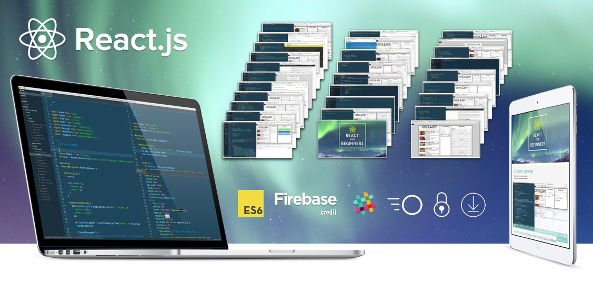

Hey Folks - I totally updated and re-recored every single video on my <a href="https://ReactForBeginners.com">React for Beginners series</a>.

Just under a year ago I launched <a href="https://ReactForBeginners.com">ReactForBeginners.com</a> — I wanted it to be an accessible, easy to understand and fun introduction to building React applications and website components.

Since then I've had 6,317 developers, designers and even a few marketing folk take the course with me. The feedback has been amazing and the series has continued to be the de facto course where people go to learn React.

React has matured a lot in the past year. The core library has deprecated many things, React Router has seen 5 major version bumps, and ES6 has exploded in popularity. Because of all this, I've spent the last month re-recording and updating the entire series.

This is a free update for anyone who has bought the course in the past. Simply head on over to your <a href="https://ReactForBeginners.com/account">account</a> to stream or download the new videos.

To anyone new to the course, it's <a href="https://ReactForBeginners.com">on sale to celebrate the re-launch</a>. As an added bonus, the next 167 people who use the code <strong>JAVASCRIPTMOVESFAST</strong> will get an additional $10 off.

<h2>What Changed?</h2>

<ol>
<li>Switched the build system from gulp and browserify to the much easier to use webpack + create-react-app.</li>
<li>The initial tutorial used React.createClass() and then refactored to ES6 Classes. Since ES6 is much more popular now, I've switched to using ES6 classes right away. Of course I have my <a href="https://ES6.io">ES6.io course</a> if you need any extra help there but I make sure to explain classes for anyone new. I've also added in lots of content to understand method binding and property initializers.</li>
<li>Remove use of deprecated linkState, switch to explicitly using value= state and onChange= events</li>
<li>Remove all mixin use as React will eventually deprecate mixins.</li>
<li>Introduce linting with ESLint</li>
<li>upgrade to React Router 4 and it's totally new API</li>
<li>Remove use of @autobind decorator</li>
<li>Upgrade to babel 6</li>
<li>Show how to build and package the application for production</li>
<li>Add in 3 deployment videos </li>
<li>Removed string refs in favour of function refs as React will likely deprecate string refs in the future</li>
<li>Use stateless components when possible and explain when you would use one</li>
<li>Remove spreading of ...this.props, only pass what is needed to child components</li>
<li>Upgraded to the new Firebase 3.0</li>
</ol>