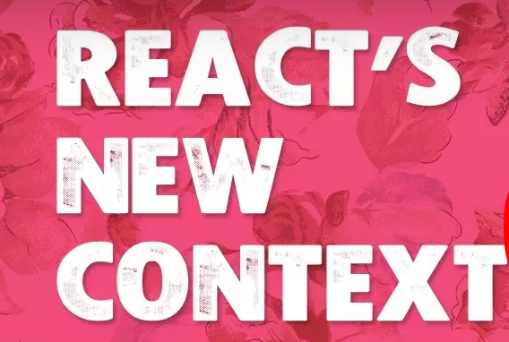
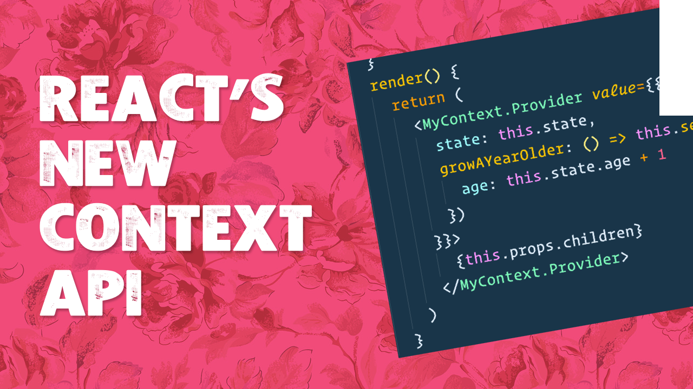

Hey Folks! React 16.3 has a new Context API which makes accessing data and functions anywhere in your application a snap. If you ever find yourself passing data down via props 4-5 levels deep, context might be what you are looking for.

Enjoy!

<YouTube videoId="XLJN4JfniH4"/>

Code Examples available at https://github.com/wesbos/React-Context

## Level two

## Level three
