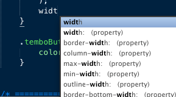

I'm a long time <a href="http://www.panic.com/coda/" target="_blank">Coda</a> user. A few months ago I, like everyone else, decided to switch over to Vim. I really liked Vim but just couldn't get the hang of it for whatever reason. After shamefully crawling back to Coda, I found myself realizing that Coda fell short in a few areas. It was then I decided to give Sublime Text 2 a shot as it had been touted as the successor to Text Mate.  Its taken me a few weeks to get used to, but I can happily say I'm a Sublime Text 2 user now. Here are a few tips that make switching over easier.


<h2>1. Install the command line utility</h2>


If you do a lot of work in bash, it's helpful to open up a file or entire folder in your editor right from the command line.

**To Install:**
Run the following line in your terminal.
`sudo ln -s "/Applications/Sublime Text 2.app/Contents/SharedSupport/bin/subl" /bin/subl`
This will then give you access to the bash command **subl** with a number of arguments.

The most basic usage is to open the current folder in Sublime Text 2. Simply type `subl .`

`subl -ab tutorial.html ` opens the file tutorial.html in the current window but keeps terminal in focus. This is handy if you need to traverse a few directories and cherry pick a number of files to be opened.

**Arguments**:
--project : Load the given project
--command : Run the given command
-n or --new-window:  Open a new window
-a or --add:         Add folders to the current window
-w or --wait:        Wait for the files to be closed before returning
-b or --background:  Don't activate the application
-s or --stay:        Keep the application activated after closing the file
-h or --help:        Show help (this message) and exit
-v or --version:     Show version and exit

 

<h2>2. Open files in current sublime text window</h2>

This was one of the biggest annoyances for me when switching over from Coda. Whenever I would drag a file into the sublime dock icon it would open a brand new instance of Sublime when I just wanted to view it along with the rest of my files. Turns out this is a super simple fix.

Hit `Command + Shift + P` to bring up the Sublime launcher type **"user global settings** and hit enter. This file is similar to a .vimrc file and holds all of your custom settings. This file won't be written over when you upgrade like **default global settings**. Once you have this file open, add the following line:

`"open_files_in_new_window": false`

 

<h2>3. Get Code Hinting in Sublime Text 2</h2>

One feature that Coda has just slam dunked is their code hinting. I rarely ever have to type entire key words. A solution for getting code completion working in Sublime Text is to install SublimeCodeIntel, a port of the Komodo editor code  completion engine. It isn't perfect, particularly in CSS file, but its pretty good and gets the job done.  <a title="Sublime Code Completion" href="https://github.com/Kronuz/SublimeCodeIntel" target="_blank">Download the repo here </a> and drop it into your packages folder at` ~/Library/Applications/Sublime Text 2/Packages`

 

 

<h2>4. Upload with Transmit shortcut</h2>

If you are working on a code n' upload project you need to be able to edit a file and quickly FTP it up to your server. Since sublime doesn't have this built in like Coda does, you'll need to use the Transmit FTP client.

First, set up your project folders in transmit.

Next, install <a href="https://github.com/jeffturcotte/sublime_transmit_docksend" target="_blank">Sublime Transmit Docksend</a>, The way this package works is by simulating a docksend (drag and drop a linked local file) to transmit when a key combination is pressed.

Finally, when editing a local file that is linked up in transmit, hit`Command + Shift + U` and the file will upload. If you are editing /js/scripts.js locally, the file will be uploaded to /js/scripts.js on your server in split second.

<h2>5. Create your own snippets!</h2>

It's a given that you should have already installed <a title="Zen Coding for Sublime Text" href="http://code.google.com/p/zen-coding/" target="_blank">Zen Coding</a>, but there are always snippets that are developer specific that you use on a daily basis. For me, I use `j + tab  to expand into a jQuery selector $(' '); To setup your own snippets, go to tools->New Snippet. The XML markup is fairly straightforward so I wont go into it. Just plop your code inbetween <!--[CDATA[</code--> and ]]>`. You can even set areas to tab through the snippet as well as defaults.

Here a basic snippet using the letter j as the tab trigger. When I tab, the cursor will be place inside the jQuery selector, tab again and I'm outside the selector ready to call a method on it.


```xml
<snippet>
    <content><![CDATA[\$('${1}')${2};]]></content>
    <tabTrigger>j</tabTrigger>
</snippet>
```

<h3>That's it!</h3>

There is a lot more to Sublime Text 2, and many cool new features such as code folding and Vim support are currently in development. I will go into many more features in coming blog posts. Want to know how to do something? Just ask in the comments below! Be sure to also <a href="http://twitter.com/wesbos">Follow me on Twitter</a>.

<a href="https:/SublimeTextBook.com"></a>