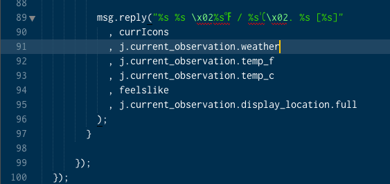
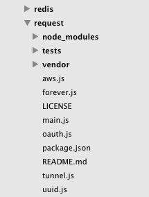

I love tweaking Sublime Text. There are hundreds of settings you can change and I've blogged about a few of them before.

Here are five visual changes you can use to make your text editor <em>just right</em>. You should place these items inside your User settings file which can be located at `preferences → Settings - User`

<h3>1. Change the caret style</h3>

Who thought a caret could be sexy? Change your caret style to phase and it will fade in and out rather than blink.


```js
"caret_style": "phase"
```

Other available options include "smooth", "phase", "blink", "wide" and "solid". I've been fond of "wide" which doesn't blink and is clearly visible for screenshots in my new book.

<h3>2. Highlight current Line</h3>

This is one thing I wish Sublime Text enabled by default. Highlighting the current line is a subtle visual cue when jumping back and forth between a browser and code.

This is also super handy when you are dealing with long lines of code/text and you want to quickly know if the current line is wrapped or not.


```js
"highlight_line": true
```



<h3>3. Increase the line height</h3>

This trick adds just two pixels to each line, but increases the readability of code so much better. Might not be for everyone but I really enjoy this one.


```js
 "line_padding_bottom": 1,
  "line_padding_top": 1
```

<h3>4. Show Code folding arrows</h3>

<a href="http://wesbos.com/sublime-text-code-folding/">Code Folding in Sublime Text</a> is really great but I've noticed most people don't use it as much as they do in editors because the arrows aren't visible until you hover over the gutter.

Make them always visible and get folding!


```js
"fade_fold_buttons": false
```


<h3>5. Bold Folder Labels</h3>

One of the downsides to Sublime Text is that the sidebar isn't as strong as other editors. One visual cue that helps me out is bolding folders. This helps me quickly identify what is a folder and what is a file.


```js
"bold_folder_labels": true
```



<h3>More...</h3>

<a href="https://sublimetextbook.com/?utm_source=5tips&utm_medium=banner&utm_campaign=product"></a>