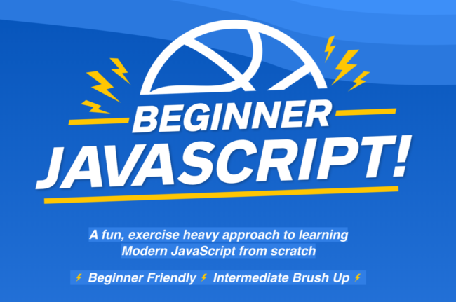

<figure class="wp-block-gallery columns-1 is-cropped"><figure></figure>
</figure>

It's here! I'm incredible proud to announce Beginner JavaScript — a fun, exercise heavy approach to learning Modern JavaScript from scratch. This is a course I've worked on for over a year, and I've been dreaming of how to make the best introduction to JavaScript for years now. 

A rock solid understanding of JavaScript is essential for success, no matter which framework you use. **This course will give you that.**

JavaScript is hard to learn. Frustration, abandonment and
 rage quits all stem from trying to use something when we don't 
understand how things work.

Being able to make your ideas is a super power. Invest in a solid base and you'll slam dunk anything that comes your way.

Go on over to <a href="https://BeginnerJavaScript.com">BeginnerJavaScript.com</a> and grab the course yourself. Enjoy!