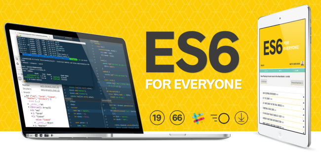

The last few months I've been hustling away at my next JavaScript course - ES6 for everyone. Today I'm super excited to launch it! <a href="https://ES6.io">ES6.io</a>

<a href="https://ES6.io">ES6 for Everyone</a> is a premium training course to strengthen your core JavaScript skills and master all that ES6 has to offer. ES6 is a major update to JavaScript that includes dozens of new features. With a focus on simplicity and readability, this course is an efficient way to find out what is new in JavaScript and most importantly when and how you should use it.

Join me for a fun and approachable look at all ES6 has to offer — boost your skills and further your career.

https://www.youtube.com/watch?v=Pji4BcJD4TA