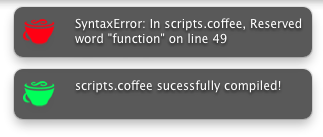

Two things I've been working with lately have been <a href="http://nodejs.org">Node.js</a> and <a href="http://jashkenas.github.com/coffee-script/">CoffeeScript</a>. If you haven't heard of either, Node.js is server side javascript and CoffeeScript is a ruby/python like langage that compiles down to regular javascript.

The way I develop my CoffeeScript is by using the Node.js compiler to watch my `scripts.coffee` for any changes and compile it into normal JavaScript every time I save my file. The process is instant, but I need to watch my terminal window to see if there were any compiling errors. As you can imagine, this can get fairly annoying especially if you aren't on dual monitors.

So, my solution was to write a Node.js module that would send a growl notification to the user when the compile was finished. I made use of the <a href="http://growl.info/extras.php#growlnotify">growlnotify</a> command line plugin for OSX.

To use, you need to first install <a href="http://growl.info/extras.php#growlnotify">growlnotify</a>.

Then use NPM to install the package `npm install coffeescript-growl`

Finally, require (with -r or --require) the module when you compile your script. I like to use something like this:

`coffee -r coffeescript-growl --watch --compile ~/sites/my_project/scripts.coffee`

Thats it! If you have any suggestions or fixes, please<a title="CoffeeScript Growl" href="https://github.com/wesbos/coffeescript-growl" target="_blank"> fork me on github </a> and <a href="https://twitter.com/#!/wesbos">follow me on twitter.</a>