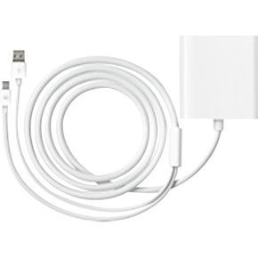
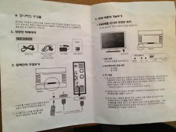

If you haven't heard, there are beautiful 27" IPS monitors coming out of Korea that use the same panels as the Apple Thunderbolt display. Turns out that Apple buys its panels from LG and any panels that aren't absolutely perfect get rejected. Enterprising companies in Korea are then buying these panels and putting them into their own monitor housing. You don't get the apple looks, nor the docking ports at the back, but at $300-400, these monitors are attractive to many who just want a high quality panel without the $1000+tax price tag an Apple display. This isn't a $300 best buy special with a 1080 resolution, its a serious monitor pushing out 2560x1440.

Before we go any further, if you are on team $1000 apple thunderbolt display. We get it, apple displays are perfect  and worth every penny to you. Pretty much everyone would kill for a thunderbolt display. This is my story how I got the exact same quality display for half the price.
    
There are <a href="http://techreport.com/review/23291/those-27-inch-ips-displays-from-korea-are-for-real" target="_blank">tons</a> and <a href="http://www.codinghorror.com/blog/2012/07/the-ips-lcd-revolution.html" target="_blank">tons</a> of articles that will catch you up to speed on these monitors, I suggest you read them if you want to know more. Here is the short and skinny:

  * There are many different brands that package the same panel and the prices vary. Some have poor build quality (including the circuitry) and other have really nice stands. The three big names are Yamakasi Catleap, Achieva Shimian and  Crossover. Do your research by reading the forums - there are literally thousands of pages of  information on this.

  * Most of these monitors are sold on ebay. Monoprice recenrly started to sell their own brand. I bought mine off a seller called 'Dream Seller' who shipped it free from Korea in a shocking 3 days.

  * You run the risk of getting a few dead pixels or back light bleeding. I paid an extra ~$25 for a pixel perfect version and I have zero dead pixels and no backlight bleed. Many buyers risk the dead pixels and end up with perfect displays, others have a few dead pixels.

  * These are barebones as it gets, DVI only and no on screen display.

I bought a Crossover Q27 LED because it has the best build quality with a metal bezel and stand. I replaced the stand with a monoprice arm because I found it less bulky. If you are considering the Crossover Q27 LED and have neck problems, go for the Crossover Q27 LED**-P **which has a stand that allows for pivoting and moving up/down.

<h3>Running it on a Macbook Pro</h3>
Most of the forum posters are serious gamers so I found I had to do quite a bit of research about running it on my Macbook Pro. The biggest takeaway is that these monitors require a **dual link dvi** cable to hook it up. Those $10 mini display port / thunderbolt → DVI connectors won't work here. Because the resolution is so high, we can't simply just convert the signal from our macbook to DVI like we do with other monitors - this is what we call **passive conversion. **As I understand it, we need an **Active converter **that will take the output from the macbook pro and kick it up to  2560x1440.

The above is Apple's version, and it doesn't come cheap at around $150. There are other companies including StarTech and Monoprice that put out cheaper, and supposedly better, adaptors for around $100-120. No cheap, so keep this in mind when factoring in the price of the monitor. These adaptors require a USB port, which is purely for power. The apple one gives you a passthrough so you don't lose a precious port. I plugged mine into a powered hub and it works fine.

I'm running this on a mid 2010 macbook pro. It's important to note here that even if you have a newer model with thunderbolt, you still need to buy this adaptor. I found a cheap one on Craigslist.
<h3>Power</h3>
This is another thing to pay serious attention to. Most of the monitors come with Korean power bricks which operate at 110-240V. North America runs on 120v, so I was safely inside that voltage. The only thing I needed to do was swap the korean plug for a north american on. Its the same plug as printers/scanners/monitors use, so I could just unplug the korean wall plug version and swap it out with mine.

If you live in a european country that runs on 250V - you need to make sure you buy a proper power pick. Do not fry your monitor!
<h3>Calibration</h3>
Out of the box, the colour was almost bang on and I only had to do a little bit of calibration. These monitors only come with two buttons: brightness UP and brightness DOWN. No problem here though, OSX comes with a very nice colour calibration wizzard which allowed me to make everything look 1:1 to my macbook pro.

**Warranty**

There isn't much of a warranty with these things past the initial delivery, this is one of the major downsides. There is no Apple store appointments for these monitors. Luckily, I was able to pop my ebay listing # into <a href="http://www.squaretrade.com/">SquareTrade</a> and they sold me a 3 year warranty for $50. Totally worth the peace of mind.

Overall Prices

Monitor $380

Display port to Dual link DVI Converter $60 (craigslist)

Monoprice Monitor Arm - $20 off craigslist

Duty - $60 (I was one of the only instances I could find online where poeple got nailed by customs. Oh well, oh Canada).

**Total: $520 taxes in**

Hope this was helpful and saves you hours of searching. In the picture above, I'm also using a USB to DVI converter from displaylink to run the third display.

 

 Please leave any tips or questions in the commends below.

<form class="validate" id="mc-embedded-subscribe-form" action="http://wesbos.us1.list-manage.com/subscribe/post?u=b18fd2807ed1a9249c7ea8961&id=20fbc2c1a5" method="post" name="mc-embedded-subscribe-form" novalidate="" target="_blank">
<h4>Let me know when this book launches</h4>
Enter your email address below and I’ll give you a hoot when its ready plus a discount code for being so great!

<input class="email" id="mce-EMAIL" type="email" name="EMAIL" placeholder="email address" required="" value="" /><input class="button" id="mc-embedded-subscribe" type="submit" name="subscribe" value="Go!" />

</form>
