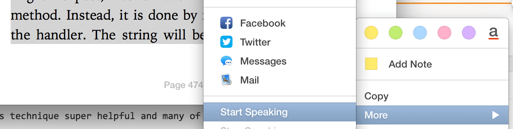

I was joking with some friends the other day that I rarely <em>read</em> books. While this is technically true, I do consume a ton of audiobooks, conference talks, video tutorials, podcasts and blog posts. It's what keeps me growing as a developer and entrepreneur. With informational resources, it's easy to find them piling up. We all have a list of tutorials we would like to watch, blog posts we should read and audiobooks we would love to listen to, if we <em>only had the time</em>, right?

Over the past 6 months I've been teaching myself to <em>speed learn</em>. That is, consume this information as fast as possible while maintaining or increasing my comprehension of the material.

<h3>Learning from the Blind Community</h3>

Now before you write this off as "not for you" because you don't like to listen to sped up voices that resemble a chipmunk, let's take a quick look at the blind and #a11y community. A few years ago at the Snow Mobile conference, I saw <a href="https://twitter.com/kevinrj">Kevin Jones</a>, who is blind, demonstrate how he uses his iPhone without seeing it.

<blockquote>
  In addition, experienced users often like to speed up the reading rate to 300 words per minute or more, which is more than the inexperienced listener can easily understand.
</blockquote>

— <http://webaim.org/techniques/screenreader/>

While the entire presentation was eye opening, the one thing that stood out to me was the speed at which the iPhone was speaking back to him. All the attendees were blown away at the speed, to which Kevin said "Oh, I've <em>slowed it down for you</em>". It turns out that many blind users have trained themselves to comprehend insanely sped-up voices in order to make up for not being able to visually read the text and navigate around their devices.

<h3>Learning to Speed Learn</h3>

So - this is what brought me to speed learning. The process is fairly simple - you need to ease into it. I started listening to content at 1.25x. At first it may seem a little fast, but after a few hours it becomes the norm. Going back to 1x now seems like slow motion. After a few months of gradual bumps I'm now at anywhere from 1.75x to 2.3x depending on the type of media (more on this in a second).

On average, podcasts, conference talks and video tutorials are spoken at around 150 WPM. Professional audiobooks are usually a little less. I speak at 145wpm in this <a href="https://youtu.be/CBQGl6zokMs">Animate.css tutorial</a>. With a little training, you can easily listen to this video at 2x and above if Youtube allowed for it. I find this technique especially helpful for long YouTube tutorial where you find yourself jumping ahead to the parts actually want.

I asked Kevin about how fast his screen reader runs at. He told me "Usually around 400 450 wpm but it can go up to 700". Note that the regular human reads at 250wpm and speaks around 125! He noted that he also uses this for learning material - for fiction he slows it down for enjoyment.

I don't have to really explain why this is ideal, but I'll state it for the sake of saying it straight up:

<blockquote>
  Consume 2x the amount of content, learn twice as much in the same amount of time!
</blockquote>

So, check out that <a href="https://youtu.be/CBQGl6zokMs">Animate.css tutorial</a> and try to watch it in 1.25x - can you handle it?

Each persons voice is different. I find that I can listen to Seth Godin's audiobooks easily at 2.5x but quick talking Renee Richee starts to get a little chip-munky around 1.75x.

<h2>Tools</h2>

So, what do you use to listen to sped up media? It's important to have good tools for playing this back as poor ones will result in your audio or video skipping or jumping.

<h3>Podcasts</h3>

Most podcatchers will include a speed up function, but I've been <em>in love</em> with Marco Arment's <a href="https://overcast.fm/">Overcast</a> for the iPhone. Not only does it have the ability to speed up podcasts, but it has <em>Smart Speed</em> which analyzes the track and removes pauses and gaps in talk shows. I can easily listen to a podcast at 2x and with Smart Speed turned on, I sometimes see the track jump to 2.3x with the gaps taken out.

<h3>Video Tutorials</h3>

The YouTube player has speeding up to 2x built in but I prefer to watch my tutorials with VLC. I use the `youtube-dl` command line tool to download my youtube videos for offline viewing and then use VLC to speed them up. VLC is the best piece of software I've found for listening to and watching media so far.

<h3>Blog Posts & eBooks</h3>

While this is still new to me, I'm playing with the OSX screen reader in Safari & iBooks to read the text back to me as I read the text on the screen. I find this helps me keep a good pace and focused on the text.

<h3>Audiobooks</h3>

Most of my audiobooks come from Audible, so I use their built in functionality which works great and goes all the way to 3x. I'm not at 3x yet, but we can dream!

<h3>Headphones</h3>

One thing I've found is that limiting distraction is important for speed learning. At the gym I'll use regular Apple earbuds, but while taking a walk or sitting on the train I use a pair of <a href="http://wes.io/a8DV">Bose QC25</a> noise canceling headphones. They aren't cheap but well worth the investment if you are really into speed learning.

<h3>Other</h3>

What do you use? I'm always open to suggestions on how to improve my speed learning. Comment below or tweet me <a href="http://twitter.com/wesbos">@wesbos</a>

I'm really not the first person to uncover the benefits of speed learning, but I've found this technique super helpful and many of my students at <a href="http://hackeryou.com">HackerYou</a> have started to train themselves as well. Anyone can do this.

There is a great [post on Quora] (http://www.quora.com/How-much-longer-does-it-take-to-listen-to-an-audiobook-than-it-does-to-read-the-equivalent-paper-or-eBookabout the actual stats behind this and I couldn't agree more.

