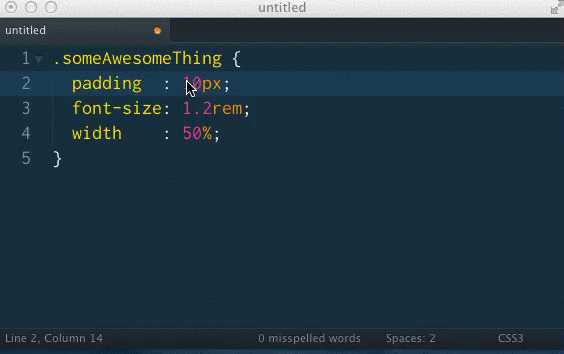

One of my favourite things about Sublime Text is the Emmet package. Most people know it for the code completions, but it also has a handful of helpful utilities.

One of those is the ability to increment / decrement values in CSS by 0.1, 1, and 10 - just like you probably already do in dev tools.

Take 1 minute to watch this video on how to use it, save yourself many minutes in the future!

https://www.youtube.com/watch?v=3X5gkXAe9nY

That's it! Next time Git requires you to edit a file or commit message, Sublime Text will pop open!

