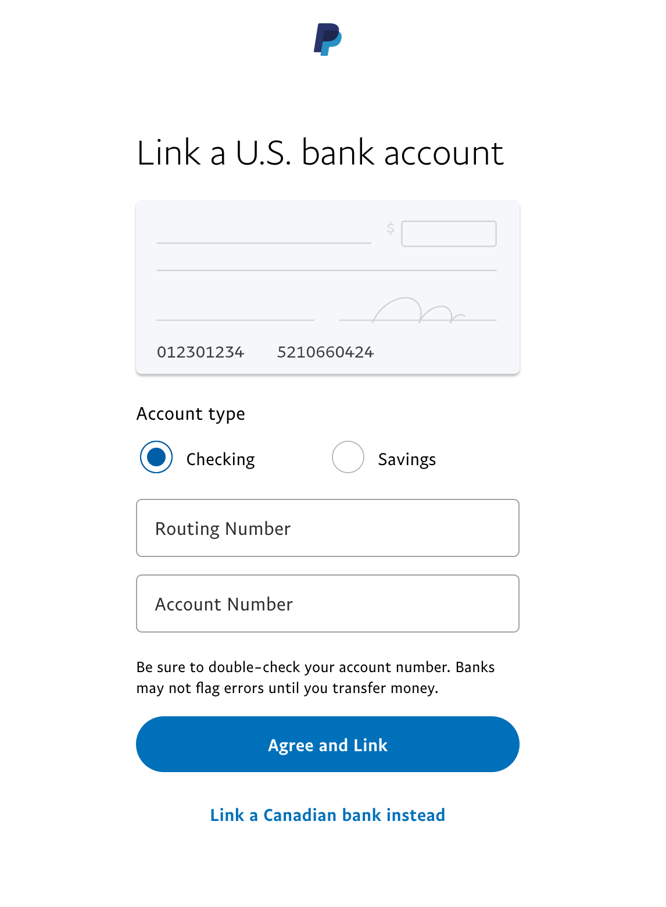
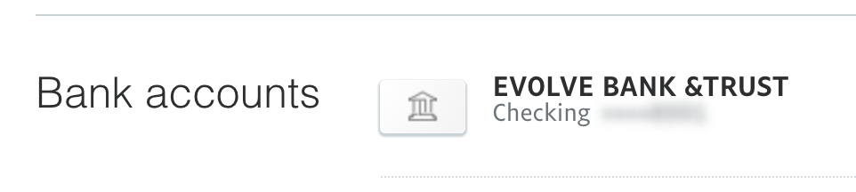
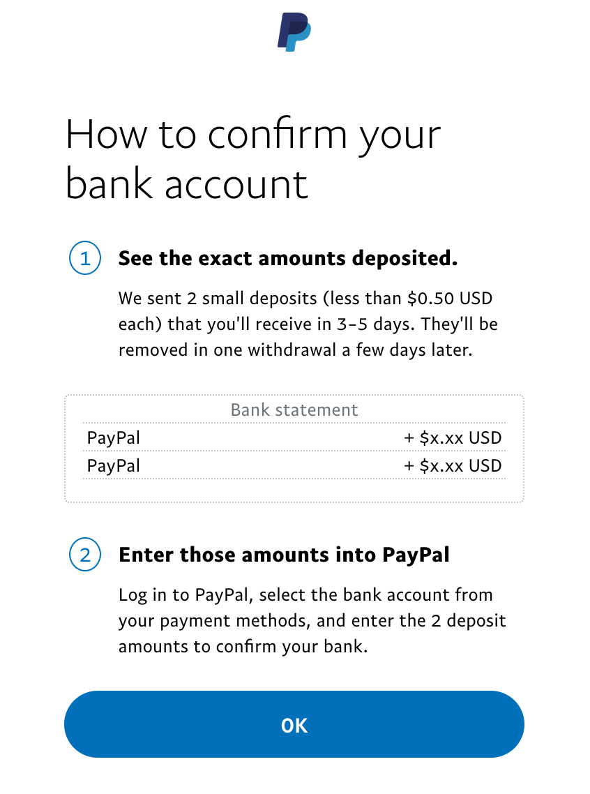
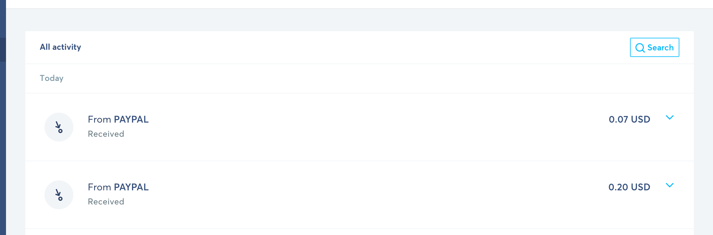

Canadian, and many international users, often find themselves with USD in their PayPal account. Whe it comes time to get that USD out of your PayPal and into your personal or business bank account, you might be surprised to see that PayPal forces you to convert your USD into your local currency before transferring it.

PayPal already charges you 3+% to receive the funds, and then another 4% to convert them. Put this on top of Merchant fees (Shopify, GumRoad) and you can easily lose 10-13% of your income.

Note: I'll be using CAD as my example currency here, but this method should work well for many other currencies. Visit the [Country Notes](#Country-notes) below for any additional details.

This is the case _even if you have a USD account with a Canadian bank_.

Thankfully there are solutions. They take work, but are 100% worth it in the long run.

### Getting Your Money Out of PayPal

The problem lies in that PayPal won't send USD to an account with a **transit** number. The solution to getting your money out of PayPal without any fees is that you must:

1. Send it to an American bank with a **routing** number
2. The account must be a US Dollar Account (as opposed to a Canadian Dollar Account)

So, as a Canadian, how do you get an American account # and routing #? There are a few solutions.

#### Solution 1: Transferwise

[Transferwise](https://transferwise.prf.hn/l/7gpROn4) is an online transfer service for converting currency. They have ["multi-currency"](https://transferwise.prf.hn/l/7gpROn4) accounts, which allow you to hold various currencies in your account before you spend, transfer or convert it.

The key here is that they will give you both an account number, and a routing number of a US based bank where you can withdrawl your paypal funds to.

It's free for personal accounts, but requires a [~$35 initial deposit](https://transferwise.prf.hn/l/62GbEPk) to verify your identity.

Business accounts must pay a $35 one-time fee to get access to your banking details. Not a big deal as this pays for itself after you move over $1,000 out of PayPal.

#### Solution 2: Royal Bank USD Account

> Note: This method is not currently working and it looks like paypal has blocked it. It still works if you have set it up, but setting up a new one will likely not work. I'll leave the instructions here in case you want to try it yourself.

I've not heard of this working with any other Canadian Bank.

A full writeup of this method is available on the [Travel Breakthrough](https://travelblogbreakthrough.com/canadian-paypal-users-transfer-usd-bank/) blog, but I believe it can be simplifed:

1. You must be an RBC Customer. Go sign up for a CAD chequings account with RBC.
2. One you are a customer, Open a RBC US dollar account. That blog recommends the RBC U.S. High Interest eSavings, but this method has worked fine for me with a Business USD Chequing.
3. Right now you need to gather your Routing and Account Number.

* **Routing Number:** 026004093
  * The trick here is that you send it to RBC's New York routing number. _Not_ their Canadian Transit number.
* **Account Number:** Your Bank's Transit Number + Your Account Number
  * This number should be visible in your online banking where it lists your accounts
  * It looks like `12345-1234567`. Simply just remove the dash and paste that number into the account field.

Save these numbers for the next step.

#### Solution 3: Get an American Account

This is a solution I didn't think was possible. But you can just call a US Bank up and ask to open an account as a Canadian. This is nice for businesses as you could take advantage of other services like a USD Business Credit Card. Hat Tip to [Paul Jarvis](https://twitter.com/pjrvs/status/1347198086351712256) for this one.

One you have an account, you should be able to get both your routing number and your account number from your bank / online banking.

> Note: Total aside, but this is something I find really handy. When using your Canadian Credit card in the US, you are sometimes asked for a zip code at gas pumps. Take the 3 numbers from your postal code, and add 00. `M5V 3L9` would be `53900`

## Linking Your Bank Account to PayPal - Online

Once you have chosen one of the above methods, you need to now link your bank account to PayPal.

The process is similar for Business and Personal accounts. [This link](https://www.paypal.com/myaccount/money/banks/new?type=US_LOCAL&isManualAddBankFlow=true) should take your straight to the page to add a new US Bank, but here is the steps in case that doesn't work.

1. Log into PayPal
2. Go wherever you manage your Cards and Bank accounts
3. Click Link new Bank
4. At the bottom of the list of banks, it will say  "Search for Other Banks"
5. Search for something that doesn't have any results, like "Dogbank"
6. There will be a link there that says "Enter your Bank Details". [Direct Link](https://www.paypal.com/myaccount/money/banks/new?type=MANUAL)
7. At the bottom, it says "Link a US. Bank Instead".

Once you have that form open, you fill in the Routing and Account number from your above solution. My Transferwise account shows up as "Evolve Bank & Trust", this is the acutal bank who is doing the transfer for you.

PayPal will then make two small deposits into your account of a few cents each. This might take a few days, but in my experience it only took 1 day. Once you see those values in your account (Transferwise, RBC or US Bank), you can input them into PayPal to confirm the account.

Bam, you are done! I'd recommend sending a small transfer initially to make sure everything works, but this will now allow you to make free USD transfers out of PayPal.

## Linking Your Bank via PayPal - over the phone

> Note: This was a trick to get around PayPal not allowing RBC accounts, but it doesn't seem to work anymore.

For RBC users, the trick of adding the American Routing number is now blocked by paypal. Luckily it still works over their automated phone.

1. Call 1-877-569-1116
2. Wait until their automated phone thing takes over
3. It will ask you to confirm your account (via a phone number, text message, bank account digits or something like that)
4. Once you are confirmed say "Add a bank account"
5. It will ask if you want to link a Canadian Bank account, Say "No"
6. It will then ask for a routing and account number, they are above.
7. Sit tight and wait for the deposits to come!

## Converting It

Okay, so you got the USD out of PayPal, what do you do with it? You can hold onto it as USD, and pay vendors and employees with it, but you are likely reading this because you want to convert it to your local currency.

Your bank is probably just as greedy as PayPal, so you probably don't want to convert it to CAD with them. Here are a few options:

  1. [Transferwise](https://transferwise.prf.hn/l/7gpROn4) - Easiest and best bang for your buck is probably using Transferwise.
  * Pro: They offer some of the best conversion rates out there.
  * Pro: Super easy if you are already using transferwise multi-currency accounts
  * Pro: Really nice online UI
  * Con: If your money isn't already in Transferwise, you will need to make a wire transfer to Transferwise (This is true for Canadians currently). This is slow, can cost $15-30, and sometimes requires you to go into your bank to complete. In this case you would hook up your CAD bank account with your Transit, Branch and Account number.

  1. [Knightsbridge FX](https://www.knightsbridgefx.com) - Another Canadian FX company.
  * Pro: Very good rates, especially if transferring lots of money
  * Pro: Canadian Company
  * Con: The sign up process is lengthy - lots of paperwork
  * Con: You must call them to make a "trade", which is not something us millennials do. No online UI.
  1. **Capital Markets** - Your Bank might have an FX Arm. See: CIBC or RBC Capital Markets
  * Pro: Great rates if transferring
  * Pro: Instant Transfers as it's within the same bank
  * Pro: Online UI to make transfers
  * Con: Special Service, you need to be screened and is mostly for businesses only
  * Con: Lots of paperwork to get setup
  1. [Norbert's Gambit](https://canadiancouchpotato.com/2013/12/03/norberts-gambit-the-complete-guide/)
  * Throwing this in there as I find it interesting, but likely not a viable method for most.
  * If you are a stock trader, you can get extremely good rates by buying a US stock, switching it to the CAD equivalent and then selling those shares.

### Country notes

If you have tried this method outside of Canda, please let me know how it has worked and any issues you have found. You can edit this file on Github or shoot me an email.

* **Denmark:** [@FORSBERGtwo](https://twitter.com/FORSBERGtwo/status/1347229522010243072) notes on twitter that even with this approach, paypal "laws" still add a 3% fee when transferring USD → USD in Denmark.
* **US and Europe**: A few people have said [Revolut](https://www.revolut.com/en-US/help/my-accounts/exchanging-money/what-foreign-exchange-rate-will-i-get) will convert currency at bank rates. I did a quick spot check for my Canadian account and the rates don't seem to be as good as the above options.

